# State Machine — Basic

The minimum playable state machine module for Playbook. One unit of work, five states, linear progression. This is the bedrock; every feature (composition, blocks, retry, operators, journal, recovery) is added on top in later architecture docs.

Tied to [`foundations.md`](foundations.md).

## The model

A **state** is a position in the lifecycle: `Initializing`, `Planning`, `Working`, `Evaluating`, `Completed`. In graph terms, each state is a node.

A **unit of work** (or just **unit**) is one traversal of the lifecycle — 5 states, bound by a shared identity. The unit is the composable entity.

Two composition modes will exist (both deferred to later docs):

- **Pipe** — sequential chain of units: `Unit A → Unit B → Unit C`. Unit B starts when Unit A reaches `Completed`.
- **Expand** — a unit's `Working` state expands into a subtree of children units. The parent's `Working` completes when all children reach `Completed`.

**Recursion is native.** Every child is itself a unit — same 5 states, same 4 signals, same shape. A child may be leaf (its `Working` does the actual work) or composite (its `Working` expands further). Depth is unbounded; the engine treats every level identically.

**Traversal is depth-first.** When expansion ships, sibling N+1 starts only after sibling N's full subtree reaches `Completed`. At any moment one unit is active along a single path from root. Parallel children — where siblings under one parent run concurrently — is an opt-in variant (out-of-scope item 9).

**Signals are uniform.** Every signal has the same shape: `{ type, payload: unknown }`. The engine routes by `type`; payloads pass through unread. This makes design easy: one signal handler, one validation shape, one test pattern across all four states.

The basic version runs **one unit, linearly, no composition.** A root unit where `Working` is leaf. Everything else — pipe, expand, nested composites, parallel children — is future work that extends this shape without changing it.

## Scope

**In**

- One unit at a time. No pipes, no expansion.
- Five states, linear: `Initializing → Planning → Working → Evaluating → Completed`.
- Four signals, one per state advance.
- Opaque payloads — the engine routes, doesn't interpret.
- One outbound port: `Checkpointer` (save / load unit).
- One use case: `SubmitSignal`.

**Out (added in later docs, in order)**

1. Failure terminal (`Failed`) and outcome derivation.
2. Blocks and operator unblock.
3. Ralph loop (bounded retry with feedback).
4. **Pipe** — sequential composition of units.
5. **Expand** — composite unit whose `Working` is a subtree of child units.
6. Journal and replay (crash recovery).
7. Effective state (computed across the unit tree).
8. Checkpoint / restore (operator-triggered).
9. Parallel children (structured concurrency).
10. Engine-generated signals (preflight, integrity).
11. Transport layers (MCP, CLI).

Each becomes its own architecture doc when work begins on it.

## Domain

### State and transition (the model)

We split the state machine into two ideas, the same way LangGraph does — but simpler.

**State** is data. In LangGraph, state is a typed dictionary of *channels*, each with a reducer function that says how updates merge. Multiple channels coexist; reading state means reading the current value of every channel.

**Transition** is movement. In LangGraph, transition is the *graph* — edges between named *nodes*, where each node is a function that returns a partial state update. The graph decides what runs next based on the current state.

The basic Playbook version simplifies both:

- **State** is one channel: `state` (the position). (`derivation` carries content alongside but does not drive transitions.)
- **Transition** is one pure function: `transition(unit, signal) → unit`. No graph definition, no node functions, no conditional edges.

We pay the LangGraph tax (subgraph quirks, ephemeral checkpoint namespaces, type leakage — see handbook issue #4) only when the engine actually needs it. The basic version doesn't.

When features land — pipe, expand, retry, blocks — more channels join the state and more rules join the transition function. The model stays the same: **state is data; transition is the function that moves it.**

### States

```ts
type State = "Initializing" | "Planning" | "Working" | "Evaluating" | "Completed";
```

`Completed` is terminal. The basic version has no other terminal state.

### Signals

The engine is a library; payloads are opaque. The engine knows the signal **type** (which state advance it triggers). It doesn't know what's inside `payload`.

```ts
type Signal =
  | { type: "initialize"; payload: unknown }
  | { type: "plan"; payload: unknown }
  | { type: "work"; payload: unknown }
  | { type: "eval"; payload: unknown };
```

Discriminated union, validated by Zod (`D3`) for shape (`type` is one of 4, `payload` exists). *What's in* `payload` is the caller's concern — the engine stores it and hands it back on read.

The basic version has no block, resolve, or override signals.

### Unit shape

```ts
type Unit = {
  id: string;
  state: State;
  derivation: {
    initialize?: unknown;
    plan?: unknown;
    work?: unknown;
    eval?: unknown;
  };
};
```

`derivation` holds the payload from each signal, keyed by signal type. No special field for "brief" — the `initialize` payload is stored the same way every other phase output is.

### Transition (the step model)

Every signal is processed as two generic operations:

1. **Update.** Store the signal's payload into `derivation[signal.type]`. Mechanical — the engine routes by signal type only and never reads payload content.
2. **Transition.** Determine the next state.

In the basic version both are combined in one pure function:

```ts
function transition(unit: Unit, signal: Signal): Unit;
```

Maps `(state, signal)` to the next state and stores the signal's payload into `derivation[signal.type]`. Throws on invalid combinations (wrong signal for current state, signal applied to a `Completed` unit, etc.).

Future features extend step 2 by plugging a caller-provided **outcome policy** into specific rule rows. The policy may inspect the unit (including prior `derivation` and `metadata`) and the incoming signal to pick the next state. Ralph loop, blocks, composite joins, approval gates, timeouts — all compose from this single extension point. The engine never interprets payload or metadata content; the policy does.

**Ralph loop is one example.** At the `Evaluating + eval` rule, a Ralph-loop policy reads `derivation.work`, the eval's gate payload, and `metadata.iteration` to return `Completed` (pass), `Working` (retry), or a capped terminal. From the engine's perspective, that's no different from any other transition — it's just what the rule row resolves to.

The valid transitions in the basic version:

| From | Signal | To |
|---|---|---|
| (unit doesn't exist) | `initialize` | `Initializing` |
| `Initializing` | `plan` | `Planning` |
| `Planning` | `work` | `Working` |
| `Working` | `eval` | `Evaluating` |
| `Evaluating` | (auto) | `Completed` |

The `Evaluating → Completed` step is automatic in the basic version: any `eval` signal completes the unit. The richer outcome policy (pass/retry/capped/blocked) is a later feature.

## Application layer

### Use case: SubmitSignal

The engine's only public function in the basic version.

```ts
SubmitSignal(unitId: string, signal: Signal): Promise<Unit>;
```

Flow:

1. Load unit via `Checkpointer.load(unitId)`. If `null` and signal is `initialize`, start fresh.
2. Apply `transition(unit, signal)` → new unit.
3. Save via `Checkpointer.save(newUnit)`.
4. Return the new unit.

Validation errors (wrong state, missing unit for non-initialize signal) reject the call without saving.

### Outbound port: Checkpointer

```ts
interface Checkpointer {
  save(unit: Unit): Promise<void>;
  load(unitId: string): Promise<Unit | null>;
}
```

Two implementations ship together (per `D18`: ≥2 implementations to justify the port):

- `MemoryCheckpointer` — Map-backed; for tests.
- `SqliteCheckpointer` — `better-sqlite3`-backed; default for real use.

Both JSON-serialize `payload` on save. Non-serializable payloads (functions, Symbols, cyclic refs) fail at save time — an application-layer concern, not the engine's.

## Hexagonal layout

```
   Caller
     │
     ▼
   ┌──────────────────────────┐
   │  Application             │
   │    SubmitSignal          │
   └────────────┬─────────────┘
                │
                ▼
   ┌──────────────────────────┐
   │  Domain (pure)           │
   │    transition(unit, sig) │
   └──────────────────────────┘
                ▲
                │ uses
   ┌────────────┴─────────────┐
   │  Outbound port           │
   │    Checkpointer          │
   └────────────┬─────────────┘
                │ implemented by
                ▼
   ┌──────────────────────────┐
   │  Adapters                │
   │    MemoryCheckpointer    │
   │    SqliteCheckpointer    │
   └──────────────────────────┘
```

"Caller" is whoever invokes `SubmitSignal`. In tests: the test itself. In integration: a future MCP adapter, CLI, or anything else. The engine doesn't know.

## Composition root

```ts
function createEngine(deps: { checkpointer: Checkpointer }): Engine;
```

Returns an `Engine` exposing `SubmitSignal`. One factory, one wiring point.

## Sequence: the happy path

```mermaid
sequenceDiagram
    autonumber
    participant C as Caller
    participant UC as SubmitSignal
    participant Dom as transition
    participant CP as Checkpointer

    C->>UC: SubmitSignal(id, initialize)
    UC->>CP: load(id)
    CP-->>UC: null
    UC->>Dom: transition(fresh, initialize)
    Dom-->>UC: {state: Initializing}
    UC->>CP: save(unit)
    UC-->>C: unit

    C->>UC: SubmitSignal(id, plan)
    UC->>CP: load(id)
    UC->>Dom: transition(unit, plan)
    Dom-->>UC: {state: Planning}
    UC->>CP: save
    UC-->>C: unit

    C->>UC: SubmitSignal(id, work)
    UC->>Dom: transition → {state: Working}
    UC->>CP: save

    C->>UC: SubmitSignal(id, eval)
    UC->>Dom: transition → {state: Completed}
    UC->>CP: save
    UC-->>C: terminal
```



That's the entire basic-version story. One linear path.

## Invariants

- **I-1.** Domain imports nothing outside `src/domain/`.
- **I-2.** `transition` is pure: same `(unit, signal)` → same result.
- **I-3.** A signal is either applied (saved) or rejected (no state change).
- **I-4.** Every outbound port has ≥2 implementations.
- **I-5.** No `any` in domain; Zod gates every signal's **shape** (not its payload's content).
- **I-6.** Engine never reads `payload` content. Payloads pass through unchanged.

## Tests we expect

Module is testable in isolation:

- **Domain tests** — `transition` against a table of `(state, signal) → state` cases. No I/O, no mocks.
- **Use-case tests** — `SubmitSignal` with `MemoryCheckpointer`. Assert unit state after each signal.
- **Adapter contract tests** — same suite run against `MemoryCheckpointer` and `SqliteCheckpointer`. Both must pass.
- **Payload-opacity tests** — round-trip arbitrary payload shapes (string, object, array, nested) through `initialize/plan/work/eval`; assert the engine hands back exactly what it received.

## How this changes

When a feature in the "Out of scope" list begins implementation, write a new architecture doc that adds it on top of this one. The new doc states what it changes (which states / signals / ports / invariants), proposes the deltas, and lands as a PR alongside the code. This document stays as the immutable bedrock — features extend, they don't rewrite.
