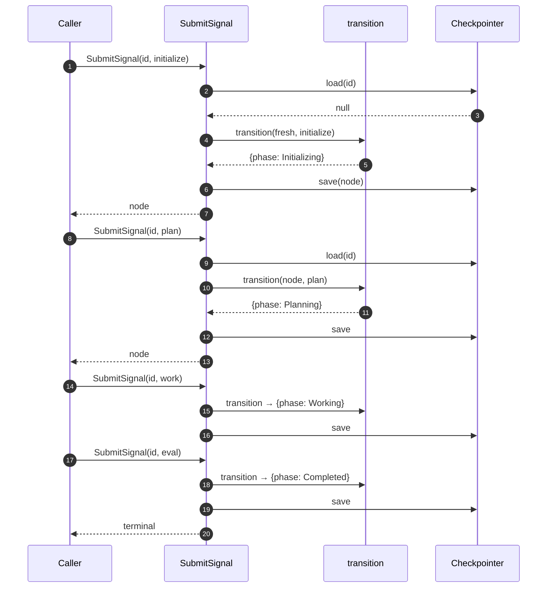

# State Machine — Basic

The minimum playable state machine module for Playbook. One NODE, four phases, linear progression. This is the bedrock; every feature (composites, blocks, retry, operators, journal, recovery) is added on top in later architecture docs.

Tied to [`foundations.md`](foundations.md).

## Scope

**In**

- One NODE at a time. No tree, no children.
- Four phases, linear: `Initializing → Planning → Working → Evaluating → Completed`.
- Four signals, one per phase advance.
- One outbound port: `Checkpointer` (save / load NODE).
- One use case: `SubmitSignal`.

**Out (added in later docs, in order)**

1. Failure terminal (`Failed`) and outcome derivation.
2. Blocks and operator unblock.
3. Ralph loop (bounded retry with feedback).
4. Composite NODEs (children, dependency ordering).
5. Journal and replay (crash recovery).
6. Effective state (computed from tree).
7. Checkpoint / restore (operator-triggered).
8. Parallel children (structured concurrency).
9. Engine-generated signals (preflight, integrity).
10. Transport layers (MCP, CLI).

Each becomes its own architecture doc when work begins on it.

## Domain

### State and transition (the model)

We split the state machine into two ideas, the same way LangGraph does — but simpler.

**State** is data. In LangGraph, state is a typed dictionary of *channels*, each with a reducer function that says how updates merge. Multiple channels coexist; reading state means reading the current value of every channel.

**Transition** is movement. In LangGraph, transition is the *graph* — edges between named *nodes*, where each node is a function that returns a partial state update. The graph decides what runs next based on the current state.

The basic Playbook version simplifies both:

- **State** is one channel: `phase`. (`brief` and `derivation` are content carried alongside, but they don't drive transitions.)
- **Transition** is one pure function: `transition(node, signal) → node`. No graph definition, no node functions, no conditional edges.

We pay the LangGraph tax (subgraph quirks, ephemeral checkpoint namespaces, type leakage — see handbook issue #4) only when the engine actually needs that machinery. The basic version doesn't.

When features land — composite children, retries, blocks — state grows more channels and the transition function grows more rules. The model stays the same: **state is data; transition is the function that moves it.**

### Phases

```ts
type Phase = "Initializing" | "Planning" | "Working" | "Evaluating" | "Completed";
```

`Completed` is terminal. The basic version has no other terminal phase.

### Signals

```ts
type Signal =
  | { type: "initialize"; brief: Brief }
  | { type: "plan"; plan: Plan }
  | { type: "work"; work: Work }
  | { type: "eval"; eval: Eval };
```

Discriminated union, validated by Zod (`D3`). The basic version has no block, resolve, or override signals.

### NODE shape

```ts
type Node = {
  id: string;
  phase: Phase;
  brief?: Brief;
  derivation: {
    plan?: Plan;
    work?: Work;
    eval?: Eval;
  };
};
```

### Transition

One pure function.

```ts
function transition(node: Node, signal: Signal): Node;
```

Maps `(phase, signal)` to `nextPhase` and stores the signal's payload into `derivation`. Throws on invalid combinations (wrong signal for current phase, signal applied to a `Completed` NODE, etc.).

The valid transitions:

| From | Signal | To |
|---|---|---|
| (NODE doesn't exist) | `initialize` | `Initializing` |
| `Initializing` | `plan` | `Planning` |
| `Planning` | `work` | `Working` |
| `Working` | `eval` | `Evaluating` |
| `Evaluating` | (auto) | `Completed` |

The `Evaluating → Completed` step is automatic in the basic version: any `eval` signal completes the NODE. The richer outcome policy (pass/retry/capped/blocked) is a later feature.

## Application layer

### Use case: SubmitSignal

The engine's only public function in the basic version.

```ts
SubmitSignal(nodeId: string, signal: Signal): Promise<Node>;
```

Flow:

1. Load NODE via `Checkpointer.load(nodeId)`. If `null` and signal is `initialize`, start fresh.
2. Apply `transition(node, signal)` → new NODE.
3. Save via `Checkpointer.save(newNode)`.
4. Return the new NODE.

Validation errors (wrong phase, missing brief, etc.) reject the call without saving.

### Outbound port: Checkpointer

```ts
interface Checkpointer {
  save(node: Node): Promise<void>;
  load(nodeId: string): Promise<Node | null>;
}
```

Two implementations ship together (per `D18`: ≥2 implementations to justify the port):

- `MemoryCheckpointer` — Map-backed; for tests.
- `SqliteCheckpointer` — `better-sqlite3`-backed; default for real use.

## Hexagonal layout

```
   Caller
     │
     ▼
   ┌──────────────────────────┐
   │  Application             │
   │    SubmitSignal          │
   └────────────┬─────────────┘
                │
                ▼
   ┌──────────────────────────┐
   │  Domain (pure)           │
   │    transition(node, sig) │
   └──────────────────────────┘
                ▲
                │ uses
   ┌────────────┴─────────────┐
   │  Outbound port           │
   │    Checkpointer          │
   └────────────┬─────────────┘
                │ implemented by
                ▼
   ┌──────────────────────────┐
   │  Adapters                │
   │    MemoryCheckpointer    │
   │    SqliteCheckpointer    │
   └──────────────────────────┘
```

"Caller" is whoever invokes `SubmitSignal`. In tests: the test itself. In integration: a future MCP adapter or CLI. The engine doesn't know.

## Composition root

```ts
function createEngine(deps: { checkpointer: Checkpointer }): Engine;
```

Returns an `Engine` exposing `SubmitSignal`. One factory, one wiring point.

## Sequence: the happy path



That's the entire basic-version story. One linear path.

## Invariants

- **I-1.** Domain imports nothing outside `src/domain/`.
- **I-2.** `transition` is pure: same `(node, signal)` → same result.
- **I-3.** A signal is either applied (saved) or rejected (no state change).
- **I-4.** Every outbound port has ≥2 implementations.
- **I-5.** No `any` in domain; Zod gates every signal.

## Tests we expect

Module is testable in isolation:

- **Domain tests** — `transition` against a table of `(phase, signal) → phase` cases. No I/O, no mocks.
- **Use-case tests** — `SubmitSignal` with `MemoryCheckpointer`. Assert NODE state after each signal.
- **Adapter contract tests** — same suite run against `MemoryCheckpointer` and `SqliteCheckpointer`. Both must pass.

## How this changes

When a feature in the "Out of scope" list begins implementation, write a new architecture doc that adds it on top of this one. The new doc states what it changes (which phases / signals / ports / invariants), proposes the deltas, and lands as a PR alongside the code. This document stays as the immutable bedrock — features extend, they don't rewrite.
