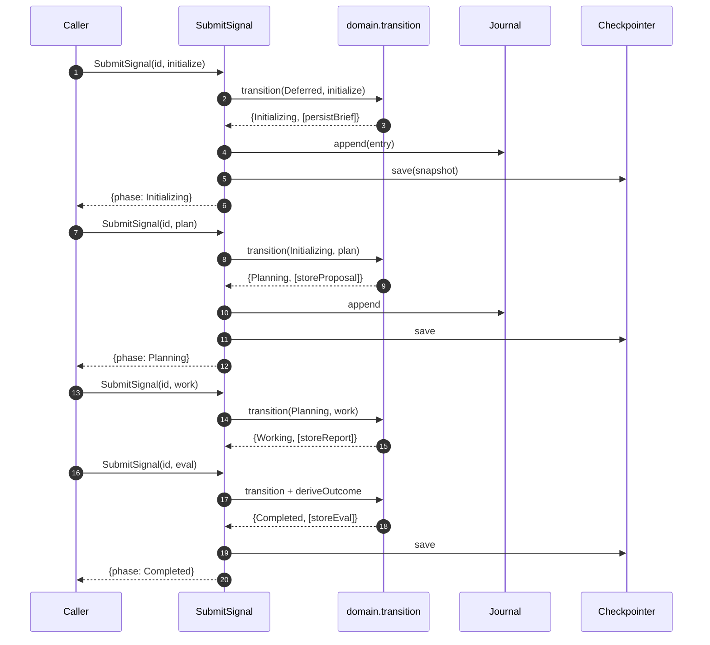
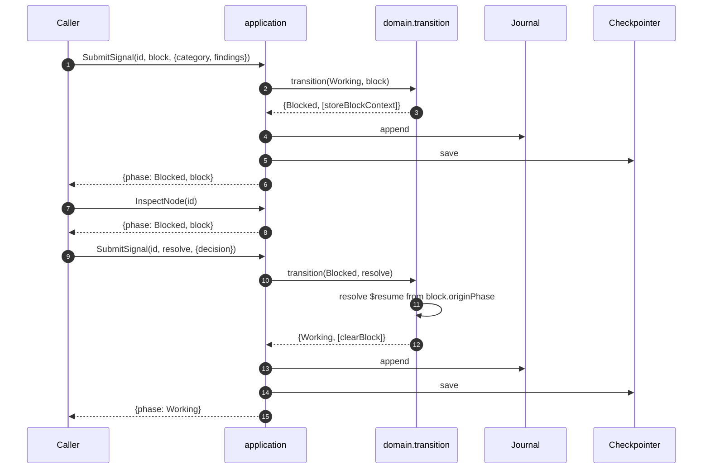
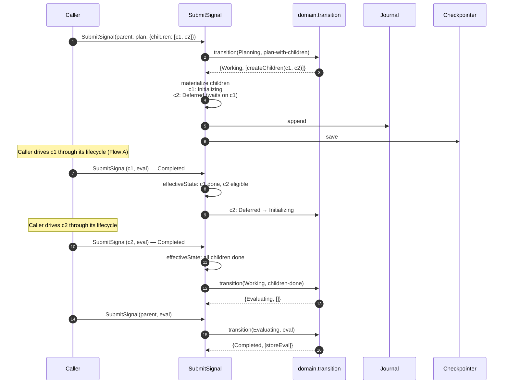
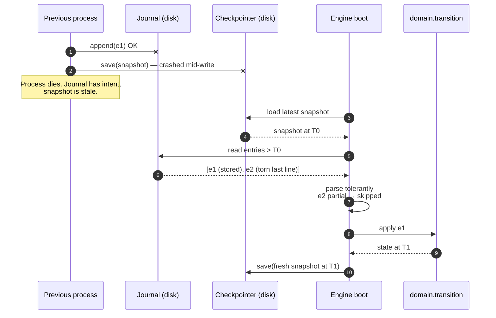
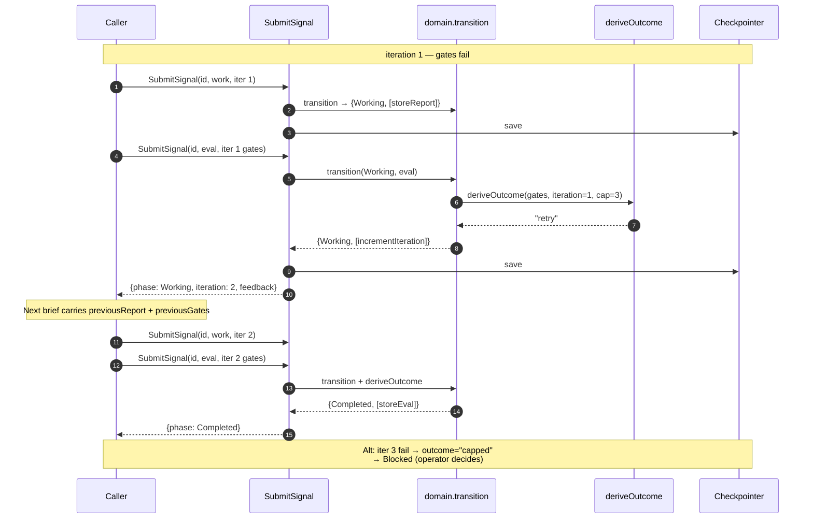

# State Machine Architecture

The state machine is the core of Playbook. This document defines it **standalone** — as a library/module with a domain, a set of use cases, and a small set of outbound ports. Transport concerns (MCP, CLI, networking) are deliberately out of scope here. Those get their own docs once the engine is proven.

Tied to [`foundations.md`](foundations.md); principle and decision references (`P*`, `D*`) point there.

## Scope of this document

**In scope**

- The domain model: phases, signals, transition rules, outcome policy, effective state.
- The use cases the engine exposes to any caller: start, submit, inspect, unblock, checkpoint, restore, replay.
- The outbound ports the engine needs: persistence, journal, clock.
- Concurrency within the engine (today: sequential; later: parallel children).
- Persistence and crash-recovery semantics.

**Out of scope (later docs)**

- MCP protocol wrapping.
- CLI surface.
- Agent wire contract (format, auth, headers).
- Daemon mode process model.
- Team / cloud tier transport.

Those layers are built on top of this engine. They don't change the engine.

## Shape in one sentence

A per-NODE finite state machine drives each unit of work through four phases (init → plan → work → evaluate). Composite NODEs expand `work` into a recursive sub-tree of child NODEs. Signals mutate state through a single pure transition function.

## Actors and user stories

Three actors (`P4`). The architecture names them by role, not by transport. A real deployment decides how each actor invokes the engine.

### Operator

- Start a playbook run from a NODE tree.
- Inspect the state tree at any time — what's running, what's blocked, what's done.
- Unblock a NODE when an agent escalates.
- Checkpoint before risky work and restore if it goes wrong.

### Agent

- Fetch the brief for a NODE it has been assigned.
- Submit its output for the current phase (plan, work, eval).
- Signal a block when it cannot proceed.

### Harness (the engine itself)

- Persist every transition before returning.
- Replay the journal on startup to recover the last consistent state.
- Enforce invariants — sequence validity, irreversible-action gates, dependency ordering.
- Treat all user content (playbooks, crafts, briefs) as opaque payload (`P2`).

## Use cases

Each use case is a function in the application layer. Inputs and outputs are plain data structures. Nothing about MCP, HTTP, sockets, or command-line args appears here — that lives in future adapter docs.

### UC-1: Start a NODE

| | |
|---|---|
| **Actor** | Operator |
| **Trigger** | A caller invokes `StartNode(nodeId, brief)` |
| **Preconditions** | No NODE with this `nodeId` exists in the session |
| **Flow** | 1. Validate brief. 2. Create NODE with `phase = Initializing`, store brief. 3. Append journal entry. 4. Write snapshot. 5. Return NODE snapshot. |
| **Postconditions** | NODE exists; phase is `Initializing`; journal has one entry |
| **Exceptions** | Brief schema invalid → rejected, no state change |

### UC-2: Agent submits a phase output

| | |
|---|---|
| **Actor** | Agent |
| **Trigger** | A caller invokes `SubmitSignal(nodeId, signal)` with `plan`, `work`, or `eval` |
| **Preconditions** | NODE exists; current phase accepts the signal (rules enforce) |
| **Flow** | 1. Validate + enrich signal. 2. `transition(state, signal)` → `{nextState, actions}`. 3. Apply actions. 4. Append journal entry. 5. Write snapshot. 6. Return new phase. |
| **Postconditions** | Phase has advanced (or stayed, on retry) |
| **Exceptions** | Wrong phase for this signal → rejected |

### UC-3: Composite NODE expands into children

| | |
|---|---|
| **Actor** | Agent (implicit — via a `plan` signal carrying `children: [...]`) |
| **Trigger** | `SubmitSignal` with a `plan` signal whose payload has a non-empty `children` |
| **Preconditions** | Parent NODE is in `Planning`; `kind = composite` |
| **Flow** | 1. Validate children (IDs unique, deps resolvable, acyclic). 2. Parent transitions `Planning → Working`. 3. `createChildren` action materializes children in `Deferred` (if they have deps) or `Initializing`. 4. Journal + snapshot. |
| **Postconditions** | Parent in `Working`; children exist |
| **Exceptions** | Child spec invalid → parent stays in `Planning` |

### UC-4: Agent signals a block

| | |
|---|---|
| **Actor** | Agent (or engine, via preflight / integrity check) |
| **Trigger** | `SubmitSignal` with `block` (agent) or engine-generated block |
| **Preconditions** | NODE is in any non-terminal phase |
| **Flow** | 1. Enrich with `originPhase` and `category`. 2. Transition to `Blocked`. 3. Cascade: ancestors whose `evaluate` depends on this NODE pause. 4. Journal + snapshot. |
| **Postconditions** | NODE in `Blocked` |
| **Exceptions** | NODE already terminal → rejected |

### UC-5: Operator unblocks a NODE

| | |
|---|---|
| **Actor** | Operator |
| **Trigger** | `SubmitSignal` with `resolve` or `security_override` |
| **Preconditions** | NODE in `Blocked`; operator identity on the signal |
| **Flow** | 1. Validate. 2. Resolve `$resume` target from `block.originPhase`. 3. Transition. 4. Journal + snapshot. |
| **Postconditions** | NODE back in the phase it was blocked from |
| **Exceptions** | NODE not `Blocked` → rejected |

### UC-6: Operator inspects state

| | |
|---|---|
| **Actor** | Operator |
| **Trigger** | Caller invokes `InspectNode(nodeId?)` |
| **Preconditions** | — |
| **Flow** | 1. Load NODE (or the whole tree if `nodeId` omitted). 2. Compute `effectiveState` per NODE. 3. Return snapshot + effective state + derivation. |
| **Postconditions** | No state change (read-only) |
| **Exceptions** | Unknown `nodeId` → returns `null`, not an error |

### UC-7: Operator checkpoints and restores

| | |
|---|---|
| **Actor** | Operator |
| **Trigger** | `Checkpoint(label?)` (save) or `Restore(ref)` (load) |
| **Preconditions** | For restore: ref exists |
| **Flow (checkpoint)** | Save full tree snapshot with label; return ref |
| **Flow (restore)** | Load snapshot; truncate journal entries after snapshot timestamp; emit `state_restored` for audit |
| **Postconditions** | State matches the labeled snapshot |
| **Exceptions** | Ref not found → rejected |

### UC-8: Engine replays journal after crash

| | |
|---|---|
| **Actor** | Harness (itself) |
| **Trigger** | Engine starts and finds journal entries newer than the latest snapshot |
| **Preconditions** | A snapshot exists; journal has entries with timestamp > snapshot.timestamp |
| **Flow** | 1. Load snapshot. 2. Read journal entries after snapshot, tolerant of a partial last line. 3. Apply each via `transition + actions`. 4. Write fresh snapshot. |
| **Postconditions** | In-memory state equals "snapshot + all committed signals to crash" |
| **Exceptions** | Journal entry rejected by current rules → halt startup with explicit error |

## Hexagonal layers (engine-only)

```
           ┌────────────────────────────────────────────────────┐
  Caller → │                                                    │
           │           Application (use cases)                  │
           │                                                    │
           │  StartNode · SubmitSignal · InspectNode            │
           │  UnblockNode · Checkpoint · Restore · Replay       │
           │                                                    │
           │            │                                       │
           │            ▼                                       │
           │           Domain (pure)                            │
           │                                                    │
           │  NodeState · Signal · TransitionRules              │
           │  transition(state, signal): {nextState, actions}   │
           │  deriveOutcome(gates, iterations): Outcome         │
           │  resolveEffectiveState(state, tree)                │
           │                                                    │
           └────────┬──────────────────────────────────┬────────┘
                    │                                  │
                    ▼  uses                            ▼  uses
           ┌────────────────────┐             ┌────────────────────┐
           │ Outbound ports     │             │ Outbound ports     │
           │   Checkpointer     │             │   Journal  · Clock │
           └──────────┬─────────┘             └──────────┬─────────┘
                      │ implemented by                   │ implemented by
                      ▼                                  ▼
           ┌────────────────────┐             ┌────────────────────┐
           │ MemoryCheckpointer │             │ NdjsonJournal      │
           │ SqliteCheckpointer │             │ SystemClock        │
           └────────────────────┘             └────────────────────┘
```

"Caller" is deliberately abstract. A future MCP adapter will be one kind of caller. So will the CLI, tests, and any future integration. The engine does not know or care.

## Domain

### Phases

A NODE is always in one of these phases. Discriminated union; exhaustive checks at every switch site.

| Phase | Meaning |
|---|---|
| `Deferred` | Waiting on dependencies |
| `Initializing` | Brief is being set |
| `Planning` | Agent is proposing a plan |
| `Working` | Agent is executing (leaf) or children are running (composite) |
| `Evaluating` | Agent is producing a gate report |
| `Completed` | Terminal success |
| `Failed` | Terminal failure |
| `Blocked` | Paused; awaits operator unblock |

### Node shape

```ts
type Node = {
  id: string;
  kind: "terminal" | "composite";
  phase: Phase;
  brief?: Brief;
  derivation: {
    proposal?: Proposal;
    report?: Report;
    gates?: GateResult;
  };
  iteration: number;
  capped: boolean;
  dependencies: string[];
  children?: Node[];
  block?: BlockContext;
};
```

The playbook's state is a tree of nodes. The engine does not flatten composites; tree shape is the state shape.

### Signals

Two families, discriminated by `type`:

- **Agent signals** — `initialize`, `plan`, `work`, `eval`, `block`, `resolve`.
- **Engine signals** — `preflight_block`, `cascade_block`, `state_restored`, `node_failed`, `integrity_block`.

Agent signals are **enriched at the use-case boundary** (origin phase, category, tree context) before reaching `transition`, so the reducer sees one consistent shape. All signals use discriminated unions with Zod validation (`D3`).

### Transition rules

Declarative table, not a switch. Each row:

```ts
type TransitionRule = {
  from: Phase | "$nonTerminal";
  signal: SignalType;
  guard?: (input: TransitionInput) => boolean;
  to: Phase | "$resume";
  actions: EntryAction[];
};
```

The table is **data**, not code. Auditable, visualizable, fuzzable. Guards are pure. `$resume` resolves through a helper that reads the block context.

### Entry actions

Transitions may emit actions: `persistBrief`, `storeProposal`, `storeReport`, `incrementIteration`, `setCapped`, `createChildren`, `archiveChildren`. Actions are data, applied after the phase move. They mutate NODE content but not phase, keeping `canTransition` pure.

### Outcome derivation

`eval` signals carry gate booleans. The engine — not the agent — derives the outcome:

```ts
deriveOutcome({security, authenticity, quality}, iterations): "completed" | "retry" | "capped" | "blocked"
```

Agents report facts; the engine decides verdicts. Matches `P1`.

### Bounded iteration (the Ralph loop)

When gates fail, the agent gets another try — with the failed report in hand. This is the Ralph loop: retry-with-feedback, bounded by a cap.

**Mechanics**

- Each NODE starts at `iteration: 1`.
- On an `eval` with failing gates AND `iteration < cap` → `deriveOutcome` returns `retry`.
- `retry` transitions `Evaluating → Working`; `incrementIteration` bumps the counter.
- When `iteration == cap` on a failing eval → `deriveOutcome` returns `capped` → transitions `Evaluating → Blocked` with `block.category: "capped"`.

**Feedback carry-over**

On retry, the NODE's next `work` brief includes `previousReport` and `previousGates`. The agent reads these from the brief and adjusts. No hidden state; feedback is data.

**Default cap**

3 iterations per NODE. Craft-level override in 0.2.0+.

**Capped goes to Blocked, not Failed**

Hitting the cap is never automatic failure. The operator decides: bump the cap, swap the craft, or fail explicitly.

### Effective state

For a composite NODE, the stored `phase` may be `Working` while children are still running. Dependency-waiting NODEs stay `Deferred` until their deps finish. The engine computes **effective state** on demand:

```ts
resolveEffectiveState(node, getPeer): EffectiveState
```

Stored vs. computed lets the tree advance without rewriting ancestor rows.

## Application layer

### Use cases (inbound ports)

The engine's entire public API. Plain functions. Input/output types are pure data. Callers hand in DTOs and get DTOs back.

```ts
StartNode(nodeId: string, brief: Brief): Promise<NodeSnapshot>;
SubmitSignal(nodeId: string, signal: Signal): Promise<NodeSnapshot>;
InspectNode(nodeId?: string): Promise<NodeSnapshot | Tree | null>;
UnblockNode(nodeId: string, decision: OperatorDecision): Promise<NodeSnapshot>;
Checkpoint(label?: string): Promise<CheckpointRef>;
Restore(ref: CheckpointRef): Promise<void>;
Replay(): Promise<void>; // engine-internal, called once at startup
```

### Outbound ports

Every side effect is a port. Implementations live in adapters.

**`Checkpointer`** (`D22`) — persistence:

```ts
interface Checkpointer {
  save(nodeId: string, snapshot: NodeSnapshot): Promise<void>;
  load(nodeId: string, ref?: CheckpointRef): Promise<NodeSnapshot | null>;
  list(nodeId: string): Promise<CheckpointRef[]>;
  delete(nodeId: string, ref?: CheckpointRef): Promise<void>;
}
```

**`Journal`** — append-only event log. Lives inside the checkpoint per `D22`, but exposed as a port so adapters can materialize differently:

```ts
interface Journal {
  append(entry: JournalEntry): Promise<void>;
  read(nodeId: string): AsyncIterable<JournalEntry>;
}
```

**`Clock`** — for determinism (`P6`):

```ts
interface Clock {
  now(): Date;
}
```

Ports follow `D18` (no premature ports): each has ≥2 real implementations or real test variation.

Future ports added only when features demand them (e.g., `AbortRegistry` for parallel cancellation, `IdGenerator` if we stop using string IDs).

### Outbound adapters (shipped)

- `MemoryCheckpointer` — tests, ephemeral runs.
- `SqliteCheckpointer` — default for solo tier (`better-sqlite3`).
- `NdjsonJournal` — append-only file per NODE.
- `SystemClock` — `new Date()`.

## Sequence diagrams

Each flow shows how the engine layers collaborate for one use case. "Caller" is whoever invokes the use case (test, adapter, future transport — not defined here).

### Flow A: Happy path — agent drives a terminal NODE to completion



### Flow B: Block and resolve



### Flow C: Composite NODE with children



### Flow D: Crash and recovery



### Flow E: Ralph loop (bounded retry)



Parallel-child flow gets its own diagram when structured concurrency ships.

## Composition root

One factory wires the engine. Nothing else touches the dependency graph:

```ts
export function createEngine(deps: {
  checkpointer: Checkpointer;
  journal: Journal;
  clock: Clock;
}): Engine;
```

`Engine` exposes the use cases. Any future caller (MCP adapter, CLI, test harness) builds an `Engine` with the adapters appropriate for its runtime and calls methods directly.

## Concurrency and interrupts

### Today: sequential

Each use-case call runs to completion before the next can start. Composite children run sequentially in dependency order. This matches the `0.1.0` and `0.2.0` release goals.

### Later: parallel children

Once v0.3.0+ adds parallel NODE execution:

- Children run under a parent `AbortSignal`. Parent cancellation aborts all.
- Join semantics: `Promise.all` for wait-all; later per-playbook choice among `allSettled` / `race` / `any`.
- One child failing does not abort siblings by default; opt-in fail-fast.
- No new framework — structured concurrency is native Node.

Interrupt handling is already uniform:

- Agent `block` or engine-derived `preflight_block` / `integrity_block` → NODE enters `Blocked`.
- Operator `resolve` or `security_override` → `$resume` rule reroutes to the pre-block phase.
- Blocks cascade up composites: a blocked descendant pauses the ancestor's `evaluate`.

## Persistence and recovery

### Journal inside checkpoint

`D22`: the journal lives inside each NODE's checkpoint, not a sidecar. One atomic write per transition; no dual-store consistency problem.

### Journal-first commit

Each signal:

1. Validate + enrich (pure).
2. Run `transition` (pure) → `{nextState, actions}`.
3. Apply actions.
4. Append to journal.
5. Write snapshot atomically (tmp + rename in the adapter).
6. Return.

If step 5 crashes: journal has intent, snapshot stale → replay on next start.
If step 4 crashes: nothing persisted → signal effectively dropped, caller retries.

### Replay

On startup, the engine reads the latest snapshot, then replays journal entries newer than the snapshot's timestamp. Adapters guarantee tolerant reads: a partial last line is skipped.

### Checkpoints

Adapters may keep N historical checkpoints. Restore walks to a named checkpoint, discards newer journal entries, reinstates state. Operator-triggered only — no automatic restore.

## What we carried forward

From `../foreman` (trial) and `../harness` (prior DIY):

| Pattern | Source | Where it lives |
|---|---|---|
| Discriminated-union signals (Zod) | foreman | `domain/signal.ts` |
| Declarative transition table | foreman | `domain/transition.ts` |
| Outcome as truth table (engine-owned) | foreman | `domain/outcome.ts` |
| Entry actions as data, applied post-transition | foreman | `domain/actions.ts` |
| Stored vs. effective state distinction | foreman | `domain/effective-state.ts` |
| Journal-first + atomic snapshot | foreman + harness | adapters |
| Tolerant journal recovery | harness | `NdjsonJournal` |
| Bounded iteration (Ralph loop) | harness | `domain/outcome.ts` + retry rules |
| Flat phase machine + orchestration loop outside | harness | state machine doesn't schedule |

## What we left behind

| Pattern | Why |
|---|---|
| LangGraph framework | Wrong shape (async fanout vs. signal-driven recursion); see handbook issue #4. |
| Phase-only state (harness) | Not enough for multi-actor crash recovery; we need richer per-NODE derivation. |
| Hard-coded persistence paths (foreman) | `D22` requires a port. |

## Invariants

- **I-1.** Domain layer imports nothing outside `src/domain/`.
- **I-2.** Application layer imports only `domain/` and `application/ports/`.
- **I-3.** The `transition` function is pure: same inputs → same `{nextState, actions}`.
- **I-4.** A signal is either applied (journaled) or rejected (no partial state change).
- **I-5.** `phase` in storage ≠ `effectivePhase` computed from tree; transitions use the computed one.
- **I-6.** Every outbound port has ≥1 in-memory test impl plus ≥1 production impl.
- **I-7.** No wall-clock reads outside the `Clock` port.
- **I-8.** No `any` types in domain; Zod schemas gate every inbound signal.

Violations fail CI — enforced via boundary rules in `foreman-lab/playbook`.

## Open questions

Deferred until implementation forces concrete answers:

- **Schema evolution** — how does a journal written at v0.1 replay under v0.2? Explicit `schemaVersion` field per entry, or adapter-level migration?
- **Composite join policies** — default `allSettled`? Per-NODE override? User-authored in the playbook YAML?
- **Operator interrupt latency** — soft deadline for a NODE to honor an interrupt, or best-effort?
- **Checkpoint compaction** — how many historical checkpoints per NODE? Global retention or per-adapter?

Track as handbook issues when they become blocking.

## What comes next (not in this doc)

When the state machine is proven (`0.1.0` ships with the engine running in-process), these get their own architecture docs:

- **MCP transport adapter** — translates MCP tool calls into use-case invocations.
- **CLI** — thin client over whatever transport is active.
- **Daemon process model** — foreground vs. long-running modes.
- **Team and cloud tiers** — separate repos, speaking Playbook's wire protocol.

Each is an **additive layer** on this architecture, not a rewrite. The engine remains stable.

## How this changes

Amendments go through an ADR under `handbook/adr/` and update this document in the same PR. The PR body names the sections and invariants it changes. Minor clarifications (typos, cross-references) can land as direct doc PRs without an ADR.
