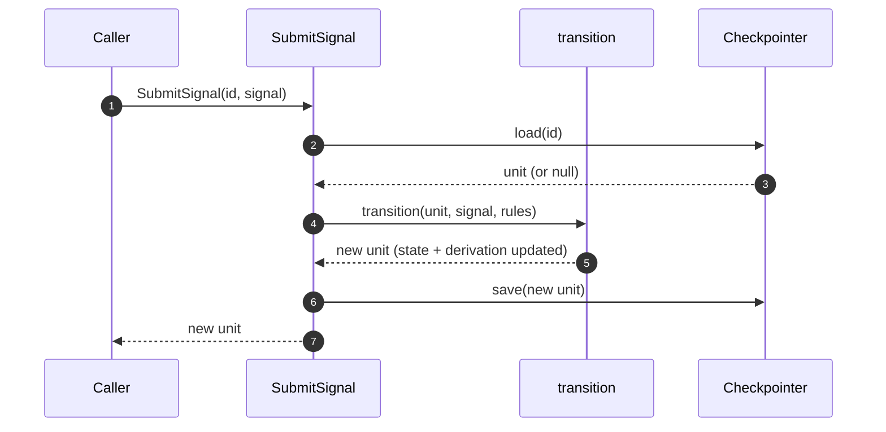

# State Machine — Basic

A generic state machine module. Opaque to domain. Configured at construction with a state set, a signal set, transition rules, and optional ports. Playbook is one caller; the engine knows nothing about Playbook's 4-phase lifecycle, crafts, briefs, or any other domain term.

Tied to [`foundations.md`](foundations.md).

## The model

A **state** is a label for a position. Any string. Caller-defined.

A **signal** is an input to the machine: a type and an opaque payload.

A **unit** is a stateful entity that traverses states by receiving signals.

A **transition** moves a unit from one state to another. Rules are declarative data; an optional policy port handles dynamic branches.

The engine treats state, signal types, and payloads as opaque. It routes, stores, and persists — the caller interprets.

## Scope

**In**

- Generic single-unit finite state machine.
- Caller-defined states (any string set).
- Caller-defined signal types (any string set).
- Caller-defined transition rules as data.
- Opaque payloads on signals; engine never reads content.
- One outbound port: `Checkpointer` (save / load unit).
- One use case: `SubmitSignal`.

**Out (added in later docs)**

1. **Policy hook** — caller-provided `OutcomePolicy` port for dynamic transitions (enables retry loops, blocks, aggregate joins, approval gates, timeouts — all as caller compositions).
2. **Entry actions** — rule-declared actions run after transition; handlers caller-provided.
3. **Metadata bucket** — caller-owned `Record<string, unknown>` on the unit, for counters / deadlines / approvals / anything the engine shouldn't interpret.
4. **Tree composition** — pipe (sequential units) and expand (composite with children). App-level orchestration; the engine stays single-unit.
5. **Journal and replay** — crash-recovery log alongside the checkpoint.
6. **Parallel step processing** — concurrent units under structured concurrency.
7. **Transport layers** — MCP, CLI, or any adapter that translates inbound calls into `SubmitSignal` invocations.

Each gets its own architecture doc when its turn comes.

## Domain

### State and transition (the model)

We split the state machine into two ideas, the same way LangGraph does — but simpler.

**State** is data. In LangGraph, state is a typed dictionary of *channels*, each with a reducer function that says how updates merge. Multiple channels coexist; reading state means reading the current value of every channel.

**Transition** is movement. In LangGraph, transition is the *graph* — edges between named *nodes*, where each node is a function that returns a partial state update. The graph decides what runs next.

The basic engine simplifies both:

- **State** is one channel: `state` (the position). `derivation` carries content alongside but does not drive transitions.
- **Transition** is one pure function: `transition(unit, signal) → unit`. Rules are a flat table; no graph definition, no node functions, no conditional edges.

Pay the LangGraph tax (subgraph quirks, ephemeral checkpoint namespaces, type leakage — see handbook issue #4) only when the engine actually needs it. The basic version doesn't.

### Generic types

```ts
type State = string;                   // caller-defined label

type Signal = {
  type: string;                        // caller-defined signal type
  payload: unknown;                    // opaque to engine
};

type Unit = {
  id: string;
  state: State;
  derivation: Record<string, unknown>; // keyed by signal.type; payload-opaque
};

type TransitionRule = {
  from: State;
  signal: string;                      // matches Signal.type
  to: State;                           // the next state
};
```

Every field is either primitive or `unknown`. The engine does not know Playbook's states, its signal types, or anything about `payload` content.

### The step (how one signal is processed)

Every `SubmitSignal` call is two generic operations:

1. **Update.** Store the signal's payload into `derivation[signal.type]`. Mechanical; the engine routes by `signal.type` only and never reads payload content.
2. **Transition.** Determine the next state. In the basic version, this is a lookup in the caller-provided rules table.

In the basic version both are combined in one pure function:

```ts
function transition(
  unit: Unit,
  signal: Signal,
  rules: TransitionRule[],
): Unit;
```

Maps `(unit.state, signal.type)` to the next state via `rules`, and stores `signal.payload` into `derivation[signal.type]`. Throws if no rule matches, or if the unit is in a terminal state (a state with no outgoing rules).

Later features extend step 2 with a caller-provided **outcome policy** port — at specific rule rows, the engine asks the policy for the next state instead of reading it from the rule. That extension point lets the caller compose retry loops, blocks, joins, approvals, timeouts — all without the engine growing new vocabulary.

## Application layer

### Use case: SubmitSignal

The engine's only public function in the basic version.

```ts
SubmitSignal(unitId: string, signal: Signal): Promise<Unit>;
```

Flow:

1. Load unit via `Checkpointer.load(unitId)`. If `null` and the caller's rules permit starting from a fresh unit with this signal, start fresh.
2. Apply `transition(unit, signal, rules)` → new unit.
3. Save via `Checkpointer.save(newUnit)`.
4. Return the new unit.

Validation errors (no matching rule, unit in terminal state) reject the call without saving.

### Outbound port: Checkpointer

```ts
interface Checkpointer {
  save(unit: Unit): Promise<void>;
  load(unitId: string): Promise<Unit | null>;
}
```

Two implementations ship together (per `D18`: ≥2 implementations to justify the port):

- `MemoryCheckpointer` — Map-backed; for tests.
- `SqliteCheckpointer` — `better-sqlite3`-backed; default for real use.

Both JSON-serialize `derivation` on save. Non-serializable payloads (functions, Symbols, cyclic refs) fail at save time — a caller concern, not the engine's.

## Hexagonal layout

```
   Caller
     │
     ▼
   ┌──────────────────────────────────────┐
   │  Application                         │
   │    SubmitSignal                      │
   └────────────────┬─────────────────────┘
                    │
                    ▼
   ┌──────────────────────────────────────┐
   │  Domain (pure)                       │
   │    transition(unit, signal, rules)   │
   └──────────────────────────────────────┘
                    ▲
                    │ uses
   ┌────────────────┴─────────────────────┐
   │  Outbound port                       │
   │    Checkpointer                      │
   └────────────────┬─────────────────────┘
                    │ implemented by
                    ▼
   ┌──────────────────────────────────────┐
   │  Adapters                            │
   │    MemoryCheckpointer                │
   │    SqliteCheckpointer                │
   └──────────────────────────────────────┘
```

"Caller" is whoever invokes `SubmitSignal`. In tests: the test itself. In integration: a future transport adapter. The engine doesn't know and doesn't care.

## Composition root

```ts
function createEngine(config: {
  rules: TransitionRule[];
  checkpointer: Checkpointer;
}): Engine;
```

Returns an `Engine` exposing `SubmitSignal`. One factory. The caller passes its rules (the state and signal vocabulary it wants to support) alongside the persistence adapter.

## Sequence: a generic signal round trip



One linear path, regardless of what states or signals the caller defined.

## Invariants

- **I-1.** Domain imports nothing outside `src/domain/`.
- **I-2.** `transition` is pure: same `(unit, signal, rules)` → same result.
- **I-3.** A signal is either applied (saved) or rejected (no state change).
- **I-4.** Every outbound port has ≥2 implementations.
- **I-5.** No `any` in domain; Zod gates every signal's **shape** (not payload content).
- **I-6.** Engine never reads `payload` or `derivation` content. They pass through unchanged.
- **I-7.** Engine never reads state labels for semantics; it only compares them as strings.

## Tests we expect

Module is testable in isolation:

- **Domain tests** — `transition` against a table of `(state, signal, rules) → state` cases. Configure the rules per test. No I/O, no mocks.
- **Use-case tests** — `SubmitSignal` with `MemoryCheckpointer` and a small rule set. Assert unit state after each signal.
- **Adapter contract tests** — same suite run against `MemoryCheckpointer` and `SqliteCheckpointer`. Both must pass.
- **Payload-opacity tests** — round-trip arbitrary payload shapes through any signal type; assert the engine hands back exactly what it received.
- **State-opacity tests** — configure the engine with arbitrary state labels (random strings); assert behavior is identical to the named-state configuration.

## Appendix: Playbook's configuration (example)

Playbook is one caller. Its configuration of the engine, for reference — not part of the engine itself.

**States (5, linear, terminal at last):**

```
"Initializing" → "Planning" → "Working" → "Evaluating" → "Completed"
```

**Signal types (4):**

```
"initialize", "plan", "work", "eval"
```

**Rules (4, basic linear):**

```ts
[
  { from: "(fresh)",       signal: "initialize", to: "Initializing" },
  { from: "Initializing",  signal: "plan",       to: "Planning" },
  { from: "Planning",      signal: "work",       to: "Working" },
  { from: "Working",       signal: "eval",       to: "Evaluating" },
  { from: "Evaluating",    signal: "eval",       to: "Completed" },
]
```

(The last row's auto-completion on any `eval` is Playbook's basic-version choice; richer outcome policies come with the `OutcomePolicy` feature doc.)

Playbook also defines the `Brief`, `Plan`, `Work`, `Eval` shapes that its agents produce as `payload`, but those live in Playbook's domain — the engine never sees them as anything but `unknown`.

## How this changes

When a future feature in the "Out" list begins implementation, write a new architecture doc that adds it on top of this one. The new doc states what it changes (which types / ports / invariants), proposes the deltas, and lands as a PR alongside the code. This document stays as the immutable bedrock — features extend via **generic primitives** (policy port, entry actions as data, metadata bucket, tree composition at app level). No feature introduces domain-specific concepts into the engine. The engine stays payload-blind, state-blind, and domain-blind.
