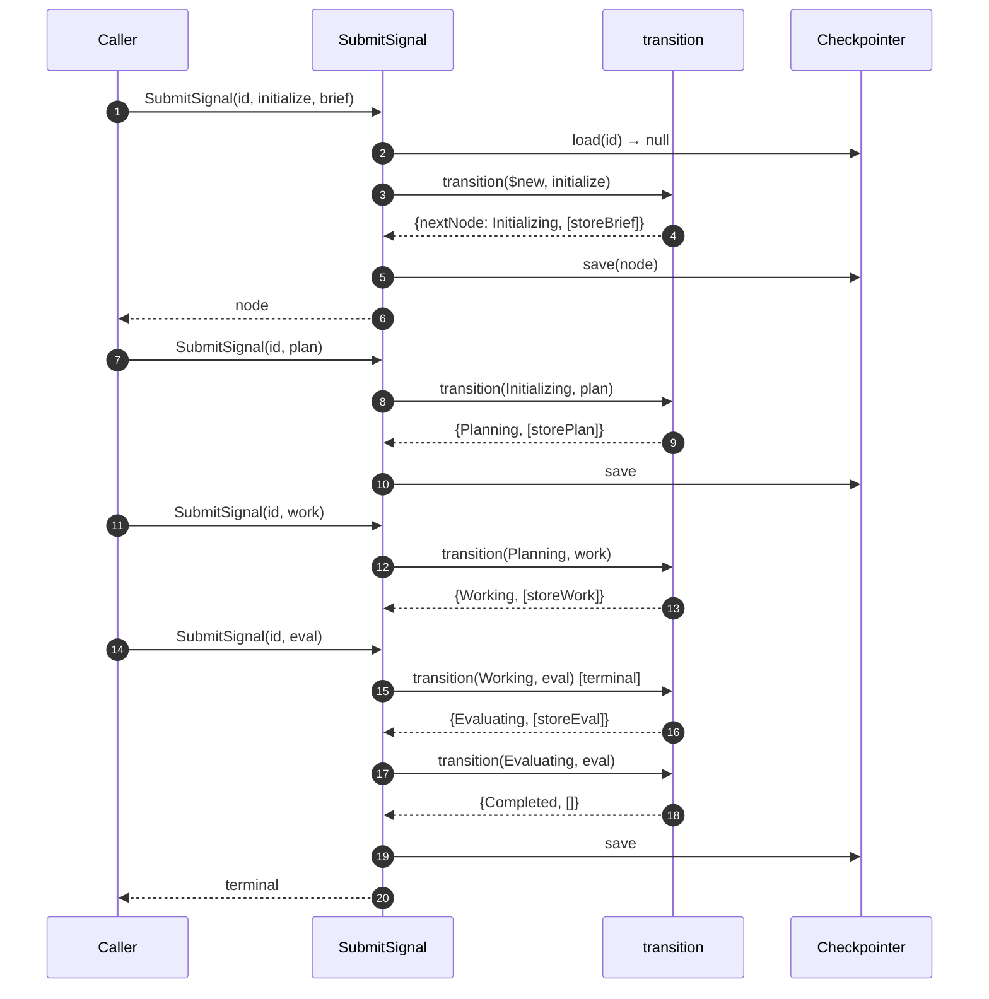

# UoW Recursive State Machine — Basic

The basic recursive state machine module for Playbook. One UoW pattern (init → plan → work → eval), used recursively: composite NODEs expand into children that follow the same pattern. Children may depend on each other.

This is the bedrock; further features (failure handling, blocks, Ralph loop, journal/replay, parallel execution, transport) are added on top in later architecture docs.

Tied to [`foundations.md`](foundations.md).

## Scope

**In**

- One UoW pattern: `init → plan → work → eval`. Used by every NODE.
- Two NODE kinds: **terminal** (does the work itself) and **composite** (expands `work` into children).
- A composite has 2+ children. Children may declare sibling dependencies.
- Path-based stable IDs (`root`, `root/build`, `root/build/test`).
- Persistence via the `Checkpointer` port (`D22`).
- Use cases: `StartNode`, `SubmitSignal`, `InspectNode`.

**Out (added in later docs)**

1. Failure terminal (`Failed`) and outcome derivation.
2. Blocks and operator unblock.
3. Ralph loop (bounded retry with feedback).
4. Multiple UoW patterns (PDCA, PGE, custom). See handbook issue #7.
5. Lazy child materialization (today: eager).
6. Parallel child execution (today: dependency-ordered, sequential).
7. Journal and replay (crash recovery).
8. Operator-triggered checkpoint / restore.
9. Engine-generated signals beyond `children-done`.
10. Transport layers (MCP, CLI).

## What is a UoW?

A **Unit of Work (UoW)** is a single instance of the four-phase pattern: `init → plan → work → eval`. Every NODE is a UoW. There is only one pattern; the engine doesn't accept others in this version.

A UoW is either:

- **Terminal** — the agent does the work directly in the `work` phase, then evaluates.
- **Composite** — the agent's `work` is to spawn children. The composite waits for children to complete, then evaluates the combined outcome.

Composites recurse: a child UoW may itself be composite, expanding into grandchildren. The same 4-phase pattern applies at every level.

## State and transition (the model)

Same split as LangGraph (state = data with reducers; transition = movement) — but simpler.

- **State** is the NODE tree. Each NODE has one channel that drives transitions: `phase`. (`brief`, `derivation`, `children`, `dependencies` are content carried alongside; they don't drive phase changes.)
- **Transition** is one pure function: `transition(node, signal) → {nextNode, sideEffects}`. No graph definition, no node functions, no conditional edges. The function reads from a small declarative table.

LangGraph's machinery (subgraphs, ephemeral checkpoint namespaces, type leakage — see handbook issue #4) is rejected. Native TypeScript covers our needs with one pure function and a table.

## Domain

### Phases

```ts
type Phase =
  | "Deferred"      // waiting on sibling dependencies
  | "Initializing"  // brief set, waiting for plan
  | "Planning"      // plan submitted, waiting for work
  | "Working"       // work submitted (terminal) or children running (composite)
  | "Evaluating"    // eval submitted, auto-completes
  | "Completed";    // terminal
```

`Completed` is the only terminal phase in the basic version. `Failed` and `Blocked` are deferred features.

### NODE shape

```ts
type NodeKind = "terminal" | "composite";

type NodeId = string; // path: parent.id + "/" + key, e.g. "root/build/test"

type Node = {
  id: NodeId;
  kind: NodeKind;
  phase: Phase;
  brief?: unknown;       // engine treats as opaque (P2)
  derivation: {
    plan?: unknown;
    work?: unknown;
    eval?: unknown;
  };
  children?: Node[];       // composite only; eager materialization
  dependencies?: string[]; // sibling keys this NODE waits on
};
```

The whole playbook run is one tree of `Node`s rooted at a single `Node`. Tree shape *is* the state shape — no flattening, no parallel sessions, no separate child threads.

### Signals

```ts
type ChildSpec = {
  key: string;             // path segment, matches /^[a-z0-9-]+$/
  kind: NodeKind;
  brief: unknown;          // opaque (P2)
  dependencies?: string[]; // sibling keys; must form a DAG
};

type Signal =
  | { type: "initialize"; brief: unknown }
  | { type: "plan"; plan: unknown }
  | { type: "work"; work: unknown; children?: ChildSpec[] }
  | { type: "eval"; eval: unknown };
```

Notes:

- **Payload is `unknown`.** The engine never inspects payload contents (`P2`). Application code defines and validates payload shapes.
- **Composite `work` carries the children manifest.** A composite NODE's "work" is to declare its children; a terminal NODE's "work" is its own output. Same signal type, different shape per kind.
- **Children specifications are validated** at signal time: keys are unique among siblings, paths match the regex, `dependencies[]` references existing sibling keys, no cycles.

The engine emits one internal signal:

```ts
type EngineSignal =
  | { type: "children-done"; nodeId: NodeId };
```

Emitted when every child of a composite reaches `Completed`. Drives the composite's `Working → Evaluating` transition.

### Transition table

The transition function is a **table interpreter**, not a switch.

```ts
type TransitionRule = {
  from: Phase | "$new";
  signal: Signal["type"] | EngineSignal["type"];
  kind?: NodeKind;          // optional kind constraint
  to: Phase;
};

const TRANSITIONS: TransitionRule[] = [
  { from: "$new",         signal: "initialize",   to: "Initializing" },
  { from: "Initializing", signal: "plan",         to: "Planning" },
  { from: "Planning",     signal: "work",         to: "Working" },
  { from: "Working",      signal: "eval",         kind: "terminal",  to: "Evaluating" },
  { from: "Working",      signal: "children-done",kind: "composite", to: "Evaluating" },
  { from: "Evaluating",   signal: "eval",         to: "Completed" },
  // Deferred → Initializing handled in side effects (see Composite NODEs)
];
```

Why a table:

- **Auditable** — readers see the entire state machine at a glance.
- **Pure** — `transition(node, signal)` returns the same `{nextNode, sideEffects}` for the same inputs.

`$new` is a virtual phase representing "NODE doesn't exist yet."

### Side effects

The transition function returns side effects alongside the next NODE. Side effects are data, applied by the application layer:

```ts
type SideEffect =
  | { type: "storeBrief"; brief: unknown }
  | { type: "storePlan"; plan: unknown }
  | { type: "storeWork"; work: unknown }
  | { type: "storeEval"; eval: unknown }
  | { type: "materializeChildren"; specs: ChildSpec[]; parentId: NodeId }
  | { type: "promoteEligible"; parentId: NodeId };  // Deferred → Initializing for ready children
```

Side effects update content, not phase. Phase moves come from the table; content moves come from side effects. Both are pure data; the application's use case applies them and writes one atomic checkpoint.

## Composite NODEs

The recursion lives here.

### Materialization (eager)

When a composite NODE receives a `work` signal with `children: ChildSpec[]`:

1. The transition fires: composite phase moves `Planning → Working`.
2. The `materializeChildren` side effect runs: each `ChildSpec` becomes a real `Node`:
   - `id` = `parent.id + "/" + spec.key`
   - `kind` = spec.kind
   - `phase` = `Initializing` if `dependencies` is empty; `Deferred` otherwise
   - `brief` = spec.brief
   - `derivation` = `{}`
3. All new children are appended to `parent.children`. The whole tree (parent + children) is written to the Checkpointer in one atomic save.

Eager materialization keeps the model simple: every child is a full row in storage from the moment its parent declares it. Lazy materialization is a deferred optimization.

### Dependency promotion

A child in `Deferred` waits until every sibling key in its `dependencies` list reaches `Completed`. The engine handles this synchronously after every signal:

1. After applying a signal that completes a NODE, the use case checks every sibling NODE in `Deferred`.
2. For each, if all dependencies are `Completed`, the `promoteEligible` side effect transitions it `Deferred → Initializing`.
3. The promotions are part of the same atomic save as the original signal.

No background watcher, no event bus — promotions ripple synchronously inside the use case.

### Composite completion

When the last child of a composite reaches `Completed`:

1. The use case detects this during the same atomic save (the same step that sets the child to `Completed`).
2. The use case applies the engine signal `children-done` to the parent.
3. The parent transitions `Working → Evaluating`.
4. The agent's next signal on the parent is the `eval` signal, which moves the composite to `Completed`.

This means `children-done` is the only engine-generated signal in the basic version. It is journaled like any other signal — full audit trail.

### Recursion

A child UoW may itself be composite, declaring its own `children` in its own `work` signal. Same rules apply at every depth. The tree grows on demand, only as deep as composites declare.

## Path-based stable IDs

Children get **stable, operator-meaningful IDs** — never UUIDs invented by the engine. Avoids the LangGraph ADR 0004 trap (handbook issue #4).

Rules:

- The root NODE id is supplied by the caller at `StartNode` (e.g., `task-2026-04-20-x` or just `root`).
- Each `ChildSpec.key` matches `/^[a-z0-9-]+$/` and is unique among siblings.
- Full child id is `parent.id + "/" + spec.key`.
- IDs are never reassigned. A NODE's id is fixed at creation.

The Checkpointer is keyed by the path string alone — no live tree needed to look up a NODE.

## Application layer

### Use cases (inbound ports)

```ts
StartNode(rootId: NodeId, kind: NodeKind, brief: unknown): Promise<Node>;
SubmitSignal(nodeId: NodeId, signal: Signal): Promise<Node>;
InspectNode(nodeId: NodeId): Promise<Node | null>;
InspectTree(rootId: NodeId): Promise<Node | null>;
```

`InspectTree` returns the full tree under a root. `InspectNode` returns one NODE. Both are read-only.

### Outbound port

```ts
interface Checkpointer {
  save(node: Node): Promise<void>;
  load(nodeId: NodeId): Promise<Node | null>;
  loadSubtree(rootId: NodeId): Promise<Node[]>;  // for composite recovery
}
```

Two implementations ship (per `D18`):

- `MemoryCheckpointer` — `Map`-backed; for tests.
- `SqliteCheckpointer` — `better-sqlite3`-backed; default for solo tier.

## Hexagonal layout

```
   Caller
     │
     ▼
   ┌──────────────────────────────────┐
   │  Application                     │
   │    StartNode · SubmitSignal      │
   │    InspectNode · InspectTree     │
   └────────────┬─────────────────────┘
                │
                ▼
   ┌──────────────────────────────────┐
   │  Domain (pure)                   │
   │    transition(node, signal) →    │
   │      {nextNode, sideEffects}     │
   └──────────────────────────────────┘
                ▲
                │ uses
   ┌────────────┴─────────────────────┐
   │  Outbound port                   │
   │    Checkpointer                  │
   └────────────┬─────────────────────┘
                │ implemented by
                ▼
   ┌──────────────────────────────────┐
   │  Adapters                        │
   │    MemoryCheckpointer            │
   │    SqliteCheckpointer            │
   └──────────────────────────────────┘
```

"Caller" is whoever invokes `SubmitSignal`. In tests: the test itself. In integration: a future MCP adapter, CLI, or test harness. The engine doesn't know.

## Composition root

```ts
function createEngine(deps: { checkpointer: Checkpointer }): Engine;
```

Returns an `Engine` exposing the use cases. One factory, one wiring point.

## Sequence: terminal happy path



## Sequence: composite expansion with dependencies

```mermaid
sequenceDiagram
    autonumber
    participant C as Caller
    participant UC as SubmitSignal
    participant Dom as transition
    participant CP as Checkpointer

    Note over C,CP: Composite parent declares 3 children:<br/>build (no deps), test (deps=[build]), ship (deps=[test])

    C->>UC: SubmitSignal(parent, work, {children: [...]})
    UC->>Dom: transition(Planning, work) [composite]
    Dom-->>UC: {Working, [materializeChildren]}
    UC->>UC: create children<br/>parent/build → Initializing<br/>parent/test → Deferred<br/>parent/ship → Deferred
    UC->>CP: save(parent + 3 children atomically)
    UC-->>C: parent

    Note over C: Caller drives parent/build through its lifecycle (terminal happy path)

    C->>UC: SubmitSignal(parent/build, eval) — completes
    UC->>UC: detect parent/build → Completed<br/>scan siblings; parent/test deps now met
    UC->>UC: promoteEligible: parent/test → Initializing
    UC->>CP: save(parent/build + parent/test atomically)

    Note over C: Caller drives parent/test through its lifecycle

    C->>UC: SubmitSignal(parent/test, eval) — completes
    UC->>UC: parent/ship deps now met → Initializing

    Note over C: Caller drives parent/ship through its lifecycle

    C->>UC: SubmitSignal(parent/ship, eval) — completes
    UC->>UC: detect all parent's children Completed
    UC->>Dom: transition(Working, children-done) [composite]
    Dom-->>UC: {Evaluating, []}
    UC->>CP: save(parent/ship + parent atomically)

    C->>UC: SubmitSignal(parent, eval) — composite eval
    UC->>Dom: transition(Evaluating, eval)
    Dom-->>UC: {Completed, [storeEval]}
    UC->>CP: save
    UC-->>C: parent terminal
```

## Invariants

- **I-1.** Domain imports nothing outside `src/domain/`.
- **I-2.** `transition` is pure: same `(node, signal)` → same `{nextNode, sideEffects}`.
- **I-3.** A signal is either fully applied (saved with all side effects) or fully rejected. No partial state change.
- **I-4.** Every NODE id is `[a-z0-9-]+(?:/[a-z0-9-]+)*` and is fixed at creation.
- **I-5.** Sibling keys are unique within a parent. Sibling dependencies form a DAG.
- **I-6.** A composite advances `Working → Evaluating` only when every child is `Completed`.
- **I-7.** Engine treats payloads as opaque (`P2`); only the application interprets them.
- **I-8.** Every outbound port has ≥2 implementations.
- **I-9.** No `any` in domain; Zod schemas gate every signal at the application boundary.

## Tests we expect

- **Domain tests** — `transition` against a table of `(phase, signal, kind) → {phase, sideEffects}` cases. No I/O.
- **Use-case tests** — `SubmitSignal` end-to-end with `MemoryCheckpointer`. Drive a terminal NODE through the happy path; drive a composite with multi-child dependencies through expansion and completion.
- **Adapter contract tests** — same suite run against `MemoryCheckpointer` and `SqliteCheckpointer`. Both must pass.

## References

- Anthropic Engineering — [*Harness Design for Long-Running AI Agent Apps*](https://www.anthropic.com/engineering/harness-design-long-running-apps). Validates the generator-evaluator separation (mapped here as the `work` and `eval` phases), explicit evaluation gates (signal-driven transitions), and file-based handoff (checkpoint state). Its guiding maxim is the same as `B1`:

  > Find the simplest solution possible, and only increase complexity when needed.

- Handbook issue #7 — full design exploration of multi-pattern recursive UoW (PDCA, PGE, custom). Not on the near roadmap; preserved as reference if a real second pattern is ever demanded.

## How this changes

When a feature in the "Out" list begins implementation, write a new architecture doc that adds it on top of this one. The new doc states what it changes (which phases / signals / ports / invariants), proposes the deltas, and lands as a PR alongside the code. This document stays as the immutable bedrock — features extend, they don't rewrite.
