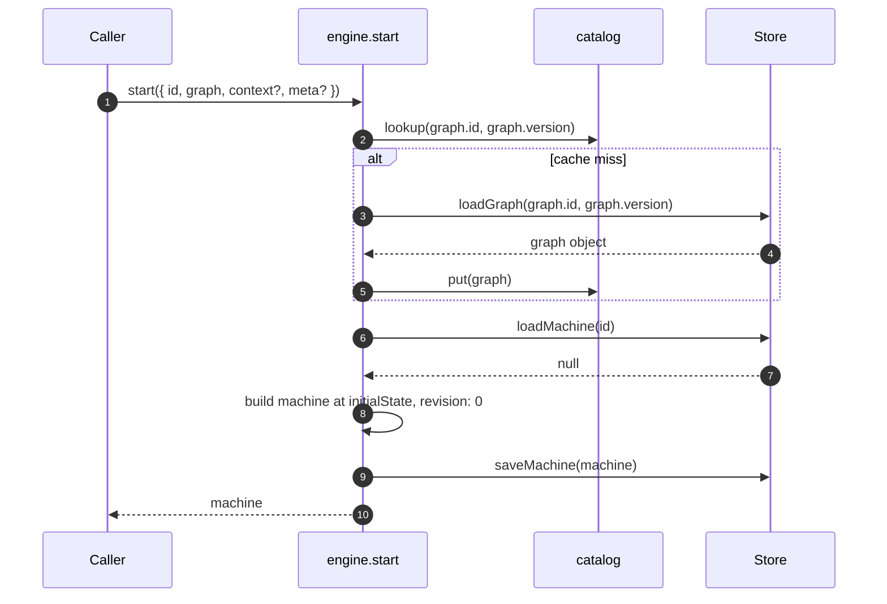
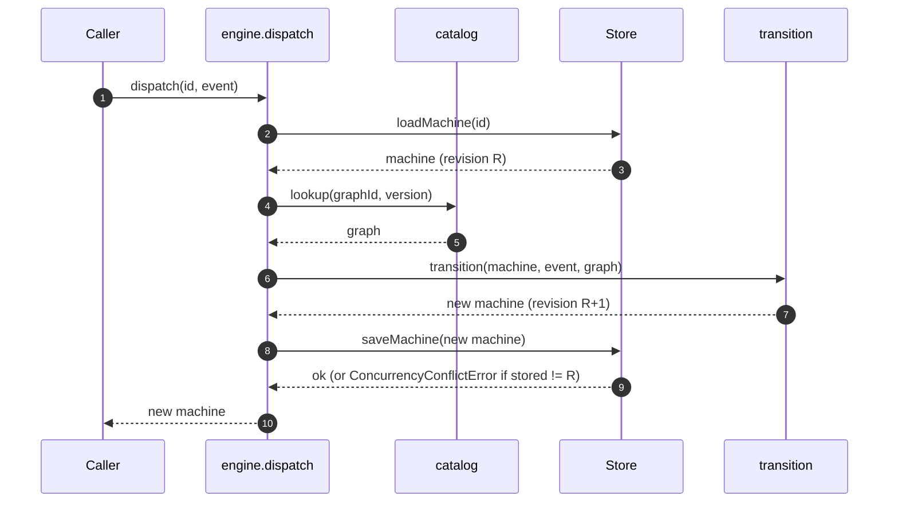
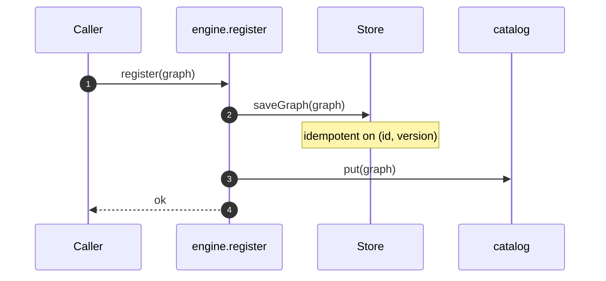

# State Machine — Basic

A generic state machine module. Opaque to domain. Supports a **catalog** of graphs that grows at runtime and loads **lazily** from a persistence store. Deliberately minimal; every feature above the basic extends via documented seams rather than engine modifications. Playbook is one caller; the engine knows nothing about Playbook's 4-phase lifecycle, crafts, briefs, or any other domain term.

Tied to [`foundations.md`](foundations.md).

## The model

A **state** is a node in the graph — an identified position with optional metadata (is it terminal, and — later — entry/exit actions, timeouts). Caller-defined.

A **state id** (`StateId`) is a string identifier that references a state within a graph. It's scoped to its graph: the id `"Planning"` under one graph is a different state than `"Planning"` under another. Machines always carry their `graphId` + `graphVersion` alongside their current state id, so resolution is unambiguous.

An **event** is an input to the machine: a type and an opaque payload.

A **transition** is a rule mapping `(from state id, event type) → to state id`. In graph terms, the edge.

A **graph** is the full set of states and transitions, plus an initial state id. Identified by `(id, version)` the caller chooses (semver, hash, anything).

A **machine** is a stateful entity traversing a graph. Has an id, a current state id, context, a caller-owned `meta` bag, a reference to the graph it runs under (`graphId`, `graphVersion`), and a `revision` counter for optimistic concurrency.

The engine maintains a **graph catalog** that grows over time. Graphs are **persisted** in the store, **registered** into the catalog at runtime, and **loaded lazily** when a machine needs one.

## Engine vs orchestrator

The engine advances **one machine at a time**. Multi-machine orchestration — tree, DAG, pipeline, parallel — lives in an orchestrator above the engine. Playbook's tree orchestrator is one such caller; tests, debuggers, future tools are others.

The engine's job is fixed: "advance one machine's state when an event arrives, using whichever graph that machine belongs to." Everything else is caller work.

## Scope

**In**

- Generic single-machine finite state machine per dispatch.
- Caller-defined states (any string set) and event types (any string set).
- First-class graphs: initial state, states (nodes), transitions.
- **Graph catalog** — many graphs per engine.
- **Runtime registration** — new graphs added while the engine runs.
- **Lazy loading** — graphs load from the store on demand.
- **Graph versioning** — each machine pinned to `(graphId, graphVersion)`; no silent upgrades.
- **Optimistic concurrency** — each machine has a monotonic `revision`; conflicting writes are rejected.
- Opaque payloads on events; engine never reads content.
- One outbound port: `Store` (save / load graphs and machines).
- Three use cases: `register`, `start`, `dispatch`.

**Out (added in later docs)**

1. **Router** — caller-provided port for dynamic transitions (retry loops, blocks, joins, approvals, timeouts all compose from it).
2. **Entry / exit actions** — state- and transition-level side effects.
3. **Guards** — boolean predicates on transitions.
4. **Graph migration** — rules for advancing a machine from older graph versions.
5. **Playbook's tree orchestrator** — pipe, expand, DFS — separate doc at orchestrator level.
6. **Journal and replay** — per-machine append-only event log for audit, replay, and crash recovery.
7. **Parallel step processing** — concurrent machines under structured concurrency.
8. **Transport layers** — MCP, CLI, or any adapter that translates inbound calls into engine invocations.
9. **Subscriber** — caller-provided port that receives transition events as they happen. Matches the Redux/RxJS/XState subscribe idiom. Enables real-time UIs, dashboards, and streaming tools. Pull integrations (GraphQL queries, REST reads) need no engine change; they wrap the `Store` directly.

Each gets its own architecture doc when its turn comes.

## Domain

### State and transition (the model)

We split the state machine into two ideas, the same way LangGraph does — but simpler.

**State** is data. **Transition** is movement.

The basic engine simplifies both:

- **State** is one channel: `state`. `context` carries content alongside but doesn't drive transitions.
- **Transition** is one pure function: `transition(machine, event, graph) → machine`. Rules are a flat table.

### Generic types

```ts
type StateId = string;              // reference/pointer to a State within a graph

type Event = {
  type: string;
  payload: unknown;
};
// Callers MAY define a superset of Event (e.g., add `timestamp`, `correlationId`)
// as long as `type` and `payload` remain present. The engine reads only those two.

type State = {
  id: StateId;
  label?: string;                   // human-readable name for UIs, logs, docs
  terminal?: boolean;
  meta?: Record<string, unknown>;   // caller-owned; engine never reads
  // future (feature-specific): entry?, exit?, timeout?
};

type Transition = {
  from: StateId;                    // points to State.id in the same graph
  event: string;
  to: StateId;
  label?: string;                   // human-readable name for UIs, logs, docs
  meta?: Record<string, unknown>;   // caller-owned; engine never reads
};

type Graph = {
  id: string;
  version: string;
  initialState: StateId;            // points to one of states[].id
  states: State[];
  transitions: Transition[];
};

type Machine = {
  id: string;
  graphId: string;
  graphVersion: string;
  revision: number;                 // starts at 0; engine increments on each save
  state: StateId;                   // points to a State in graph.states
  context: Record<string, unknown>;
  meta: Record<string, unknown>;    // caller-owned; engine never reads
};
```

Every field is either primitive or `unknown`. The engine does not know Playbook's specific states, event types, or anything about `payload` content.

### The step (how one event is processed)

Every `dispatch` is three generic operations:

1. **Update.** Store the event's payload into `context[event.type]`. Mechanical.
2. **Transition.** Look up `(machine.state, event.type)` in the graph's transitions; return the next state.
3. **Increment.** Bump `machine.revision` by 1 so the next save enforces the concurrency contract (see §Concurrency).

Combined in one pure function:

```ts
function transition(
  machine: Machine,
  event: Event,
  graph: Graph,
): Machine;
```

Throws if no row matches, or if the `State` identified by `machine.state` is marked terminal.

The engine resolves `graph` on each dispatch by looking up the machine's `graphId` and `graphVersion` in the catalog, loading from the store lazily if not already cached.

Later features extend step 2 with a **Router port** — at specific rows, the engine asks a caller-provided router for the next state instead of reading it from the row.

### Payload storage — snapshot vs event log

`Machine.context` is a **latest-wins snapshot**, keyed by event type. Dispatching a `plan` event stores `event.payload` at `context.plan`. A second `plan` event overwrites the first. The machine always carries one value per event type: the most recent.

This is intentional. The snapshot is bounded and queryable; it tells you "where is this machine now" without list walking. Callers read `context.plan` on retry to feed the agent the previous plan; no history traversal needed.

Full event history — every attempt, every payload, in order — belongs to the **Journal** (out-of-scope item 6). When the Journal ships, every dispatch appends an entry alongside the snapshot update. Context is the reduced state; Journal is the event stream. Both persistable, both queryable.

### Concurrency

The engine treats dispatches as **per-machine serial**: at most one `dispatch` per `machineId` is in flight at a time. Enforced via optimistic concurrency on the `Store`:

- `Machine.revision` starts at `0` on `start`.
- Each successful `dispatch` increments it by 1 before save.
- `Store.saveMachine` enforces that the stored revision equals `machine.revision - 1` at save time. If not, it throws a conflict error.

On conflict, the caller retries (reload, re-apply, re-save) or fails. The engine itself does not retry — that's a caller policy.

Callers may still need to serialize externally if they want to avoid conflict errors entirely (e.g., a lock per `machineId` at the orchestrator level). The revision field is the safety net; the orchestrator is the first line.

`revision` is a **monotonic integer**, not an opaque etag or a semver string. Integer comparison is trivial (stored + 1 === incoming), doesn't collide with `graphVersion` (the semver string on the graph), and is cheap to persist across any store adapter.

### Graph catalog and lazy loading

The engine holds an in-memory **catalog** keyed by `(graphId, graphVersion)`. The catalog is:

- **Lazy**: populated on demand. When a machine is dispatched and its `(graphId, graphVersion)` isn't in the catalog, the engine calls `Store.loadGraph(...)` and caches the result.
- **Runtime-mutable**: callers register new graphs at any time via `register`. Registration saves to the store and adds to the catalog.
- **Version-precise**: multiple versions of the same `id` can coexist.

Cache policy is adapter-agnostic in the basic version: caches forever unless explicitly evicted. A future revision may add eviction (LRU, TTL) without changing the external API.

## Application layer

### Use cases

```ts
interface Engine {
  // Add or update a graph. Saves to the store and catalogs it.
  register(graph: Graph): Promise<void>;

  // Create a new machine under a specific graph at its initialState.
  // Does NOT apply an event. Use dispatch for the first state change.
  start(params: {
    id: string;                                     // machine id
    graph: { id: string; version: string };         // which graph, which version
    context?: Record<string, unknown>;              // initial context (optional)
    meta?: Record<string, unknown>;                 // initial meta (optional)
  }): Promise<Machine>;

  // Advance an existing machine. Resolves its graph lazily from the catalog.
  dispatch(id: string, event: Event): Promise<Machine>;
}
```

**`register`** — idempotent on `(graph.id, graph.version)`. Saves to the store, updates the catalog.

**`start`** — fails if a machine with `params.id` already exists. Loads the specified graph (cache → store → error), creates a machine at `graph.initialState`, `revision: 0`, stamped with the `graph.id` / `graph.version` from the parameters, saves, returns. No event is applied; the machine is ready to receive its first real event via `dispatch`.

**`dispatch`** — loads machine, looks up its graph (cache → store → error), applies `transition(...)`, bumps `revision`, saves with optimistic check, returns. Fails if the machine doesn't exist, the event has no matching transition, the machine is in a terminal state, or the revision conflicts.

### Outbound port: `Store`

```ts
interface Store {
  // Graphs
  saveGraph(graph: Graph): Promise<void>;
  loadGraph(id: string, version: string): Promise<Graph | null>;

  // Machines (the instances)
  saveMachine(machine: Machine): Promise<void>;
  // Behavior:
  //   - If no machine exists with this id: insert (require machine.revision === 0).
  //   - If a machine exists: update only if stored.revision === machine.revision - 1.
  //   - Otherwise: throw a ConcurrencyConflictError.
  loadMachine(machineId: string): Promise<Machine | null>;
}
```

`saveGraph` is idempotent on `(id, version)`.

Two implementations ship (per `D18`: ≥2 implementations to justify the port):

- `MemoryStore` — Map-backed; for tests.
- `SqliteStore` — `better-sqlite3`-backed; default for real use.

Both JSON-serialize graphs and machines on save.

## Hexagonal layout

```
   Caller
     │
     ▼
   ┌────────────────────────────────────────────┐
   │  Application                               │
   │    register · start · dispatch             │
   │                                            │
   │    (graph catalog, lazy-loaded)            │
   └────────────────┬───────────────────────────┘
                    │
                    ▼
   ┌────────────────────────────────────────────┐
   │  Domain (pure)                             │
   │    transition(machine, event, graph)       │
   └────────────────────────────────────────────┘
                    ▲
                    │ uses
   ┌────────────────┴───────────────────────────┐
   │  Outbound port                             │
   │    Store                                   │
   └────────────────┬───────────────────────────┘
                    │ implemented by
                    ▼
   ┌────────────────────────────────────────────┐
   │  Adapters                                  │
   │    MemoryStore · SqliteStore               │
   └────────────────────────────────────────────┘
```

The catalog lives in the application layer — a cache in front of the `Store` port.

## Composition root

```ts
async function createEngine(config: {
  store: Store;
  graphs?: Graph[];   // optional bootstrap set
}): Promise<Engine>;
```

Behavior:

1. If `graphs` is provided, call `register` for each.
2. Returns an `Engine` exposing `register`, `start`, `dispatch`.

## Sequences

### A. `start`



### B. `dispatch` with warm cache



### C. Runtime registration



## Extension points

The engine is deliberately minimal. Every future capability extends through one of these seams — none require modifying the engine's core.

1. **Generic types.** States, events, context, and metadata are all caller-defined data. The engine carries them, never interprets them.
2. **Open event envelope.** `Event` requires `{type, payload}`. Callers may carry extra fields (`timestamp`, `correlationId`, `source`, etc.) by declaring a superset type in their own code. The engine reads only `type` and `payload`; it neither validates nor strips the rest.
3. **`Store` as a port.** Any adapter that satisfies the interface works. Callers can **wrap** the port (decorator pattern) to add logging, metrics, encryption, retry, or caching without touching the engine or its shipped adapters.
4. **Caller-owned `meta`, everywhere.** Machines, states, and transitions all carry `meta: Record<string, unknown>`. The engine never reads or writes their contents. Use them for: machine iteration counters and deadlines, state display names / descriptions / icons / colors for UIs, transition labels and reasons for operator docs — anything specific to the caller's domain.
5. **Declared future ports.** The Out-of-scope list names the expected extension hooks (`Router`, `Actions`, `Guards`, `Subscriber`). Each becomes an optional port when it ships. Engines constructed without these ports fall back to the basic behavior; engines constructed with them gain the feature. Backward-compatible by construction.
6. **Immutable bedrock.** The types, ports, and invariants documented here are the stable API. New ports are added in minor versions; fields can be added in minor versions; renames and removals require a major version and an ADR. Callers can rely on this contract.

### UI and read-integrations

Pull-style integrations (GraphQL, REST, CLI listing, documentation generators, diagram exporters) are **adapters around `Store`**, not engine changes. The store exposes `loadGraph(id, version)` and `loadMachine(id)`; those are enough to serve any read API. Push-style integrations (dashboards, live timelines) use the future `Subscriber` port for transition events.

For runtime-growing systems where users author many graphs, `State.label` and `Transition.label` hold the human-readable names most UIs need. Anything richer — descriptions, icons, colors, documentation links, tags — goes into `State.meta` and `Transition.meta` as caller-defined shapes. The engine persists all of them as opaque values; the UI reads them through its adapter.

What this rules out (deliberately):

- **Monkey-patching** — the engine doesn't expose internals for runtime mutation.
- **Subclassing** — the engine exposes interfaces; there's no base class to extend. Composition over inheritance.
- **Plugins with unchecked access** — all extension is through typed ports or typed data. No stringly-keyed plugin registry.

## Invariants

- **I-1.** Domain files (`types`, `schemas`, `transition`, `errors`) import nothing outside `src/graph/` domain set.
- **I-2.** `transition` is pure: same `(machine, event, graph)` → same result.
- **I-3.** An event is either applied (machine saved) or rejected (no state change).
- **I-4.** Every outbound port has ≥2 implementations.
- **I-5.** No `any` in domain; Zod gates every event's and graph's shape.
- **I-6.** Engine reads only the structural fields it needs to route events and validate transitions (`id`, `state`, `from`, `to`, `event`, `terminal`, `version`, `revision`). All other fields — `payload`, `context`, `Machine.meta`, `State.label`, `State.meta`, `Transition.label`, `Transition.meta` — pass through unchanged.
- **I-7.** Engine never reads `StateId` values for semantics; it only compares them as strings. Resolution to `State` objects is always scoped by `(graphId, graphVersion)`.
- **I-8.** Every machine carries `(graphId, graphVersion)`. Dispatch uses that exact version; no silent upgrades.
- **I-9.** `saveGraph` and `register` are idempotent on `(id, version)`.
- **I-10.** The catalog is a cache: any entry must be reconstructible from the store. Clearing the catalog never loses data.
- **I-11.** `Machine.revision` is monotonically non-decreasing across the machine's lifetime. Every successful `dispatch` increments it by exactly 1. Conflicting writes are rejected.

## Tests we expect

- **Domain tests** — `transition` against tables of `(state, event, graph) → state`. Pure, no I/O.
- **Use-case tests** — `register`, `start`, `dispatch` with `MemoryStore`.
- **Adapter contract tests** — run against `MemoryStore` and `SqliteStore`. Cover graph save/load, machine save/load, idempotent graph save, optimistic concurrency conflict.
- **Payload-opacity tests** — round-trip arbitrary payload shapes.
- **State-opacity tests** — configure with arbitrary random `StateId`s; behavior unchanged.
- **Event-envelope extensibility tests** — dispatch events with extra fields beyond `{type, payload}`; assert the engine ignores them.
- **Lazy-loading tests** — dispatch a machine whose graph is only in the store; catalog populates from the store once.
- **Runtime-registration tests** — start with empty catalog; register at runtime; dispatch against it.
- **Multi-version tests** — two versions of one id coexist; machines advance under their respective versions.
- **Concurrency-conflict tests** — simulate a stale write; assert the conflict is raised and no state changes.
- **Terminal-state tests** — events into terminal machines are rejected.
- **Missing-graph tests** — dispatch against a machine whose graph is neither cached nor stored; clean error.
- **Store-decorator test** — wrap `MemoryStore` with a logging decorator; engine behavior unchanged; log captures calls.

## Appendix: Playbook's configuration (example)

Playbook authors let users create playbooks at runtime. Each playbook is a graph registered into the engine's catalog.

```ts
const engine = await createEngine({
  store: new SqliteStore("./.playbook.sqlite"),
  // no pre-registered graphs; all arrive at runtime
});

// user creates a new playbook → orchestrator registers its graph
await engine.register({
  id: "playbook.user-123.tdd-workflow",
  version: "1",
  initialState: "Initializing",
  states: [
    { id: "Initializing", label: "Setting up" },
    { id: "Planning",     label: "Planning" },
    { id: "Working",      label: "Executing" },
    { id: "Evaluating",   label: "Evaluating" },
    { id: "Completed",    label: "Done", terminal: true },
  ],
  transitions: [
    { from: "Initializing", event: "plan", to: "Planning",   label: "Propose plan" },
    { from: "Planning",     event: "work", to: "Working",    label: "Start work" },
    { from: "Working",      event: "eval", to: "Evaluating", label: "Submit evaluation" },
    { from: "Evaluating",   event: "eval", to: "Completed",  label: "Finalize" },
  ],
});

// orchestrator starts a machine at the graph's initialState (no event applied)
const machine = await engine.start({
  id: "run-abc",
  graph: { id: "playbook.user-123.tdd-workflow", version: "1" },
  context: { brief: /* caller-defined */ },
});
// machine.state === "Initializing", revision === 0

// orchestrator then dispatches the first event to advance
await engine.dispatch("run-abc", { type: "plan", payload: /* caller-defined */ });
// → state === "Planning", revision === 1
```

Playbook's `Brief`, `Plan`, `Work`, `Eval` payload shapes live in Playbook's domain — the engine sees them only as `unknown`.

## How this changes

When a future feature in the "Out" list begins implementation, write a new architecture doc that adds it on top of this one. Each new doc states what it changes (types, ports, invariants), proposes the deltas, and lands as a PR alongside the code. This document stays as the bedrock — features extend via the documented extension points. No feature introduces domain-specific concepts into the engine. The engine stays payload-blind, state-blind, and domain-blind.
