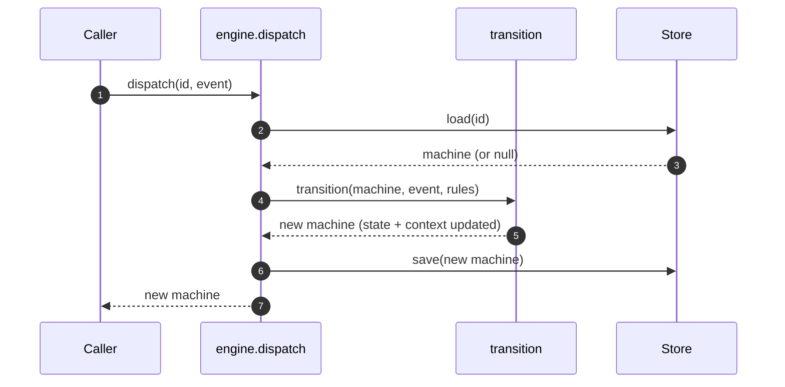

# State Machine — Basic

A generic state machine module. Opaque to domain. Configured at construction with a state set, an event set, transitions, and optional ports. Playbook is one caller; the engine knows nothing about Playbook's 4-phase lifecycle, crafts, briefs, or any other domain term.

Tied to [`foundations.md`](foundations.md).

## The model

A **state** is a label for a position. Any string. Caller-defined.

An **event** is an input to the machine: a type and an opaque payload.

A **machine** is a stateful entity that traverses states by receiving events. Has an id, a current state, context (writable data), and metadata (caller-owned bag).

A **transition** moves a machine from one state to another. Rules are declarative data; an optional router port handles dynamic branches.

The engine treats state labels, event types, and payloads as opaque. It routes, stores, and persists — the caller interprets.

## Engine vs orchestrator

The engine advances **one machine at a time**. Anything involving multiple machines — tree, DAG, pipeline, parallel branches, dependencies — is **orchestration** and lives outside the engine. An orchestrator is a caller that decides which machine gets which event when.

Playbook is one orchestrator (it arranges machines into a tree and walks them depth-first). Other callers — tests, pipeline tools, DAG runners, debuggers — arrange machines into entirely different shapes using the same engine. The engine stays the same across all of them.

This is the deepest split in the architecture. Every "feature" in the Out list below is either (a) an extension to the engine's primitives (transitions, router, actions, context) or (b) work that lives entirely in an orchestrator. Nothing expands the engine's job beyond "advance one machine's state when an event arrives."

## Scope

**In**

- Generic single-machine finite state machine.
- Caller-defined states (any string set).
- Caller-defined event types (any string set).
- Caller-defined transitions as data.
- Opaque payloads on events; engine never reads content.
- One outbound port: `Store` (save / load machine).
- One use case: `dispatch`.

**Out (added in later docs)**

1. **Router** — caller-provided port for dynamic transitions (enables retry loops, blocks, aggregate joins, approval gates, timeouts — all as caller compositions).
2. **Entry actions** — transition-declared actions run after the state change; handlers caller-provided.
3. **Guards** — boolean predicates on transitions (does this rule apply?), caller-provided.
4. **Playbook's tree orchestrator** — pipe (sequential machines), expand (composite with children), DFS traversal. A separate architecture doc at the orchestrator level; does not modify the engine.
5. **Journal and replay** — crash-recovery log alongside the store.
6. **Parallel step processing** — concurrent machines under structured concurrency.
7. **Transport layers** — MCP, CLI, or any adapter that translates inbound calls into `dispatch` invocations.

Each gets its own architecture doc when its turn comes.

## Domain

### State and transition (the model)

We split the state machine into two ideas, the same way LangGraph does — but simpler.

**State** is data. In LangGraph, state is a typed dictionary of *channels*, each with a reducer function that says how updates merge. Multiple channels coexist; reading state means reading the current value of every channel.

**Transition** is movement. In LangGraph, transition is the *graph* — edges between named *nodes*, where each node is a function that returns a partial state update. The graph decides what runs next.

The basic engine simplifies both:

- **State** is one channel: `state` (the position). `context` carries content alongside but does not drive transitions.
- **Transition** is one pure function: `transition(machine, event) → machine`. Rules are a flat table; no graph definition, no node functions, no conditional edges.

Pay the LangGraph tax (subgraph quirks, ephemeral checkpoint namespaces, type leakage — see handbook issue #4) only when the engine actually needs it. The basic version doesn't.

### Generic types

```ts
type State = string;                 // caller-defined label

type Event = {
  type: string;                      // caller-defined event type
  payload: unknown;                  // opaque to engine
};

type Machine = {
  id: string;
  state: State;
  context: Record<string, unknown>;  // keyed by event.type; payload-opaque
  metadata: Record<string, unknown>; // caller-owned bag
};

type Transition = {
  from: State;
  event: string;                     // matches Event.type
  to: State;                         // the next state
};
```

Every field is either primitive or `unknown`. The engine does not know Playbook's states, its event types, or anything about `payload` content.

### The step (how one event is processed)

Every `dispatch` call is two generic operations:

1. **Update.** Store the event's payload into `context[event.type]`. Mechanical; the engine routes by `event.type` only and never reads payload content.
2. **Transition.** Determine the next state. In the basic version, this is a lookup in the caller-provided transition table.

In the basic version both are combined in one pure function:

```ts
function transition(
  machine: Machine,
  event: Event,
  transitions: Transition[],
): Machine;
```

Maps `(machine.state, event.type)` to the next state via `transitions`, and stores `event.payload` into `context[event.type]`. Throws if no row matches, or if the machine is in a terminal state (a state with no outgoing transitions).

Later features extend step 2 with a caller-provided **`Router` port** — at specific rows, the engine asks the router for the next state instead of reading it from the row. That extension point lets the caller compose retry loops, blocks, joins, approvals, timeouts — all without the engine growing new vocabulary.

## Application layer

### Use case: `dispatch`

The engine's only public method in the basic version.

```ts
interface Engine {
  dispatch(machineId: string, event: Event): Promise<Machine>;
}
```

Flow:

1. Load machine via `Store.load(machineId)`. If `null` and the caller's transitions permit starting fresh with this event, create a new machine.
2. Apply `transition(machine, event, transitions)` → new machine.
3. Save via `Store.save(newMachine)`.
4. Return the new machine.

Validation errors (no matching transition, machine in terminal state) reject the call without saving.

### Outbound port: `Store`

```ts
interface Store {
  save(machine: Machine): Promise<void>;
  load(machineId: string): Promise<Machine | null>;
}
```

Two implementations ship together (per `D18`: ≥2 implementations to justify the port):

- `MemoryStore` — Map-backed; for tests.
- `SqliteStore` — `better-sqlite3`-backed; default for real use.

Both JSON-serialize `context` and `metadata` on save. Non-serializable payloads (functions, Symbols, cyclic refs) fail at save time — a caller concern, not the engine's.

## Hexagonal layout

```
   Caller
     │
     ▼
   ┌────────────────────────────────────────┐
   │  Application                           │
   │    engine.dispatch                     │
   └────────────────┬───────────────────────┘
                    │
                    ▼
   ┌────────────────────────────────────────┐
   │  Domain (pure)                         │
   │    transition(machine, event, rules)   │
   └────────────────────────────────────────┘
                    ▲
                    │ uses
   ┌────────────────┴───────────────────────┐
   │  Outbound port                         │
   │    Store                               │
   └────────────────┬───────────────────────┘
                    │ implemented by
                    ▼
   ┌────────────────────────────────────────┐
   │  Adapters                              │
   │    MemoryStore                         │
   │    SqliteStore                         │
   └────────────────────────────────────────┘
```

"Caller" is whoever invokes `dispatch`. In tests: the test itself. In integration: a future transport adapter. The engine doesn't know and doesn't care.

## Composition root

```ts
function createEngine(config: {
  transitions: Transition[];
  store: Store;
}): Engine;
```

Returns an `Engine` exposing `dispatch`. One factory. The caller passes its transitions (the state and event vocabulary it wants to support) alongside the persistence adapter.

## Sequence: a generic event round trip



One linear path, regardless of what states or event types the caller defined.

## Invariants

- **I-1.** Domain imports nothing outside `src/domain/`.
- **I-2.** `transition` is pure: same `(machine, event, transitions)` → same result.
- **I-3.** An event is either applied (saved) or rejected (no state change).
- **I-4.** Every outbound port has ≥2 implementations.
- **I-5.** No `any` in domain; Zod gates every event's **shape** (not payload content).
- **I-6.** Engine never reads `payload`, `context`, or `metadata` content. They pass through unchanged.
- **I-7.** Engine never reads state labels for semantics; it only compares them as strings.

## Tests we expect

Module is testable in isolation:

- **Domain tests** — `transition` against a table of `(state, event, transitions) → state` cases. Configure transitions per test. No I/O, no mocks.
- **Use-case tests** — `dispatch` with `MemoryStore` and a small transition set. Assert machine state after each event.
- **Adapter contract tests** — same suite run against `MemoryStore` and `SqliteStore`. Both must pass.
- **Payload-opacity tests** — round-trip arbitrary payload shapes through any event type; assert the engine hands back exactly what it received.
- **State-opacity tests** — configure the engine with arbitrary state labels (random strings); assert behavior is identical to the named-state configuration.

## Appendix: Playbook's configuration (example)

Playbook is one caller. Its configuration of the engine, for reference — not part of the engine itself.

**States (5, linear, terminal at last):**

```
"Initializing" → "Planning" → "Working" → "Evaluating" → "Completed"
```

**Event types (4):**

```
"initialize", "plan", "work", "eval"
```

**Transitions (5, basic linear):**

```ts
[
  { from: "(fresh)",       event: "initialize", to: "Initializing" },
  { from: "Initializing",  event: "plan",       to: "Planning" },
  { from: "Planning",      event: "work",       to: "Working" },
  { from: "Working",       event: "eval",       to: "Evaluating" },
  { from: "Evaluating",    event: "eval",       to: "Completed" },
]
```

(The last row's auto-completion on any `eval` is Playbook's basic-version choice; richer outcome policies come with the `Router` feature doc.)

Playbook also defines the `Brief`, `Plan`, `Work`, `Eval` shapes that its agents produce as `payload`, but those live in Playbook's domain — the engine never sees them as anything but `unknown`.

## How this changes

When a future feature in the "Out" list begins implementation, write a new architecture doc that adds it on top of this one. The new doc states what it changes (which types / ports / invariants), proposes the deltas, and lands as a PR alongside the code. This document stays as the immutable bedrock — features extend via **generic primitives** (router port, entry actions as data, guards as data, metadata bucket, tree composition at app level). No feature introduces domain-specific concepts into the engine. The engine stays payload-blind, state-blind, and domain-blind.
