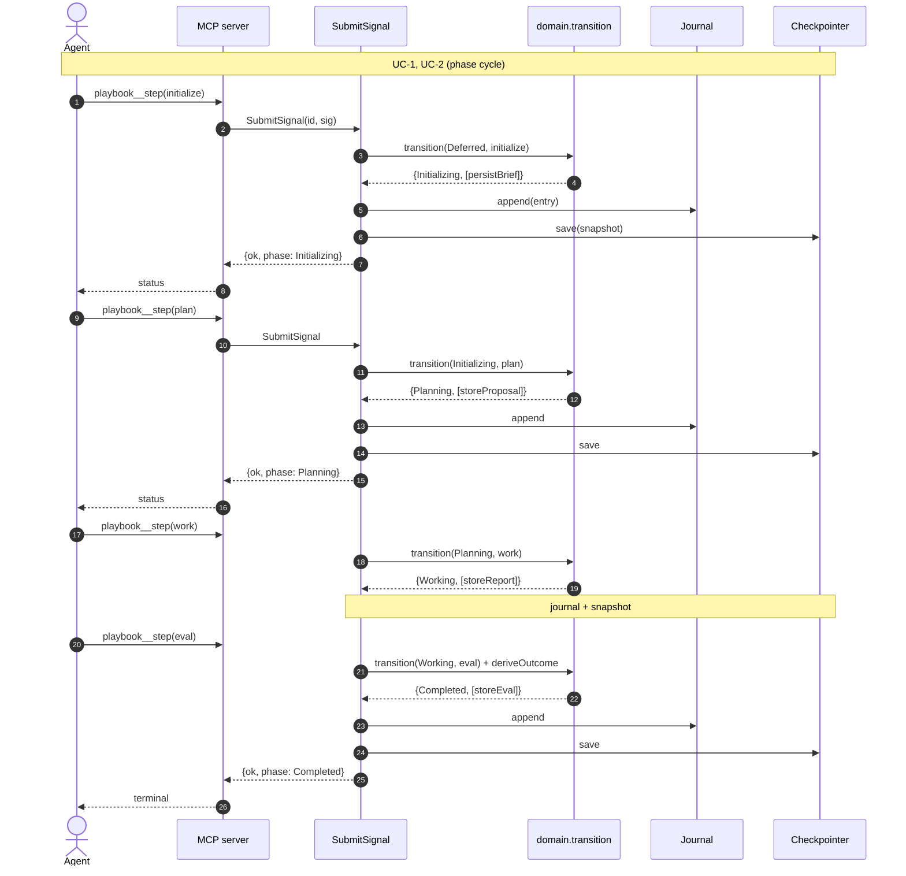
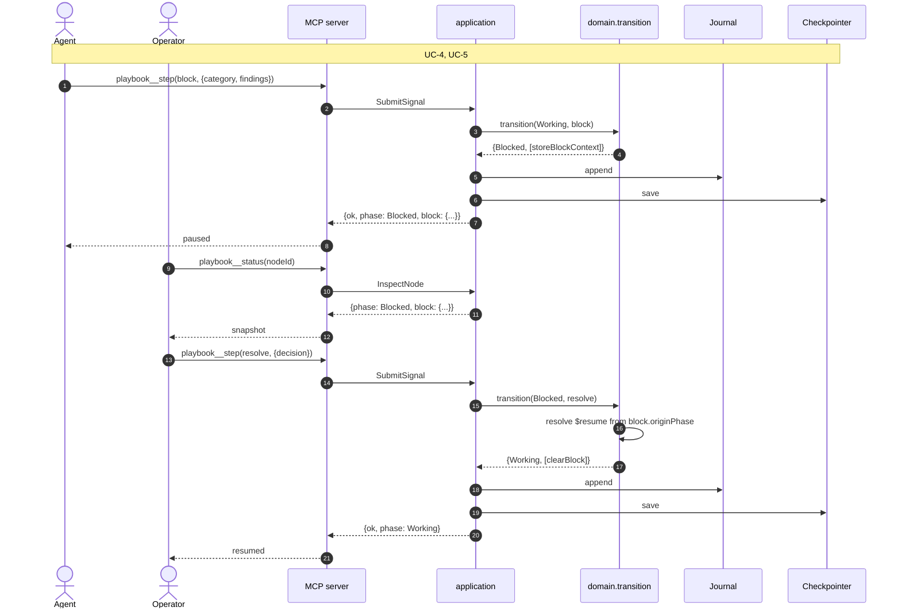
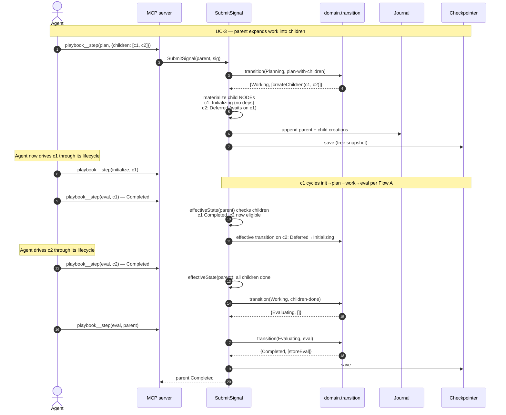
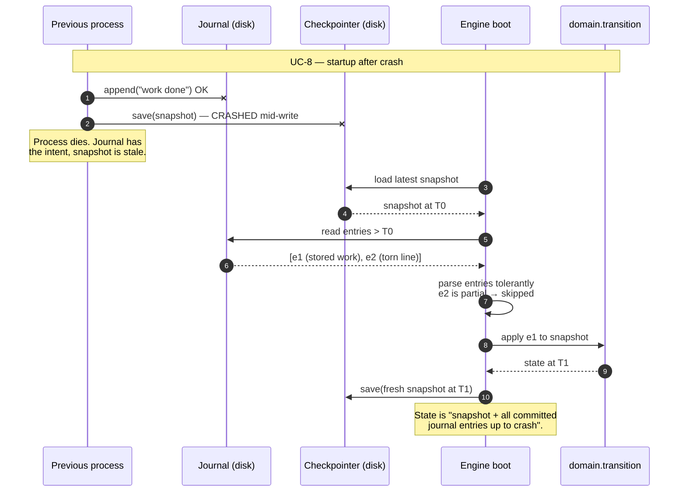

# State Machine Architecture

How Playbook's state machine is organized. Scope: the engine core and the ports around it, not the MCP protocol details or CLI surface beyond how they call in.

Tied to [`foundations.md`](foundations.md); principle and decision references (`P*`, `D*`) point there.

## Shape in one sentence

A per-NODE finite state machine drives each unit of work through four phases (init → plan → work → evaluate). Composite NODEs expand `work` into a recursive sub-tree of child NODEs. Signals mutate state through a single pure transition function. Everything else — persistence, transport, time — sits behind ports at the boundary.

## Actors and user stories

Three actors (`P4`). Each has a set of goals the engine must serve.

### Operator (human)

- Start a playbook run from a task spec.
- Inspect the state tree at any time — what's running, what's blocked, what's done.
- Unblock a NODE when the agent escalates.
- Checkpoint before risky work and restore if it goes wrong.
- Cancel a run cleanly, without leaving corrupted state.

### Agent (AI coding agent)

- Fetch the brief for a NODE it has been assigned.
- Submit its output for the current phase (plan, work, eval).
- Signal a block when it cannot proceed (missing capability, security concern, ambiguity, policy violation).
- Resume from the same phase after an interrupt.

### Harness (engine itself)

- Persist every transition before returning, so no work is lost on crash.
- Replay the journal on startup to recover the last consistent state.
- Enforce invariants — sequence validity, irreversible-action gates, dependency ordering.
- Never read playbook or craft content; treat them as opaque payload in the brief.

## Use cases

Each use case is triggered by an actor, flows through the engine, and produces an outcome. Implementations live in the application layer; adapters route to them.

### UC-1: Start a NODE

| | |
|---|---|
| **Actor** | Operator (via CLI → MCP, or MCP client directly) |
| **Trigger** | First `playbook__step` call with an `initialize` signal for a fresh `nodeId` |
| **Preconditions** | No NODE with this `nodeId` exists in the session |
| **Flow** | 1. Validate and enrich the `initialize` signal. 2. Create the NODE with `phase = Initializing`, store brief. 3. Append journal entry. 4. Write snapshot atomically. 5. Respond with current NODE snapshot. |
| **Postconditions** | NODE exists; phase is `Initializing`; journal has one entry |
| **Exceptions** | Signal schema invalid → validation error, no state change. Session storage unavailable → infrastructure error, no state change. |

### UC-2: Agent submits a phase output

| | |
|---|---|
| **Actor** | Agent |
| **Trigger** | `playbook__step` with `plan`, `work`, or `eval` signal |
| **Preconditions** | NODE exists; current phase matches what the signal expects (rules table enforces) |
| **Flow** | 1. Validate + enrich signal. 2. `transition(state, signal)` → `{nextState, actions}`. 3. Apply actions (store proposal / report / eval). 4. Append journal entry. 5. Write snapshot. 6. Respond with new phase + any operator prompts. |
| **Postconditions** | Phase has advanced per the transition rules (or stayed, for retries) |
| **Exceptions** | Wrong phase for this signal type → rejected, no state change. Guard failed (e.g., eval with incomplete gates) → rejected. |

### UC-3: Composite NODE expands into children

| | |
|---|---|
| **Actor** | Agent (implicit, via a `plan` signal with `children: [...]`) |
| **Trigger** | `plan` signal whose payload carries a non-empty `children` array |
| **Preconditions** | Parent NODE is in `Planning`; `kind = composite` |
| **Flow** | 1. Validate the children specification (IDs unique within parent, dependencies resolvable, no cycles). 2. Transition parent `Planning → Working`. 3. Emit `createChildren` entry action; each child NODE is materialized in `Deferred` (with deps) or `Initializing` (no deps). 4. Journal + snapshot. |
| **Postconditions** | Parent in `Working`; children exist; ready children can receive their own signals |
| **Exceptions** | Child spec invalid (duplicate IDs, cyclic deps) → rejected, parent stays in `Planning`. |

### UC-4: Agent signals a block

| | |
|---|---|
| **Actor** | Agent (or engine via preflight/integrity check) |
| **Trigger** | `block` signal from agent, or engine-generated `preflight_block` / `integrity_block` |
| **Preconditions** | NODE is in any non-terminal phase |
| **Flow** | 1. Validate + enrich (attach `originState`, `category`, optional `findings`). 2. Transition to `Blocked` with origin stored in `block.originPhase`. 3. Cascade: any ancestor in `evaluate` that is waiting on this NODE pauses. 4. Journal + snapshot. 5. Respond with block context for operator. |
| **Postconditions** | NODE in `Blocked`; operator needed before progress |
| **Exceptions** | NODE already terminal → rejected (can't block a completed NODE). |

### UC-5: Operator unblocks a NODE

| | |
|---|---|
| **Actor** | Operator |
| **Trigger** | `resolve` or `security_override` signal with a decision payload |
| **Preconditions** | NODE is in `Blocked`; operator identity on the signal |
| **Flow** | 1. Validate signal. 2. Resolve `$resume` target from `block.originPhase` + decision. 3. Transition to the resume target. 4. Journal + snapshot. 5. Respond with resumed phase. |
| **Postconditions** | NODE back in the phase it was blocked from |
| **Exceptions** | NODE not `Blocked` → rejected. |

### UC-6: Operator inspects state

| | |
|---|---|
| **Actor** | Operator |
| **Trigger** | `playbook__status` MCP call |
| **Preconditions** | — |
| **Flow** | 1. Load the requested NODE (or the whole tree). 2. Compute `effectiveState` for each NODE (resolves deferred / composite phases against the tree). 3. Respond with snapshot + effective states + derivation. |
| **Postconditions** | No state change (read-only; `D5`). |
| **Exceptions** | Unknown `nodeId` → returns `null`, not an error. |

### UC-7: Operator checkpoints and restores

| | |
|---|---|
| **Actor** | Operator |
| **Trigger** | `checkpoint` signal (save), `restore` signal (load) |
| **Preconditions** | For restore: checkpoint ID exists in the Checkpointer's list |
| **Flow (checkpoint)** | Save the current tree snapshot with a label; record the checkpoint ref. |
| **Flow (restore)** | Load the snapshot by ref; truncate journal entries after the snapshot's timestamp; emit `state_restored` signal for audit. |
| **Postconditions** | State matches the labeled snapshot; journal reflects the restore action. |
| **Exceptions** | Checkpoint ref not found → rejected with recoverable error. |

### UC-8: Engine replays journal after crash

| | |
|---|---|
| **Actor** | Harness (itself) |
| **Trigger** | Engine starts and finds a snapshot + journal entries newer than the snapshot |
| **Preconditions** | Checkpointer returns a last snapshot; Journal returns entries > snapshot.timestamp |
| **Flow** | 1. Load snapshot into memory. 2. Iterate journal entries newer than snapshot, applying each `transition + actions` in order. 3. If the last journal line is a torn partial write, skip it. 4. After replay, write a fresh snapshot so next crash replays less. |
| **Postconditions** | In-memory state equals "snapshot + all committed signals up to the crash." |
| **Exceptions** | Journal entry rejected by current rules (schema drift) → halt startup with explicit error, do not proceed silently. |

## Hexagonal layers

Per `D8` (transport, handler, flow three-layer rule) and `D9` (no engine side-channels), the engine is hexagonal: pure domain at the center, ports for dependencies, adapters at the edge. Cross-layer imports fail the build.

```
┌─────────────────────────────────────────────────────────────────┐
│ Inbound adapters                                                │
│   MCP server (playbook__status, playbook__step)                 │
│   CLI (thin client over MCP per D21)                            │
└─────────────────────────────┬───────────────────────────────────┘
                              │ calls
┌─────────────────────────────▼───────────────────────────────────┐
│ Application (use cases)                                         │
│   StartNode · SubmitSignal · InspectNode · UnblockNode          │
│   Checkpoint · Restore                                          │
│                                                                 │
│ Uses outbound ports:                                            │
│   Checkpointer · Journal · Clock · (future) AbortRegistry       │
└─────────────────────────────┬───────────────────────────────────┘
                              │ invokes
┌─────────────────────────────▼───────────────────────────────────┐
│ Domain (pure)                                                   │
│   NodeState · Signal · TransitionRules                          │
│   transition(state, signal): {nextState, actions}               │
│   deriveOutcome(gates, iterations): Outcome                     │
│   resolveEffectiveState(state, tree): EffectiveState            │
└─────────────────────────────────────────────────────────────────┘
                              ▲
                              │ implements
┌─────────────────────────────┴───────────────────────────────────┐
│ Outbound adapters                                               │
│   MemoryCheckpointer · SqliteCheckpointer (D22)                 │
│   NdjsonJournal · SystemClock                                   │
└─────────────────────────────────────────────────────────────────┘
```

## Domain

### Phases

A NODE is always in one of these phases. Discriminated union; exhaustive checks at every switch site.

| Phase | Meaning |
|---|---|
| `Deferred` | Waiting on dependencies |
| `Initializing` | Brief is being set |
| `Planning` | Agent is proposing a plan |
| `Working` | Agent is executing (leaf) or children are running (composite) |
| `Evaluating` | Agent is producing a gate report |
| `Completed` | Terminal success |
| `Failed` | Terminal failure |
| `Blocked` | Paused; awaits operator unblock |

### Node shape

```ts
type Node = {
  id: string;
  kind: "terminal" | "composite";
  phase: Phase;
  brief?: Brief;
  derivation: {
    proposal?: Proposal;
    report?: Report;
    gates?: GateResult;
  };
  iteration: number;
  capped: boolean;
  dependencies: string[];         // sibling IDs this NODE waits on
  children?: Node[];              // composite only; recursion lives here
  block?: BlockContext;           // set when phase === Blocked
};
```

A playbook's entire state is a tree of nodes. The engine does not flatten composites into separate threads; tree shape is the state shape.

### Signals

Two families, discriminated by `type`:

- **Agent signals** — thin payloads submitted via MCP: `initialize`, `plan`, `work`, `eval`, `block`, `resolve`.
- **Engine signals** — rich payloads generated internally: `preflight_block`, `cascade_block`, `state_restored`, `node_failed`, `integrity_block`.

Agent signals are **enriched at the boundary** (category, origin state, tree context) before reaching the reducer, so the reducer sees one consistent shape. All signals are Zod-discriminated unions per `D3`.

### Transition rules

Declarative table, not a switch. Each row:

```ts
type TransitionRule = {
  from: Phase | "$nonTerminal";
  signal: SignalType;
  guard?: (input: TransitionInput) => boolean;
  to: Phase | "$resume";
  actions: EntryAction[];
};
```

The rule table is **data**, not code. Visualizing, auditing, and fuzzing the state machine works against the table directly. Guards are pure functions; `$resume` resolves through a separate helper that reads the block context.

### Entry actions

Transitions may emit actions after validation — `persistBrief`, `storeProposal`, `storeReport`, `incrementIteration`, `setCapped`, `createChildren`, `archiveChildren`. Actions are data, applied after the phase move. They mutate NODE content but not phase, which keeps `canTransition` pure.

### Outcome derivation

`eval` signals carry gate booleans (security, authenticity, quality). The engine — not the agent — derives the outcome:

```ts
deriveOutcome({security, authenticity, quality}, iterations): "completed" | "retry" | "capped" | "blocked"
```

Policy lives in the engine. Agents report facts; the engine decides verdicts. Matches `P1` (harness, not agent).

### Effective state

For a composite NODE, the stored `phase` may be `Working` while its children are still running. Dependency-waiting NODEs stay `Deferred` until their deps finish. The engine computes **effective state** on demand:

```ts
resolveEffectiveState(node, getPeer): EffectiveState
```

Stored state is what's written; effective state is what transitions read. Separating them lets the tree advance without rewriting ancestor rows.

## Application layer

### Inbound ports (use cases)

Use cases are the engine's public surface. Each one takes a DTO in, returns a DTO out. No transport leaks.

| Use case | Purpose |
|---|---|
| `StartNode(nodeId, brief)` | Initialize a NODE with its brief |
| `SubmitSignal(nodeId, signal)` | Apply an agent signal; advance phase |
| `InspectNode(nodeId)` | Read current + effective state |
| `UnblockNode(nodeId, decision)` | Operator resolution of a block |
| `Checkpoint(label?)` | Snapshot the tree |
| `Restore(checkpointId)` | Restore a prior snapshot |

### Outbound ports (dependencies)

Every side effect is a port. Implementations live in adapters.

**`Checkpointer`** (`D22`) — persistence:

```ts
interface Checkpointer {
  save(nodeId, snapshot): Promise<void>;
  load(nodeId, ref?): Promise<NodeSnapshot | null>;
  list(nodeId): Promise<CheckpointRef[]>;
  delete(nodeId, ref?): Promise<void>;
}
```

**`Journal`** — append-only event log (lives inside the checkpoint per `D22`, but exposed as a port so adapters can materialize differently):

```ts
interface Journal {
  append(entry: JournalEntry): Promise<void>;
  read(nodeId): AsyncIterable<JournalEntry>;
}
```

**`Clock`** — for determinism (`P6`):

```ts
interface Clock {
  now(): Date;
}
```

**Future**: `AbortRegistry` for parallel NODE cancellation; added when parallel execution lands (see Later section).

Ports follow `D18` (no premature ports): each has ≥2 real implementations or real test variation.

## Adapters

### Outbound (shipped)

- `MemoryCheckpointer` — for tests and ephemeral runs. Snapshots live in a `Map`.
- `SqliteCheckpointer` — production default for solo tier. One row per checkpoint; `(nodeId, timestamp)` index.
- `NdjsonJournal` — append-only file at `.playbook/<nodeId>.journal.ndjson`.
- `SystemClock` — `new Date()`.

Third-party impls users can plug in: Postgres, S3, git-backed, encrypted. All satisfy the same port.

### Inbound

- `McpServer` (foreground + daemon modes per `P8`) — exposes `playbook__status` and `playbook__step` tools (`D5`). Parses incoming tool calls into use-case DTOs, routes to the application layer, formats responses.
- `Cli` — thin client over MCP (`D21`). `playbook run`, `playbook status`, `playbook resume` translate to MCP calls against the local daemon.

## Sequence diagrams

Four flows that matter most. Each shows how the layers collaborate for one use case.

### Flow A: Happy path — agent drives a terminal NODE to completion



### Flow B: Block and resolve



### Flow C: Composite NODE with children



### Flow D: Crash and recovery



These four cover init/cycle, block/resolve, composite expansion, and recovery. Parallel-child flows will get their own diagram when structured concurrency ships.

## Composition root

One factory function wires everything. Nothing else touches the dependency graph:

```ts
export function createEngine(deps: {
  checkpointer: Checkpointer;
  journal: Journal;
  clock: Clock;
}): Engine;
```

`Engine` exposes the use cases. `McpServer` and `Cli` each instantiate an `Engine` with the adapters appropriate for their runtime (in-process for foreground CLI; shared long-running instance for daemon mode).

## Concurrency and interrupts

### Today: sequential

Each `SubmitSignal` call runs to completion on a single NODE. Multiple NODEs advance between calls, not during. Composite children run sequentially. This matches the `0.1.0` and `0.2.0` release goals.

### Later: parallel children

Once v0.3.0+ adds parallel NODE execution:

- **Structured concurrency** — children run under a parent `AbortSignal`. Parent cancellation aborts all children.
- **Join semantics** — `Promise.all` for wait-all; later per-playbook choice among `allSettled` / `race` / `any`.
- **Per-child isolation** — one child failing does not abort siblings by default; opt-in fail-fast.
- **No new framework** — structured concurrency is native Node. The engine orchestrates; nursery-style helpers stay inside domain code.

Interrupts at operator level are already uniform:

- Agent submits `block` signal (or engine derives a block from preflight/integrity checks) → NODE enters `Blocked`.
- Operator submits `resolve` (or `security_override`) signal → `$resume` rule resolves to the pre-block phase.
- Blocks cascade up composites: a blocked descendant pauses ancestor `evaluate`.

## Persistence and recovery

### Journal inside checkpoint

`D22`: the journal lives inside each NODE's checkpoint, not a sidecar file. One atomic write per transition; no dual-store consistency problem.

### Journal-first commit

Each signal:

1. Validate + enrich (pure).
2. Run `transition` (pure). Get `{nextState, actions}`.
3. Apply actions (may touch derivation, not phase).
4. Append to journal.
5. Write snapshot atomically (tmp + rename; whatever the adapter does).
6. Return response.

If step 5 crashes: journal has the intent, snapshot is stale → replay on next start.
If step 4 crashes: neither persisted → signal is effectively dropped (client can retry).

### Replay

On startup, the engine reads the latest snapshot, then replays any journal entries after the snapshot's timestamp. Adapters guarantee tolerant reads: a partial last line is skipped, not rejected.

### Checkpoints

Adapters may keep N historical checkpoints. Restore walks to a named checkpoint, discards newer journal entries, reinstates state. Operator-triggered only — no automatic restore.

## What we carried forward

From `../foreman` (trial) and `../harness` (prior DIY):

| Pattern | Source | Where it lives |
|---|---|---|
| Discriminated-union signals (Zod) | foreman | `domain/signal.ts` |
| Declarative transition table | foreman | `domain/transition.ts` |
| Outcome as truth table (engine-owned) | foreman | `domain/outcome.ts` |
| Entry actions as data, applied post-transition | foreman | `domain/actions.ts` |
| Stored vs. effective state distinction | foreman | `domain/effective-state.ts` |
| Journal-first + atomic snapshot | foreman + harness | adapters |
| Tolerant journal recovery | harness | `NdjsonJournal` |
| Flat phase machine + orchestration loop outside | harness | state machine doesn't schedule |

## What we left behind

| Pattern | Why |
|---|---|
| LangGraph framework | Wrong shape (async fanout vs. signal-driven recursion); trial documented six deviations. Native TS covers our needs. See handbook issue #4. |
| Phase-only state (harness) | Not enough for multi-actor crash recovery; we need richer per-NODE derivation in state. |
| Hard-coded persistence paths (foreman) | `D22` requires a port. No direct filesystem writes from application. |
| Callback-driven orchestration (harness) | MCP contract + typed signals replace hooks. |

## Invariants

- **I-1.** Domain layer imports nothing outside `src/domain/`.
- **I-2.** Application layer imports only `domain/` and `application/ports/`.
- **I-3.** A transition function is pure: same inputs → same `{nextState, actions}`.
- **I-4.** A signal is either applied (journaled) or rejected (no partial state change).
- **I-5.** `phase` in storage ≠ `effectivePhase` computed from tree; transitions use the computed one.
- **I-6.** Every outbound port has ≥1 in-memory test impl plus ≥1 production impl.
- **I-7.** No wall-clock reads outside the `Clock` port.
- **I-8.** No `any` types in domain; Zod schemas gate every inbound signal.

Violations fail CI — enforced via boundary rules in `foreman-lab/playbook`.

## Open questions

Deferred until implementation forces concrete answers:

- **Schema evolution** — how does a journal written at v0.1 replay under v0.2? Explicit `schemaVersion` field per entry, or adapter-level migration?
- **Composite join policies** — default `allSettled`? Per-NODE override? User-authored in the playbook YAML?
- **Operator interrupt latency** — is there a soft deadline for a NODE to honor an interrupt, or purely best-effort?
- **Checkpoint compaction** — how many historical checkpoints per NODE? Global retention policy or per-adapter?

Track these as issues on handbook when they become blocking.

## How this changes

Architectural amendments go through an ADR under `handbook/adr/` and update this document in the same PR. The PR body must say which section(s) and invariant(s) it changes. Minor clarifications (typos, new cross-references) can land as direct doc PRs without an ADR.
