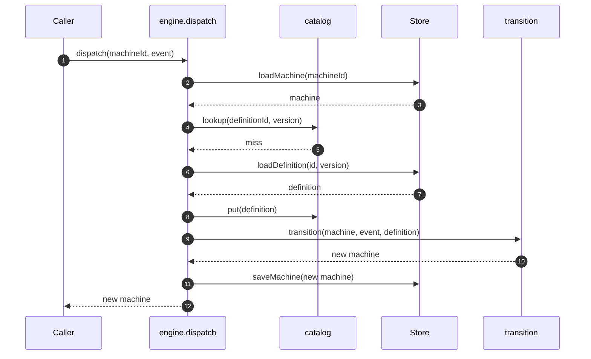
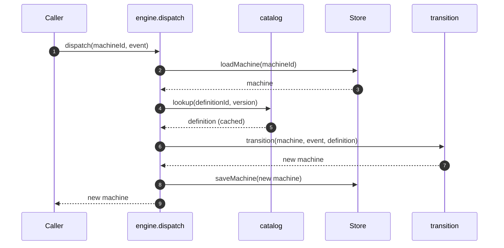
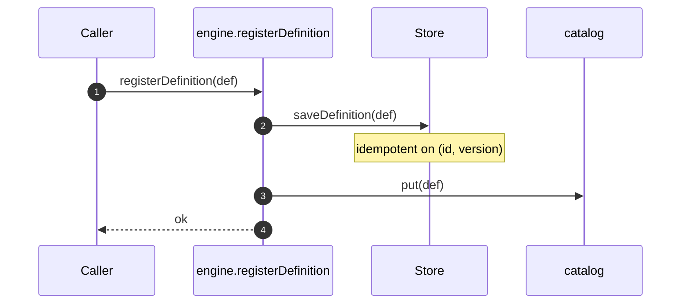

# State Machine — Basic

A generic state machine module. Opaque to domain. Supports a **catalog** of machine definitions that grows at runtime and loads **lazily** from a persistence store. Playbook is one caller; the engine knows nothing about Playbook's 4-phase lifecycle, crafts, briefs, or any other domain term.

Tied to [`foundations.md`](foundations.md).

## The model

A **state** is a label for a position. Any string. Caller-defined.

A **state node** is a state plus metadata (is it terminal, and — later — entry/exit actions, timeouts). In graph terms, the vertex.

An **event** is an input to the machine: a type and an opaque payload.

A **transition** is a rule mapping `(from state, event type) → to state`. In graph terms, the edge.

A **machine definition** is the full graph: initial state, state nodes, transitions. Identified by `(id, version)` the caller chooses (semver, hash, anything).

A **machine** is a stateful entity traversing a graph. Has an id, current state, context, metadata, and a reference to the definition it runs under (`definitionId`, `definitionVersion`).

The engine maintains a **definition catalog** that grows over time. Definitions are **persisted** in the store, **registered** into the catalog at runtime, and **loaded lazily** when a machine needs one.

## Engine vs orchestrator

The engine advances **one machine at a time**. Multi-machine orchestration — tree, DAG, pipeline, parallel — lives in an orchestrator above the engine. Playbook's tree orchestrator is one such caller; tests, debuggers, future tools are others.

The engine's job is fixed: "advance one machine's state when an event arrives, using whichever definition that machine belongs to." Everything else is caller work.

## Scope

**In**

- Generic single-machine finite state machine per dispatch.
- Caller-defined states (any string set) and event types (any string set).
- First-class machine definitions: initial state, state nodes, transitions.
- **Definition catalog** — the engine holds many definitions at once.
- **Runtime registration** — new definitions can be added while the engine is running.
- **Lazy loading** — definitions are loaded from the store on demand, not at startup.
- **Definition versioning** — machines are stamped with `(definitionId, definitionVersion)`; the right graph is looked up per dispatch.
- Opaque payloads on events; engine never reads content.
- One outbound port: `Store` (save / load definitions and machines).
- Three use cases: `registerDefinition`, `startMachine`, `dispatch`.

**Out (added in later docs)**

1. **Router** — caller-provided port for dynamic transitions (retry loops, blocks, joins, approvals, timeouts all compose from it).
2. **Entry / exit actions** — state- and transition-level side effects.
3. **Guards** — boolean predicates on transitions.
4. **Definition migration** — rules for advancing a machine from older definition versions.
5. **Playbook's tree orchestrator** — pipe, expand, DFS — separate doc at orchestrator level.
6. **Journal and replay** — crash-recovery log.
7. **Parallel step processing** — concurrent machines under structured concurrency.
8. **Transport layers** — MCP, CLI, or any adapter that translates inbound calls into engine invocations.

Each gets its own architecture doc when its turn comes.

## Domain

### State and transition (the model)

We split the state machine into two ideas, the same way LangGraph does — but simpler.

**State** is data. **Transition** is movement.

The basic engine simplifies both:

- **State** is one channel: `state`. `context` carries content alongside but doesn't drive transitions.
- **Transition** is one pure function: `transition(machine, event, definition) → machine`. Rules are a flat table.

### Generic types

```ts
type State = string;

type Event = {
  type: string;
  payload: unknown;
};

type StateNode = {
  id: State;
  terminal?: boolean;
  // future: entry?, exit?, meta?, timeout?
};

type Transition = {
  from: State;
  event: string;
  to: State;
};

type MachineDefinition = {
  id: string;                          // caller-chosen identifier
  version: string;                     // caller-chosen version string
  initialState: State;
  states: StateNode[];                 // vertices
  transitions: Transition[];           // edges
};

type Machine = {
  id: string;
  definitionId: string;                // which graph this machine runs under
  definitionVersion: string;           // at which version
  state: State;
  context: Record<string, unknown>;
  metadata: Record<string, unknown>;
};
```

### The step (how one event is processed)

Every `dispatch` is two generic operations:

1. **Update.** Store the event's payload into `context[event.type]`. Mechanical.
2. **Transition.** Look up `(machine.state, event.type)` in the definition's transitions; return the next state.

Combined in one pure function:

```ts
function transition(
  machine: Machine,
  event: Event,
  definition: MachineDefinition,
): Machine;
```

Throws if no row matches, or if `machine.state` is a terminal node.

The engine resolves `definition` on each dispatch by looking up the machine's `definitionId` and `definitionVersion` in the catalog, loading from the store lazily if not already cached.

Later features extend step 2 with a **Router port** — at specific rows, the engine asks a caller-provided router for the next state. Retry loops, blocks, joins, approvals, timeouts all compose from this.

### Definition catalog and lazy loading

The engine holds an in-memory **catalog** keyed by `(definitionId, definitionVersion)`. The catalog is:

- **Lazy**: populated on demand. When a machine is dispatched and its `(definitionId, definitionVersion)` isn't in the catalog, the engine calls `Store.loadDefinition(...)` and caches the result.
- **Runtime-mutable**: callers register new definitions at any time via `registerDefinition`. Registration saves to the store and adds to the catalog.
- **Version-precise**: multiple versions of the same `definitionId` can coexist in the catalog. An older machine (stamped with an older version) is dispatched against its own version; a newer machine against its own. No silent upgrades.

Cache policy is adapter-agnostic in the basic version: the engine caches forever unless explicitly evicted. A future revision may add eviction policies (LRU, TTL) without changing the external API.

## Application layer

### Use cases

The engine exposes three methods.

```ts
interface Engine {
  // Add or update a definition. Saves to the store and catalogs it.
  registerDefinition(definition: MachineDefinition): Promise<void>;

  // Create a new machine under a specific definition. Applies the first event.
  startMachine(args: {
    machineId: string;
    definitionId: string;
    definitionVersion: string;
    event: Event;
  }): Promise<Machine>;

  // Advance an existing machine. Resolves its definition lazily.
  dispatch(machineId: string, event: Event): Promise<Machine>;
}
```

**`registerDefinition`** — idempotent on `(id, version)`. Saves to the store, updates the catalog. Multiple calls with the same `(id, version)` are no-ops after the first.

**`startMachine`** — fails if `machineId` already exists. Loads the specified definition (cache → store → error), creates a machine stamped with that `(definitionId, definitionVersion)`, applies the first event, saves.

**`dispatch`** — loads the machine, looks up its definition (cache → store → error), applies the event, saves. Fails if the machine doesn't exist.

### Outbound port: `Store`

```ts
interface Store {
  // Definitions (the graphs)
  saveDefinition(definition: MachineDefinition): Promise<void>;
  loadDefinition(id: string, version: string): Promise<MachineDefinition | null>;

  // Machines (the instances)
  saveMachine(machine: Machine): Promise<void>;
  loadMachine(machineId: string): Promise<Machine | null>;
}
```

`saveDefinition` is idempotent on `(id, version)`.

Two implementations ship:

- `MemoryStore` — Map-backed; for tests.
- `SqliteStore` — `better-sqlite3`-backed; default for real use.

Both JSON-serialize definitions and machines on save.

## Hexagonal layout

```
   Caller
     │
     ▼
   ┌────────────────────────────────────────────┐
   │  Application                               │
   │    registerDefinition · startMachine       │
   │    dispatch                                │
   │                                            │
   │    (definition catalog, lazy-loaded)       │
   └────────────────┬───────────────────────────┘
                    │
                    ▼
   ┌────────────────────────────────────────────┐
   │  Domain (pure)                             │
   │    transition(machine, event, definition)  │
   └────────────────────────────────────────────┘
                    ▲
                    │ uses
   ┌────────────────┴───────────────────────────┐
   │  Outbound port                             │
   │    Store                                   │
   └────────────────┬───────────────────────────┘
                    │ implemented by
                    ▼
   ┌────────────────────────────────────────────┐
   │  Adapters                                  │
   │    MemoryStore · SqliteStore               │
   └────────────────────────────────────────────┘
```

The catalog lives in the application layer — not domain (it's mutable state with I/O) and not adapters (it's use-case coordination). It's a cache in front of the `Store` port.

## Composition root

```ts
async function createEngine(config: {
  store: Store;
  definitions?: MachineDefinition[];   // optional bootstrap set
}): Promise<Engine>;
```

Behavior:

1. If `definitions` is provided, call `registerDefinition` for each (saves to store, adds to catalog).
2. Returns an `Engine` exposing `registerDefinition`, `startMachine`, `dispatch`.

No definition is required at construction — the catalog may start empty and grow entirely at runtime. Lazy loading populates it from the store as needed.

## Sequences

### A. Dispatch with cold cache (lazy load)



### B. Dispatch with warm cache



### C. Runtime registration



## Invariants

- **I-1.** Domain imports nothing outside `src/domain/`.
- **I-2.** `transition` is pure: same `(machine, event, definition)` → same result.
- **I-3.** An event is either applied (machine saved) or rejected (no state change).
- **I-4.** Every outbound port has ≥2 implementations.
- **I-5.** No `any` in domain; Zod gates every event's and definition's **shape**.
- **I-6.** Engine never reads `payload`, `context`, or `metadata` content. They pass through unchanged.
- **I-7.** Engine never reads state labels for semantics; it only compares them as strings.
- **I-8.** Every machine carries a `definitionId` and `definitionVersion`. Dispatch uses that exact version; no silent upgrades.
- **I-9.** `saveDefinition` and `registerDefinition` are idempotent on `(id, version)`.
- **I-10.** The catalog is a cache: any entry must be reconstructible from the store. Clearing the catalog never loses data.

## Tests we expect

- **Domain tests** — `transition` against tables of `(state, event, definition) → state`. Pure, no I/O.
- **Use-case tests** — `registerDefinition`, `startMachine`, `dispatch` with `MemoryStore`. Assert machine state after each event.
- **Adapter contract tests** — run against `MemoryStore` and `SqliteStore`. Cover definition save/load, machine save/load, idempotent definition save.
- **Payload-opacity tests** — round-trip arbitrary payload shapes; engine hands back exactly what it received.
- **State-opacity tests** — configure with arbitrary random state labels; behavior is unchanged.
- **Lazy-loading tests** — dispatch a machine whose definition is only in the store, not the catalog; verify the catalog populates from the store exactly once.
- **Runtime-registration tests** — start with an empty catalog; register a definition at runtime; dispatch successfully against it.
- **Multi-version tests** — register `(id="x", version="1.0.0")` and `(id="x", version="2.0.0")`; create a machine under each; dispatch; assert each advances under its own definition.
- **Terminal-state tests** — any event dispatched to a machine in a terminal state is rejected.
- **Missing-definition tests** — dispatch a machine whose `definitionId`/`version` is neither cached nor in the store; assert clean error.

## Appendix: Playbook's configuration (example)

Playbook authors let users create playbooks at runtime. Each playbook is a machine definition registered into the engine's catalog. Multiple definitions coexist; new ones are added as users author them.

```ts
const engine = await createEngine({
  store: new SqliteStore("./.playbook.sqlite"),
  // no pre-registered definitions; all arrive at runtime
});

// user creates a new playbook → orchestrator registers its definition
await engine.registerDefinition({
  id: "playbook.user-123.tdd-workflow",
  version: "1",
  initialState: "Initializing",
  states: [
    { id: "Initializing" },
    { id: "Planning" },
    { id: "Working" },
    { id: "Evaluating" },
    { id: "Completed", terminal: true },
  ],
  transitions: [
    { from: "Initializing", event: "plan", to: "Planning" },
    { from: "Planning",     event: "work", to: "Working" },
    { from: "Working",      event: "eval", to: "Evaluating" },
    { from: "Evaluating",   event: "eval", to: "Completed" },
  ],
});

// orchestrator starts a machine under that playbook's definition
const machine = await engine.startMachine({
  machineId: "run-abc",
  definitionId: "playbook.user-123.tdd-workflow",
  definitionVersion: "1",
  event: { type: "initialize", payload: { /* caller-defined */ } },
});
```

Playbook's `Brief`, `Plan`, `Work`, `Eval` payload shapes live in Playbook's domain — the engine sees them only as `unknown`.

## How this changes

When a future feature in the "Out" list begins implementation, write a new architecture doc that adds it on top of this one. Each new doc states what it changes (types, ports, invariants), proposes the deltas, and lands as a PR alongside the code. This document stays as the bedrock — features extend via generic primitives. No feature introduces domain-specific concepts into the engine. The engine stays payload-blind, state-blind, and domain-blind.
