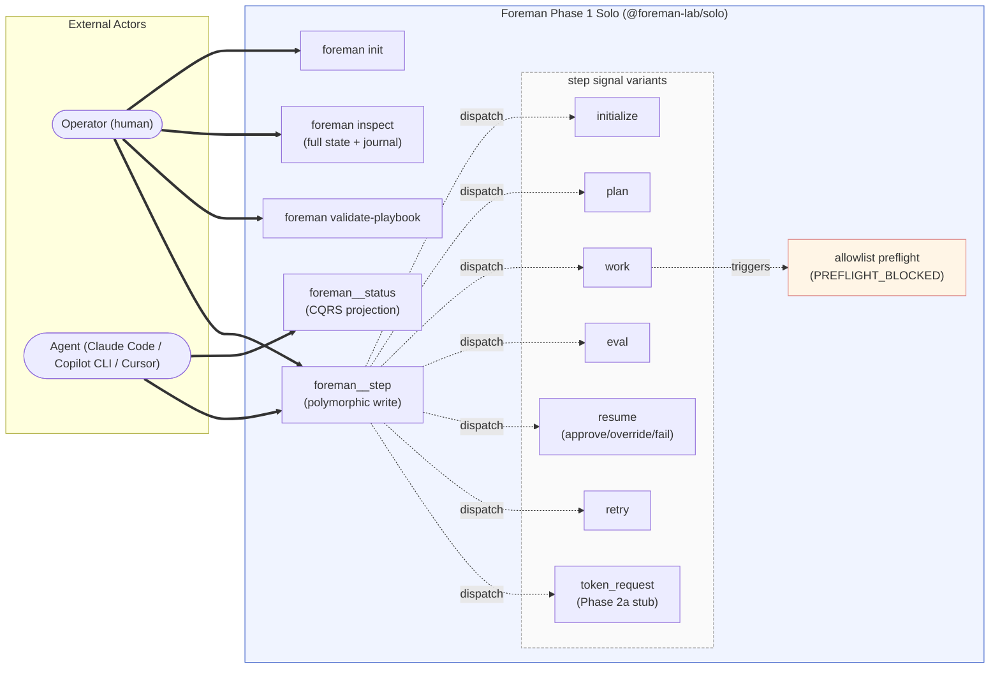
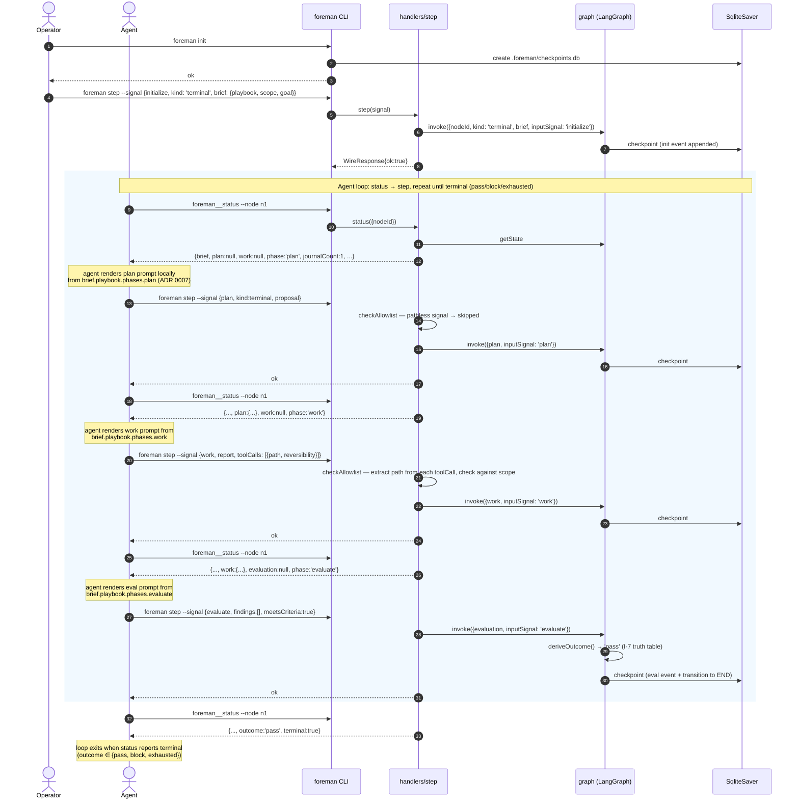
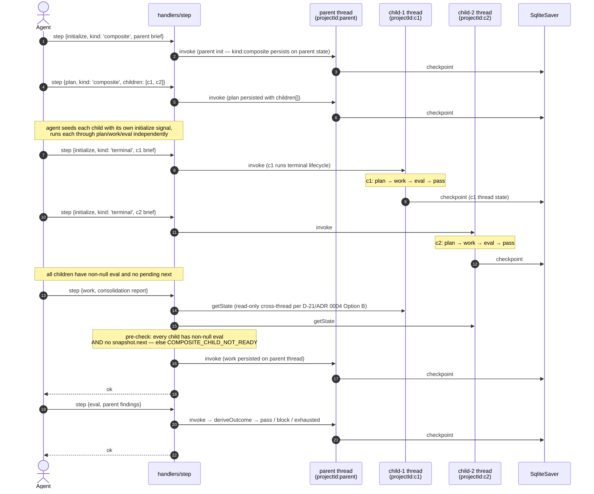

# Phase 1 Solo — Architecture

**Status:** Locked — Phase 1 baseline (walk-through completed 2026-04-17 via 15-item Codex+Copilot-debated review; final integrity pass by both on 2026-04-17)
**Last updated:** 2026-04-17
**Scope:** Phase 1 Solo tier of foreman (single-user, local, MCP stdio + CLI)
**Template:** arc42-lite (8 of 12 arc42 sections)
**Related:** [`foundations.md`](../foundations.md) (principles + decisions), [`roadmap.md`](../roadmap.md) (Phase 1 scope, Gate 2 + Gate 6), [`architecture.md`](../architecture.md) (cross-tier architecture)

---

## 1. Introduction and Goals

### 1.1 What Phase 1 Solo is

Phase 1 Solo is the **first shippable tier of foreman**: a single-user, local orchestration harness for AI coding agents, distributed as the npm package `@foreman-lab/solo`. It exposes an MCP stdio server (primary consumer, per P-4) and a CLI (humans, CI, debugging). State is persisted locally to `.foreman/checkpoints.db` (SQLite). No daemon, no HTTP, no UI, no multi-user.

### 1.2 Business goals

| Goal                                                   | Measured by                                                                                                                               |
| ------------------------------------------------------ | ----------------------------------------------------------------------------------------------------------------------------------------- |
| Ship `@foreman-lab/solo@1.0.0` on npm under Apache 2.0 | Tag cut + `npm publish` succeeds + `npm install -g @foreman-lab/solo` works on a clean machine                                            |
| Enable agent-first adoption via MCP                    | 3+ agents (Claude Code, Copilot CLI, one more) successfully complete a scenario test end-to-end                                           |
| Validate the architectural bets before Phase 2         | 4-node LangGraph flow, signal protocol, and port discipline hold up under real scenarios; no pivots needed before Phase 2a tripwire fires |
| Provide a concrete reference for Phase 2a extraction   | `packages/core/` extraction at Phase 2a is mechanical (~4h), not design rework                                                            |
| Earn the first tripwires honestly                      | No artificial marketing push; adoption signals come from real usage (per P-9)                                                             |

### 1.3 Stakeholders

| Stakeholder                                                          | Primary concerns                                                                                                  |
| -------------------------------------------------------------------- | ----------------------------------------------------------------------------------------------------------------- |
| **Agent developers** (Claude Code, Copilot CLI, Codex, Cursor teams) | Signal protocol stability; Zod schemas + error codes; test coverage of MCP surface; schema versioning (D-7, D-18) |
| **Solo developers** adopting foreman                                 | Install simplicity; `docs/agent-setup.md` (M5 Batch G deliverable — not yet present) snippets; 2+ working example playbooks; clear error messages            |
| **Phase 2+ future maintainers**                                      | Clean extraction points (D-9, D-17); no hidden coupling; composition root clarity                                 |
| **Security reviewers**                                               | S-1..S-5 materialization in code; pre-commit secret scan; no ambient credentials in tests                         |
| **Operator (end user)**                                              | `foreman status` is honest about what's happening; resume flow is trivial; interrupts are explicit                |

### 1.4 Top-level success criteria

Phase 1 Solo ships when the 10 gates from the roadmap's Phase 1 ship criteria (locked in [`docs/phase-1-solo/spec.md`](spec.md)) are all met. This architecture doc does not duplicate those gates; it describes **how the system is built to make those gates reachable**.

---

## 2. Architectural Constraints

Constraints are inherited. Phase 1 Solo adds no new foundational decisions — it materializes the existing ones.

### 2.1 Inherited from `foundations.md`

| Constraint                                                   | Source   | Phase 1 implication                                                                                                      |
| ------------------------------------------------------------ | -------- | ------------------------------------------------------------------------------------------------------------------------ |
| Node.js 20+, TypeScript, ESM, pnpm monorepo                  | D-1, D-9 | Single `packages/solo/` at Phase 1 (no `packages/core/` yet per D-9)                                                     |
| Zod-first schemas; types via `z.infer`                       | D-3      | Signal, channel, and error schemas in `packages/solo/src/types/`                                                         |
| `throw BaseError` internally; wire envelope at boundary      | D-4, D-5 | Handler throws; transport catch → `{ ok:false, error }` response                                                         |
| Config precedence: CLI flags > env > project file > defaults | D-8      | `resolveConfig()` in composition root                                                                                    |
| MCP SDK wrapped in one directory                             | D-7      | `packages/solo/src/mcp/adapter.ts` is the only file importing the SDK                                                    |
| LangGraph as core flow engine                                | D-16     | `@langchain/langgraph` + `SqliteSaver` (Phase 1 checkpointer)                                                            |
| Handler/Transport Separation (3 layers)                      | D-17     | 3 directory boundaries enforced by import-boundary lint                                                                  |
| Playbook injection via signal (no filesystem loading)        | D-18     | `foreman` never reads playbook files; agent embeds playbook in `Brief`                                                   |
| Naming and terminology                                       | D-19     | camelCase, PascalCase types, SCREAMING_SNAKE error codes, `foreman__*` MCP tools                                         |
| Outbound port discipline (narrow)                            | D-20     | **Zero ports** at Phase 1 post-2026-04-18 domain-blind pivot (see ADR 0007). Clock + token-vending stub ship as function parameters / handler internals. Earlier M4 plan introduced `PromptAssemblerPort`; reverted when rendering was relocated to the agent layer. |

### 2.2 Inherited from `roadmap.md`

| Constraint                                  | Source      | Phase 1 implication                                                                                                                                                                                                                                                                                                           |
| ------------------------------------------- | ----------- | ----------------------------------------------------------------------------------------------------------------------------------------------------------------------------------------------------------------------------------------------------------------------------------------------------------------------------- |
| Phase 1 Solo scope (high-level)             | Gate 2      | In: LangGraph + SQLite + MCP stdio + CLI subset + playbook injection + 2 examples + interrupt-at-edge + agent-setup doc + error-codes doc. Out: daemon, HTTP, UI, multi-user, cross-project, telemetry.                                                                                                                       |
| Hosted moat: scoped token vending (primary) | Gate 6      | Phase 1 adds `TokenRequest` signal type (M2) + vending hook (handler function — not a port) + `projectId` field in checkpoint schema (design hedge). **M3/M4 handler stubs `token_request` with `SCHEMA_VALIDATION_FAILED`. M4 Batch C1 (unstub) was dropped 2026-04-18 to Phase 2a** — foreman as infrastructure does not call external APIs, and pass-through vending provides zero security value vs the agent reading env directly (see ADR 0007). `TokenVendingPort` materializes at Phase 2a when Vault/HSM provides real scoping + revocation + audit. |
| Demand-driven phase promotion               | P-9, Gate 4 | Phase 1 does **not** implement telemetry, analytics, or any feature whose only purpose is to fire a tripwire                                                                                                                                                                                                                  |

### 2.3 Inherited from `architecture.md`

| Constraint                            | Source   | Phase 1 implication                                                                                        |
| ------------------------------------- | -------- | ---------------------------------------------------------------------------------------------------------- |
| Architectural style: 7-pattern hybrid | §1.1     | Phase 1 materializes all 7 patterns within `packages/solo/`                                                |
| 4-node LangGraph flow                 | §1.4, §4 | `init` → `plan` → `work` → `evaluate` exactly; no extra nodes                                              |
| 7 state channels + 1 journal          | §1.5, §5 | Zod-backed channel schemas in `packages/solo/src/types/state.ts`                                           |
| 7 signal types                        | §3.1     | Full list: `initialize`, `plan`, `work`, `eval`, `resume`, `token_request`, `status`                       |
| Interrupt-at-edge (not mid-node)      | §4.3     | LangGraph's `interrupt()` called inside `evaluate`; resume routes to `originNode ∈ {"init","plan","work"}` |
| Composite thread routing              | §4.4     | ADR 0004 Option B (locked 2026-04-18): `thread_id = ${projectId}:${nodeId}` — one thread per node, not per project. `checkpoint_ns = ''` (empty; reserved for LangGraph-managed subgraph routing, unused at M3+). Each composite child runs its own independent thread. |
| Composition root                      | §11.7    | `packages/solo/src/app.ts` is **the** wiring location (consumed by `cli/bin.ts`) — no hidden singletons     |

### 2.4 Phase-1-specific technical constraints

- Single npm package: `@foreman-lab/solo`. No `@foreman-lab/core` until Phase 2a.
- SQLite only. `@langchain/langgraph-checkpoint-sqlite` is the only checkpointer.
- Stdio transport only. Spawned by MCP client.
- Localhost only. No network-exposed surface.
- Single-user. OS file permissions are the auth story; no user accounts.
- Per-directory `.foreman/` is the project root marker (like `.git/`); discovered by walking up from CWD.
- macOS + Linux officially supported at launch; Windows follows demand.

---

## 3. System Context and Scope

### 3.1 Context diagram

```
              ┌────────────────────────────┐
              │          Agent             │
              │ (MCP host: Claude Code,    │
              │  Copilot CLI, Codex, etc.) │
              └──────────────┬─────────────┘
                             │ MCP stdio (Zod-validated signals)
                             │ + agent-side prompt rendering
                             │ from brief.playbook.phases[phase]
                             │ (domain-blind — ADR 0007)
                             ▼
         ┌─────────────────────────────────────────┐
         │          @foreman-lab/solo (bin)        │
         │                                         │
         │  ┌──────────┐  ┌──────────────┐  ┌───┐  │
         │  │ MCP/CLI  │→ │  Handlers    │→ │ G │  │
         │  │transport │  │  +mutex      │  │ r │  │
         │  └──────────┘  │  +TTL        │  │ a │  │
         │                │  +allowlist  │  │ p │  │
         │                │   preflight  │  │ h │  │
         │                │  (M5 C)      │  └─┬─┘  │
         │                └──────┬───────┘    │    │
         │                       └────┬───────┘    │
         │                            ▼            │
         │                   ┌─────────────────┐   │
         │                   │  SqliteSaver    │   │
         │                   │  (LangGraph     │   │
         │                   │   BaseCheckpoint│   │
         │                   │   Saver)        │   │
         │                   └────────┬────────┘   │
         └────────────────────────────┬────────────┘
                                      │
                                      ▼
                               ┌──────────────┐
                               │ .foreman/    │
                               │ checkpoints  │
                               │ .db          │
                               └──────┬───────┘
                                      │
                                      │ (CLI invocations + operator resume)
                                      │
                            ┌─────────┴─────────┐
                            │     Operator      │
                            │ (human — resumes  │
                            │  interrupts, etc.)│
                            └───────────────────┘
```

**Post-2026-04-18 domain-blind pivot (ADR 0007):** no `adapters/` layer between handlers and the checkpointer. LangGraph's `BaseCheckpointSaver` is already the abstraction per D-16 — foreman doesn't wrap it. Agent-side rendering replaces what was pre-pivot a `PromptAssemblerPort` seam. `token_request` signal (S-1 mechanism) is stubbed at Phase 1; real `TokenVendingPort` lands at Phase 2a with Vault/HSM (diagram intentionally omits a `process.env` arrow — foreman does NOT pass-through credentials).

### 3.2 In scope (matches roadmap Gate 2, post-Copilot revisions)

- MCP stdio server exposing **2 tools** (`foreman__status` + `foreman__step`) per ADR 0003. `foreman__step` is a polymorphic write over 7 internal signal types (initialize/plan/work/eval/resume/retry/token_request); `foreman__status` is CQRS read.
- CLI subset (5 commands: `init`, `status`, `step`, `inspect`, `validate-playbook`) — `step` subsumes the former `resume` subcommand per ADR 0003.
- SQLite checkpointer via `SqliteSaver.fromConnString(.foreman/checkpoints.db)`
- Skill injection inside `Brief` (no filesystem reads)
- Interrupt-at-edge + `Command` resume protocol
- `projectId` field in checkpoint schema (Gate 6 hedge)
- Prompt rendering by external agent (no runtime port at Phase 1 post-2026-04-18 domain-blind pivot; see ADR 0007). Raw `brief.playbook.phases[phase]` carried through `brief` channel; agent interpolates locally.
- 2 worked example playbooks: `tdd-feature`, `refactor-extract`
- `docs/agent-setup.md` (M5 Batch G deliverable — not yet present) with copy-paste snippets for 3+ agents
- `docs/error-codes.md` enumerating every `ErrorCode`
- Per-project `.foreman/` isolation + project-root discovery

### 3.3 Out of scope (deferred to later phases)

| Feature                       | Deferred to                     | Why                                                                 |
| ----------------------------- | ------------------------------- | ------------------------------------------------------------------- |
| HTTP transport                | Phase 2a                        | No need for long-running server; agent spawns MCP stdio per session |
| Persistent daemon             | Phase 2a                        | Same reason; CLI + MCP are both ephemeral-process shapes            |
| UI / dashboard                | Phase 2b                        | Gated on independent UI-demand tripwire                             |
| Multi-user / RBAC             | Phase 3                         | Team tier                                                           |
| Cross-project aggregation     | Phase 2a+                       | Requires daemon + multi-project indexing                            |
| Telemetry (automatic)         | Never by default (P-7)          | Opt-in only; hosted service is the consumer                         |
| Token vendor port abstraction | Phase 2a                        | Phase 1 is process.env pass-through; no real variation yet (D-20)   |
| Clock port abstraction        | When 3+ consumers appear (D-20) | Function-parameter injection is enough                              |
| PostgresSaver                 | Phase 3                         | SQLite covers single-user local                                     |
| SSO / SAML / OIDC             | Phase 4                         | Enterprise tier                                                     |
| Windows support               | Post-ship, demand-driven        | Darwin + Linux at v1.0                                              |

### 3.4 User stories (per actor)

Three active actors at Phase 1 Solo (per foundations P-2 three-actor model):

- **Operator** (human): sets up foreman, initializes nodes, resolves blocks, inspects state.
- **Agent** (AI — Claude Code / Copilot CLI / Cursor / etc.): reads state, renders prompts locally from raw playbook phases (ADR 0007), submits signals.
- **Harness** (foreman itself): validates signals, enforces the state machine, persists to SQLite, derives outcomes.

**Operator stories**

| ID    | Story                                                                                                                 | Shipped in |
| ----- | --------------------------------------------------------------------------------------------------------------------- | ---------- |
| US-1  | As an operator, I want to initialize foreman in a project directory so that I can start orchestrating AI work.        | M2         |
| US-2  | As an operator, I want to create a new node with a brief + playbook so that the agent has a bounded scope.            | M2 / M3    |
| US-3  | As an operator, I want to read a node's projected status so that I can see progress at a glance.                      | M3         |
| US-4  | As an operator, I want to inspect a node's full state + journal so that I can debug what the agent did and why.       | M5 Batch A |
| US-5  | As an operator, I want to approve or override an evaluator block so that I can resolve security interrupts.           | M3         |
| US-6  | As an operator, I want to fail a node so that I can abandon work I no longer want.                                    | M3         |
| US-7  | As an operator, I want to retry an exhausted node so that I can give a stuck agent another chance.                    | M3         |
| US-8  | As an operator, I want to validate a playbook YAML before injecting it into a brief so that I catch shape errors early. | M5 Batch A |
| US-9  | As an operator, I want my playbook to declare a `scope.paths` allowlist so that off-target file writes are rejected.  | M5 Batch C |

**Agent stories**

| ID    | Story                                                                                                                       | Shipped in                          |
| ----- | --------------------------------------------------------------------------------------------------------------------------- | ----------------------------------- |
| US-10 | As an agent, I want to drive a `loop(status → step)` — poll `foreman__status` to read brief + `playbook.phases[phase]`, render the prompt locally (ADR 0007), then submit the next `foreman__step` — so the CLI flow after `foreman init` is a single repeatable shape. | M5 Batch A contract (brief-exposure) |
| US-11 | As an agent, I want to submit a plan so that foreman records my proposed approach and advances to the work phase.           | M2 / M3                             |
| US-12 | As an agent, I want to submit a work report + tool-calls so that foreman journals my actions and advances to evaluate.      | M3                                  |
| US-13 | As an agent, I want to submit an evaluation with findings + meetsCriteria so that foreman derives the outcome (I-7).        | M3                                  |
| US-14 | As an agent, I want a clear `PREFLIGHT_BLOCKED` error with path + reason + allowed-list when I touch out-of-scope paths.    | M5 Batch C                          |
| US-15 | As an agent running a composite parent, I want to read each child's state cross-thread so I can consolidate before submitting parent work. | M3 (ADR 0004 Option B)  |

**Harness (system) stories**

| ID    | Story                                                                                                                             | Shipped in          |
| ----- | --------------------------------------------------------------------------------------------------------------------------------- | ------------------- |
| US-16 | As the harness, I MUST persist state durably across process restarts so that work survives crashes and reboots.                   | M2 (SqliteSaver)    |
| US-17 | As the harness, I MUST enforce sequence validity (no plan before init, no work before plan, no retry except from exhausted).      | M3                  |
| US-18 | As the harness, I MUST reject signals whose tool-call paths violate `playbook.scope` so playbooks can establish operator boundaries. | M5 Batch C       |
| US-19 | As the harness, I MUST emit the brief's raw playbook phases verbatim in `foreman__status` so external agents can render prompts (domain-blind / ADR 0007). | M5 Batch A contract |
| US-20 | As the harness, I MUST serialize concurrent signals on the same `nodeId` so SQLite writes don't collide (per-nodeId mutex).       | M3                  |

### 3.5 Use-case diagram

Actors → use cases → system boundary. Dotted lines show the "dispatch-on-type" relationship inside `foreman step` per ADR 0003. Solid arrows are actor → use-case invocations.



### 3.6 Sequence — terminal TDD happy path (`kind: 'terminal'`, single round, meetsCriteria=true)

Closes US-1, US-2, US-10, US-11, US-12, US-13, US-16, US-17, US-19.

**CLI flow shape (canonical):** `foreman init` once, then the agent drives a **`loop(status → step)`** — it re-reads `foreman__status` before every `foreman__step` to pick up the current phase + the matching `brief.playbook.phases[phase]` string, renders the prompt locally (ADR 0007), then submits the next signal. The diagram below shows that polling loop across one terminal-kind round (composite-kind variant in §3.7).



### 3.7 Sequence — composite parent consolidation (`kind: 'composite'`, US-15)

Shows the ADR 0004 Option B cross-thread read for the parent's work-phase consolidation. Each child runs its own independent `plan → work → eval` on its own `thread_id = projectId:childNodeId`. Every step below is preceded by an agent `foreman__status` poll (omitted for clarity — same `loop(status → step)` shape as §3.6).



---

## 4. Solution Strategy

Phase 1 Solo materializes `architecture.md` §1.1 (the 7-pattern hybrid style). **See `architecture.md` §1.1 for the pattern table and rationale** — this section does not duplicate it.

For detailed module responsibilities and import rules, see §5 (Building Block View).

Phase 1's contribution is **where each pattern lands on disk** within `packages/solo/`:

| Pattern                 | Phase 1 location                                                                                                                          |
| ----------------------- | ----------------------------------------------------------------------------------------------------------------------------------------- |
| Hexagonal (narrow)      | Zero outbound ports at Phase 1 per D-20 + ADR 0007. Seams live as function parameters (clock) and handler internals (token stub). No `ports/` or `adapters/` directory until Phase 2a promotes one. |
| Layered                 | Directory boundaries in `packages/solo/src/{mcp,cli,handlers,graph,types,errors}/`, enforced by `dependency-cruiser`                       |
| Command bus             | MCP/CLI transport → `handlers/` → `graph.invoke(new Command(...))`                                                                        |
| Event sourcing          | `journal` state channel with append reducer; derived state is pure functions over journal                                                 |
| CQRS                    | `handlers/status.ts` is read-only (`graph.getState`); all other handlers are writes                                                       |
| FSM                     | `graph/nodes/{init,plan,work,evaluate}.ts` + `graph/edges/outcome.ts`                                                                     |
| DI via composition root | `packages/solo/src/app.ts` (CLI bin entry at `packages/solo/src/cli/bin.ts`)                                                              |

### 4.1 Key strategic translation decisions for Phase 1

- **LangGraph is consumed directly (not wrapped).** Per D-16 + D-20, there is no `FlowEnginePort`. The `packages/solo/src/graph/` directory IS the containment boundary.
- **Prompt rendering is agent-side.** Foreman carries raw `brief.playbook.phases[phase]` through the `brief` channel and exposes it via `foreman__status`. The agent interpolates any `{{var}}`/`${var}` placeholders locally and constructs its own prompt. Foreman never interprets phase text (P-1 + ADR 0007). The `token_request` stub stays a plain handler function at Phase 1; Phase 2a promotes it to `TokenVendingPort` when Vault/HSM lands.
- **Composition root is declarative, not a DI container.** No Inversify, no TSyringe. Plain TypeScript function calls — `buildGraph({ checkpointer, now })`, `createHandlers({ graph, projectId })`, `createMcpServer({ handlers })`. Easier to reason about for a single-package Phase 1; a library is overkill. See §5.2 (`app.ts` row) for the wiring surface.
- **Per-nodeId async mutex is in-memory only.** Phase 1 has no distributed concurrency — see `architecture.md` §11.5 for the concurrency model including cross-process SQLite WAL behavior.

---

## 5. Building Block View

### 5.1 Top-level package structure

```
packages/solo/
├── package.json              # @foreman-lab/solo (name, version, bin, exports, files)
├── tsconfig.json             # extends workspace root
├── src/
│   ├── app.ts                # composition root (wires checkpointer + graph + handlers + mcp-server)
│   ├── cli/bin.ts            # CLI bin entrypoint (consumes app.ts)
│   ├── types/                # Zod schemas + inferred TS types
│   ├── errors/               # BaseError class taxonomy (ErrorCode union lives in types/error-codes.ts)
│   ├── graph/                # LangGraph nodes, edges, channels
│   ├── handlers/             # signal → graph.invoke dispatch + mutex + ttl
│   ├── mcp/                  # MCP stdio adapter
│   └── cli/                  # CLI parser + output formatter
├── test/
│   ├── unit/                 # per-module unit tests
│   ├── integration/          # handler + graph + checkpointer
│   └── scenario/             # 3 end-to-end scenarios (Gate 2 requirement)
└── README.md                 # package-level readme
```

### 5.2 Module responsibilities

| Module      | Responsibility                                                                                                                                                                                                                                                                                                  | Allowed imports                                               | Forbidden imports                                                                        |
| ----------- | --------------------------------------------------------------------------------------------------------------------------------------------------------------------------------------------------------------------------------------------------------------------------------------------------------------- | ------------------------------------------------------------- | ---------------------------------------------------------------------------------------- |
| `types/`    | Zod schemas for signals, channels, briefs, playbooks, errors; inferred TS types                                                                                                                                                                                                                                 | `zod` only                                                    | any other foreman module                                                                 |
| `errors/`   | `BaseError` + `ValidationError` + `SecurityError` + `StorageError` classes                                                                                                                                                                                                                                      | `types/`, `zod`, Node built-ins                               | all other foreman modules (`graph/`, `handlers/`, `mcp/`, `cli/`)                        |
| `graph/`    | 4 node implementations; `channels.ts` (`FlowState`); `outcome.ts` (truth table pure fn); `preflight.ts` (scope check); `retry-count.ts` (cap tracking); `checkpointer.ts` (SqliteSaver wiring); `build.ts` (graph factory); `edges/*.ts` (conditional routers). Composite children are external threads per ADR 0004 Option B — no subgraph / `Send` factory.                                                                                                                                                     | `@langchain/langgraph`, `types/`, `errors/`                   | `handlers/`, `mcp/`, `cli/`                                                              |
| `handlers/` | **Amended by ADR 0003 (v3+):** one unified `step.ts` handler dispatching on signal `type`, plus `status.ts` (read). Legacy `initialize.ts`/`plan.ts`/etc. collapse into `step.ts` at M3. Adjacent: `checkpoint-config.ts` (thread_id/ns builder), `mutex.ts` (per-nodeId lock; M3), `ttl.ts` (stale check; M3). | `types/`, `graph/`, `errors/`                                 | `mcp/`, `cli/`                                                                           |
| `mcp/`      | **Amended by ADR 0003:** registers **2 tools** (`foreman__status`, `foreman__step`) — not 7. Zod parse → handlers.step dispatch → response envelope.                                                                                                                                                            | `@modelcontextprotocol/sdk`, `handlers/`, `types/`, `errors/` | `graph/` directly, `cli/`                                                                |
| `cli/`      | Commander-based argv parser; output formatter (JSON + human-readable); subcommands map to handlers                                                                                                                                                                                                              | `commander`, `handlers/`, `types/`, `errors/`                 | `graph/` directly, `mcp/`                                                                |
| `app.ts`    | Composition root: wires checkpointer + graph + handlers + mcp-server. Consumed by `cli/bin.ts`.                                                                                                                                                                                                                | all modules                                                   | —                                                                                        |

**`ErrorCode` ownership:** The `ErrorCode` union type (SCREAMING_SNAKE strings as a TypeScript union, **not** a TS `enum` — per D-19 casing rules) lives in `types/errors.ts` alongside other Zod schemas. The error **classes** (`BaseError` and subclasses) live in `errors/` and import `ErrorCode` from `types/`. One-way dependency (`types/` → no foreman deps; `errors/` → `types/` + `zod`). This keeps `types/` pure so the wire envelope (§3.4) can Zod-validate `error.code` without introducing circular imports.

### 5.3 Sub-structure detail: `graph/`

```
graph/
├── channels.ts               # FlowState Annotation.Root definition
├── nodes/
│   ├── init.ts               # validate brief, set nodeId + kind, emit init event
│   ├── plan.ts               # persist proposal (terminal) or children[] list (composite); agent seeds child threads externally per ADR 0004 Option B
│   ├── work.ts               # accept work report, update work channel
│   └── evaluate.ts           # preflight scan + deriveOutcome + interrupt() if block
├── edges/
│   └── outcome.ts            # conditional router: pass/retry/block/exhausted
├── outcome.ts                # deriveOutcome(input) → Outcome — pure fn, truth table
├── preflight.ts              # scope allowlist check (M5 Batch C); invariant checks before agent eval runs
├── retry-count.ts            # per-node retry cap tracking
├── checkpointer.ts           # SqliteSaver wiring
└── build.ts                  # buildGraph({ checkpointer, now }) → compiled graph (composite children run as independent threads per ADR 0004 Option B — no Send factory)
```

### 5.4 Sub-structure detail: `handlers/`

```
handlers/
├── index.ts                  # createHandlers(deps) → { initialize, plan, work, eval, resume, tokenRequest, status }
├── initialize.ts             # validate InitializeSignal → graph.invoke with init
├── plan.ts                   # validate PlanSignal → graph.invoke with plan
├── work.ts                   # validate WorkSignal → graph.invoke with work
├── eval.ts                   # validate EvalSignal → graph.invoke with eval
├── resume.ts                 # validate ResumeSignal → graph.invoke(new Command({resume}))
├── token-request.ts          # validate TokenRequestSignal → vendToken(signal) → response
├── status.ts                 # read-only: graph.getState + ttl check → response
├── mutex.ts                  # withNodeLock(nodeId, fn) helper
└── ttl.ts                    # isStale(initEvent, now) helper; 24h TTL check
```

---

## 6. Runtime View

Seven scenarios trace Phase 1 behavior end-to-end. Each is implemented as a scenario test (Gate 2 requirement #2). Scenarios 1–5 cover the core flow (happy path, security block + resume, composite parent + children, TTL expiration, concurrent signals); Scenarios 6–7 cover error-path integrity (Zod rejection, retry loop).

### Scenario 1 — Happy path (terminal node, single round to pass)

```
Agent                     MCP Transport      Handler           Graph (LangGraph)
─────                     ─────────────      ───────           ─────────────────
initialize signal ─────▶  Zod validate  ─▶  withNodeLock  ─▶  init node runs
                                                                 • validate brief
                                                                 • emit init event
                                                                 • set channels
                          ◀───────────── response {ok:true}
                          (with initial status)

status signal     ─────▶  Zod validate  ─▶  getState (CQRS)
                          ◀───────────── snapshot of channels + journal

plan signal       ─────▶  Zod validate  ─▶  withNodeLock  ─▶  plan node runs
                                                                 • (post-pivot: agent already rendered prompt externally)
                                                                 • agent's plan stored
                                                                 • plan event appended
                          ◀───────────── {ok:true, state:...}

work signal       ─────▶  Zod validate  ─▶  withNodeLock  ─▶  work node runs
                                                                 • work stored
                                                                 • work event appended
                          ◀───────────── {ok:true}

eval signal       ─────▶  Zod validate  ─▶  withNodeLock  ─▶  evaluate node runs
                                                                 • preflight scan (clean)
                                                                 • deriveOutcome()
                                                                 • outcome: pass
                                                                 • eval event appended
                                                                 • conditional edge: pass → END
                          ◀───────────── {ok:true, outcome:"pass"}
```

### Scenario 2 — Interrupt flow: security block + operator resume

**Amended by ADR 0003** (state-machine scope + 2-tool MCP surface). Operator resolution now arrives via `foreman step --signal '{"type":"resume",...}'`, not a separate `foreman resume` subcommand. The LangGraph `interrupt()` + `Command({resume})` primitive is unchanged; only the transport wrapper collapsed to one MCP tool.

```
Agent                                Handler                    Graph
─────                                ───────                    ─────
(after plan/work) step signal  ─▶   withNodeLock            ─▶  evaluate node
  type=eval, findings incl.                                      • preflight: dirty (secret in toolCall)
  critical                                                       • deriveOutcome() → block (security)
                                                                 • interrupt(blockPayload)
                                                                 • block event in journal
                                                                   {category:"security", originNode:"work"}
                                     ◀──── interrupt returned; handler re-exits
                                     ◀──── response: {ok:true, interrupted:true, block:{...}}

Operator (separate process / later time):
  $ foreman step --signal '{"type":"resume","nodeId":"n1",
                             "payload":{"action":"approve","note":"intentional"}}'

CLI ──── handlers.step(ResumeSignal variant) ──▶ graph.invoke(new Command({resume:{...}, goto:originNode}))
                                                                 • approve/override → goto originNode ("work")
                                                                 • fail → goto END (node terminates as failed)
                                                                 • (on approve, agent re-submits work with flagged item now approved)
```

### Scenario 3 — Composite: parent with 2 children

**Amended by ADR 0004** (2026-04-18) and **Option B** (user decision 2026-04-18, v0.7). The prior design used LangGraph `Send` + subgraph checkpoints with `checkpoint_ns = childNodeId`. The composite/Send spike (`packages/solo/scripts/composite-send-spike.ts`) proved that pattern does not work under LangGraph 1.2.9 — subgraph namespaces are auto-assigned as `<nodeName>:<task-uuid>` (ephemeral), not at operator-chosen handles. Under ADR 0004, each node (terminal or composite) is its own top-level thread; the wrapper orchestrates initialization and the agent drives consolidation. Under Option B, composite parents have a **work phase = consolidation** (agent synthesizes children's outputs via playbook prompt); the evaluate node is kind-agnostic. See ADR 0004 for rationale.

```
(All threads share the same compiled graph; they differ only in thread_id.)

Root (composite) thread — thread_id = "project:root"
  ├─ step(type='initialize', nodeId='root', kind='composite', brief=…)
  │    ▶ initialize node writes channels; journal:[initialize]
  │
  ├─ step(type='plan', nodeId='root', payload={kind:'composite', children:[briefC1, briefC2]})
  │    ▶ plan node stores children list in root.plan channel
  │    ▶ LAZY EXPANSION: children defined here, not at init
  │    ▶ journal:[initialize, plan]
  │
  │        (wrapper reads root.plan; for each child brief:)
  │
  │   ╔══════════════════════════════════════╗    ╔══════════════════════════════════════╗
  │   ║  Child c1 thread                     ║    ║  Child c2 thread                     ║
  │   ║  thread_id = "project:c1"            ║    ║  thread_id = "project:c2"            ║
  │   ╠══════════════════════════════════════╣    ╠══════════════════════════════════════╣
  │   ║ step(initialize, c1, kind='terminal', …) ║ ║ step(initialize, c2, kind='terminal', …) ║
  │   ║ step(plan,       c1, …)                  ║ ║ step(plan,       c2, …)                  ║
  │   ║ step(work,       c1, …)                  ║ ║ step(work,       c2, …)                  ║
  │   ║ step(evaluate,   c1) → pass              ║ ║ step(evaluate,   c2) → pass              ║
  │   ╚══════════════════════════════════════╝    ╚══════════════════════════════════════╝
  │                                (can run in parallel —
  │                                 wrapper uses Promise.all or
  │                                 concurrent client sessions)
  │
  ├─ step(type='work', nodeId='root', payload={ report: <consolidated>, toolCalls: [] })
  │    ▶ handlers/step.ts work pre-check (Option B, v0.7):
  │      • state.kind === 'composite' detected
  │      • for each brief in state.plan.children:
  │          getState(checkpointConfig('project', child.nodeId)) → evaluation present?
  │      • all children evaluated → proceed
  │      • (if any child lacks evaluation → COMPOSITE_CHILD_NOT_READY; no invoke)
  │    ▶ agent authored `report` by synthesizing c1 + c2 outputs using
  │      root.brief.playbook.phases.work as the consolidation prompt (D-18)
  │    ▶ work node writes work channel; journal:[initialize, plan, work]
  │
  └─ step(type='evaluate', nodeId='root')
       ▶ evaluate node kind-agnostic (Option B, v0.7): assesses root.work same as
         a terminal node would — no composite branch inside evaluate.
       ▶ journal:[initialize, plan, work, evaluate]

Notes:
  - Composite parents HAVE a work phase (Option B, v0.7): the agent's work report IS
    the consolidation. The prior "no work phase" note is superseded.
  - Composite readiness check lives in handlers/step.ts 'work' pre-check, NOT inside
    the evaluate node. Evaluate node is kind-agnostic — same code path for terminal
    and composite.
  - Cross-thread reads from the handler (graph.getState on child threads) are
    explicitly permitted under D-21 (read-vs-transition clarification, foundations.md):
    reads to inform rejection decisions do not cross the signal/channel/journal
    protocol boundary; only writes do.
  - Composite children that are themselves kind='composite' cascade the same pattern
    recursively: their plan signal returns grandchildren; wrapper spawns grandchild
    threads; grandparent's work signal consolidates when their children terminate.
  - Aggregation is wrapper-driven (ADR 0003 storage doctrine). Foreman never auto-
    fires parent work on child terminal; the wrapper observes child states and the
    agent explicitly sends step(type='work') with a consolidated report when ready.
```

### Scenario 4 — Agent disappears mid-work: TTL path

```
t=0:     initialize signal → init completes, ttlExpiresAt = t+24h
t=5min:  plan signal → plan completes
t=10min: (work signal never arrives — agent process killed)
...
t=24h+1m:
         status signal  ─▶  handler.status()
                             • graph.getState → channels show work=null
                             • ttl.isStale(initEvent, now) → true
                             • response: { ok:true, data:{ ..., stale:true } }

Operator sees stale:true; options:
  (a) resume --action=fail      → node ends with exhausted outcome, reason:"ttl_expired"
  (b) re-initialize a new node  → old node stays in journal for audit
  (c) do nothing — stale is advisory; node still accepts signals if agent returns
```

### Scenario 5 — Concurrent invokes on the same nodeId

```
t=0ms:  MCP client A calls foreman__step({nodeId:"n-1", signal:plan})
t=1ms:  MCP client B calls foreman__step({nodeId:"n-1", signal:plan}) (competing)

Handler layer:
  A: withNodeLock("n-1", fn) → acquires lock, runs fn
  B: withNodeLock("n-1", fn) → waits on A's promise
  A completes (graph.invoke writes checkpoint); releases lock
  B proceeds: reads latest checkpoint (A's write), runs graph.invoke on now-updated state

Result: deterministic, last-writer-wins serialization. No conflict, no SQLite BUSY seen by agent.
```

### Scenario 6 — Validation rejection: malformed signal hits Zod

```
Agent                             MCP Transport           Handler          Graph
─────                             ─────────────           ───────          ─────
initialize signal with            Zod.safeParse()
missing `kind` field        ─▶    returns {success:false}
                                  (required by brief
                                   schema per I-2)

Transport constructs and          BaseError-derived
throws ValidationError            wire envelope
from ZodError:                    assembled by
  code: BRIEF_KIND_MISSING        transport catch
  message: "kind is required
    on initialize; set
    'terminal' or 'composite'"
  details: { path: ["brief",
    "kind"], received: undefined }
  (details projected from
   ZodIssue; wire shape, not
   raw Zod output)

                                  ◀────── response:
                                          { ok: false,
                                            error: {
                                              code: "BRIEF_KIND_MISSING",
                                              message: "...",
                                              details: {...}
                                            }}

No graph.invoke, no checkpoint write, no journal event.
Handler layer and below never see the malformed signal.
Validation failures are auditable via structured logs (Phase 2a), not journal — journal is for domain events only.
```

Exercises: D-4 (throw + typed errors), D-5 (error taxonomy), S-4 (transport Zod validation), I-2 (kind invariant — the schema under test), D-19 (SCREAMING_SNAKE error code naming), wire envelope contract (architecture.md §3.4), error-codes.md completeness (Q-10).

### Scenario 7 — Retry loop: eval fails, retry succeeds on round 2

```
Round 1:
  (init → plan → work complete as in Scenario 1)

  eval signal                                        ─▶  evaluate node
    findings: [{severity:"warning",                      • preflight clean
      detail:"test suite regression —                    • deriveOutcome():
      2 assertions failing"}]                              - blockDetected=false
    meetsCriteria: false                                   - hasCriticalFinding=false
                                                           - meetsCriteria=false
                                                           - retryCount=0, maxRetries=3
                                                           → outcome: retry  (rule 4)
                                                         • eval event appended to journal
                                                         • conditional edge: retry → plan
                                        ◀─── response: {ok:true, data:{outcome:"retry"}}

  Graph is now positioned at `plan` node, awaiting next plan signal.
  `plan` channel will be overwritten (replace reducer); `work` channel
  retains prior value (available as context for replanning).

Round 2:
  plan signal (revised plan referencing prior work)  ─▶  plan node
                                                         • plan channel overwritten (replace reducer)
                                                         • plan event appended
  work signal (fixed work)                           ─▶  work node
  eval signal                                        ─▶  evaluate node
    findings: []                                         • preflight clean
    meetsCriteria: true                                  • deriveOutcome():
                                                           - blockDetected=false
                                                           - hasCriticalFinding=false
                                                           - meetsCriteria=true
                                                           - retryCount=1, maxRetries=3
                                                           → outcome: pass  (rule 3)
                                                         • eval event appended to journal
                                                         • conditional edge: pass → END
                                        ◀─── response: {ok:true, data:{outcome:"pass"}}

Journal now contains 2 eval events; retryCount derived from journal scan (I-8).
```

Exercises: outcome truth table rules 3 + 4 (retry then pass); journal-derived retry count (retryCount=0 → 1 across rounds); unified retry edge targets `plan` (no kind branch); replace-reducer overwrite on `plan` channel; `work` channel persists across retry (context for replanning). Rule 5 (exhausted — retries exhausted) is covered in Scenario 8.

### Scenario 8 — Exhausted + retry: retry-count exhausted, operator restarts node

**Added by ADR 0003** (state-machine scope; `retry` as a control signal distinct from `resume`).

```
Rounds 1–3:
  Three iterations of plan → work → eval, each producing outcome: retry (rule 4).
  Journal now contains 3 eval events; retryCount derived from journal scan = 3.

Round 4 eval:
  eval signal                                        ─▶  evaluate node
    findings: [{severity:"warning", ...}]                • preflight clean
    meetsCriteria: false                                 • deriveOutcome():
                                                           - blockDetected=false
                                                           - hasCriticalFinding=false
                                                           - meetsCriteria=false
                                                           - retryCount=3, maxRetries=3
                                                           → outcome: exhausted  (rule 5)
                                                         • evaluate event appended to journal
                                                         • conditional edge: exhausted → END
                                        ◀─── response: {ok:true, data:{outcome:"exhausted"}}

  Node is now at END (terminal). No interrupt() is called — exhausted is terminal per ADR 0003 §2.5,
  in contrast to block which uses LangGraph's interrupt() primitive.

Operator reviews journal (via foreman status), decides to retry:
  $ foreman step --signal '{"type":"retry","nodeId":"n1",
                             "payload":{"reason":"approach was flawed; agent should replan from scratch"}}'

CLI ──── handlers.step(RetrySignal variant) ──▶ retry-control handler:
                                                   • reject if last derived outcome != exhausted (else
                                                     SCHEMA_VALIDATION_FAILED)
                                                   • append {type:"retry_reset", nodeId:"n1", actor,
                                                     ts, reason:"..."} to journal channel
                                                   • clear evaluation channel to null
                                                     (replace reducer supports explicit null)
                                                   • return success
                                        ◀─── response: {ok:true, data:{resetForNode:"n1"}}

Agent sends a new plan (retry-count derivation now counts evaluate events AFTER the retry_reset marker):
  step signal, type="plan"                          ─▶  plan node
    payload:{kind:"terminal",                            • plan channel overwritten
      proposal:"fresh approach ..."}                     • plan event appended
  step signal, type="work"                          ─▶  work node
  step signal, type="evaluate" (passes now)         ─▶  evaluate node
                                                         • deriveOutcome():
                                                           - retryCount (since retry_reset) = 0
                                                           - meetsCriteria = true → outcome: pass
                                                         • edge: pass → END
                                        ◀─── response: {ok:true, data:{outcome:"pass"}}
```

Exercises: outcome rule 5 (exhausted); retry signal is a control signal (no graph invocation, no interrupt); retry_reset journal marker; retry-count derivation after marker; evaluation channel cleared on retry; 2-tool MCP surface per ADR 0003. Retry is α-only (target=plan implied; no `target` field in payload).

---

## 7. Deployment View

### 7.1 Install

**Prerequisites**

- Node.js ≥ 20 LTS
- macOS or Linux (Windows: use WSL2 — keep projects in the Linux filesystem, not `/mnt/c`)
- Write permission in the target project directory (for `.foreman/`)

```bash
# Primary (recommended for daily use; required for MCP server config)
npm install -g @foreman-lab/solo
# produces: `foreman` binary in PATH

# Quick-try without global install (re-downloads if not cached)
npx -y @foreman-lab/solo --version
# or any subcommand: npx -y @foreman-lab/solo status, npx -y @foreman-lab/solo init, etc.
#
# ⚠ DO NOT use `npx` as your MCP client's `command` (e.g., in ~/.config/claude-code/mcp.json).
#   Cold-start cost (registry fetch + tarball extract) is 2–5 s, far exceeding
#   the Q-11a < 800 ms handshake budget. MCP clients must point to the globally-
#   installed `foreman` binary.
```

**Verify your setup**

```bash
node -v                          # expect v20+
foreman --version                # after global install
# (or: npx -y @foreman-lab/solo --version — for uninstalled smoke test only)
```

**First-run sequence** (assumes install + `foreman --version` verified above):

```bash
# 1. Enter your project root (any existing repo or new directory)
cd ~/your-project

# 2. Initialize — creates .foreman/ with checkpoints.db + config.json
#    Safe to re-run: no-ops if .foreman/ already exists.
foreman init

# 3. Verify
foreman status
# → { ok: true, data: { nodes: [], project: { id: "...", root: "/absolute/path" } } }

# 4. Configure your MCP client (recommended — MCP is the primary interface, per P-4)
#    See docs/agent-setup.md for copy-paste snippets (Claude Code, Copilot CLI, Cursor).
#    CLI-only usage works without this step.
```

**`NO_FOREMAN_DIR` error?** Foreman walks up from CWD toward the filesystem root looking for a `.foreman/` directory (like `git` finds `.git/`). If none is found, all commands except `foreman init` fail with `NO_FOREMAN_DIR`. **Fix:** run `foreman init` in your project root.

**Install / platform edge cases** (Alpine Linux, older glibc, native compilation fallback, `npx` alternative to global install) are covered in `docs/phase-1-solo/troubleshooting.md` (Phase 1 deliverable — separate doc to keep this architecture spec focused on design, not operational runbook).

### 7.2 MCP client configuration (example: Claude Code)

```json
// ~/.config/claude-code/mcp.json
{
  "mcpServers": {
    "foreman": {
      "command": "foreman",
      "args": ["mcp"]
    }
  }
}
```

Equivalent snippets for Copilot CLI, Cursor, and other MCP clients are provided in `docs/agent-setup.md` (M5 Batch G deliverable — not yet present) (Phase 1 ship artifact).

### 7.3 Runtime topologies

| Mode      | Process                        | Lifetime                                     | State file                | Concurrency                                                 |
| --------- | ------------------------------ | -------------------------------------------- | ------------------------- | ----------------------------------------------------------- |
| CLI       | single short-lived per command | ~100ms–few seconds                           | `.foreman/checkpoints.db` | Per-invocation; SQLite WAL handles cross-process if overlap |
| MCP stdio | spawned by MCP client          | duration of agent session (minutes to hours) | same                      | Per-nodeId async mutex within process                       |

### 7.4 External integrations

- **MCP clients:** stdin/stdout pipe; JSON-RPC 2.0 over newline-delimited JSON
- **Operating system:** filesystem (`.foreman/`), environment variables (`FOREMAN_*` + credential pass-through for S-1)
- **Agent runtime:** **none** — foreman does not call LLMs or external APIs (P-1)

### 7.5 Upgrade path to Phase 2a

Phase 1 → Phase 2a extraction is mechanical:

1. Create `packages/core/` with an empty `package.json` for `@foreman-lab/core`
2. Move `graph/`, `handlers/`, `types/`, `errors/` from `packages/solo/src/` to `packages/core/src/`. (No `ports/` or `adapters/` directory at Phase 1 post-2026-04-18 pivot; if Phase 2a promotes `TokenVendingPort`, those directories land inside `packages/core/` at that time.)
3. Update `packages/solo/src/{mcp,cli,index}.ts` imports from relative (`./graph/...`) to package-qualified (`@foreman-lab/core`)
4. Add `packages/daemon/` with HTTP transport; import `@foreman-lab/core` handlers
5. Codemod + test run: ~4 hours

The Phase 1 single-package layout is designed for this extraction. Import-boundary lint already enforces the directory boundaries that will become package boundaries.

---

## 8. Quality Requirements and Risks

### 8.1 Non-functional requirements (NFRs)

| #     | Quality attribute                                   | Target                                                                                                                                                                                                                                                                                                                                                                                         | Measurement                                                                                                               | Phase 1 gate                                                                              |
| ----- | --------------------------------------------------- | ---------------------------------------------------------------------------------------------------------------------------------------------------------------------------------------------------------------------------------------------------------------------------------------------------------------------------------------------------------------------------------------------- | ------------------------------------------------------------------------------------------------------------------------- | ----------------------------------------------------------------------------------------- |
| Q-1   | Cold start — `foreman status`                       | < 500 ms                                                                                                                                                                                                                                                                                                                                                                                       | Wall-clock benchmark on reference machine                                                                                 | Scenario test                                                                             |
| Q-2   | Signal latency (handler excl. graph.invoke)         | < 100 ms p95                                                                                                                                                                                                                                                                                                                                                                                   | Handler-layer benchmark                                                                                                   | Unit test                                                                                 |
| Q-3   | Branch test coverage on `graph/` + `handlers/`      | ≥ 80%                                                                                                                                                                                                                                                                                                                                                                                          | `vitest --coverage` report                                                                                                | CI gate                                                                                   |
| Q-4   | Determinism (P-5 reproducibility)                   | Same (brief, signals) → same final state + journal                                                                                                                                                                                                                                                                                                                                             | Replay test: kill mid-flow + re-invoke                                                                                    | Scenario test                                                                             |
| Q-5   | Idle memory + FD count (MCP server, no active node) | < 80 MB RSS, < 30 open FDs (advisory)                                                                                                                                                                                                                                                                                                                                                          | After scenario tests return to idle: 2 s settle → `ps -o rss` + `lsof -p` count; CI posts result as PR summary annotation | Advisory (CI-reported, not a gate) — Phase 2a promotes to ship gate per roadmap §Phase 2a |
| Q-6a  | Concurrency safety (same nodeId)                    | 100 concurrent mixed signals (plan/work/eval round-robin) on same nodeId serialize without race; no `SQLITE_BUSY` events; final state matches sequential-apply of same signals; wall-clock < 2 s; `locks` Map drains to 0 (no key leak)                                                                                                                                                        | `test/load/concurrent-signals.test.ts`; CI with `--pool=forks`, 60 s timeout, 1 retry                                     | CI gate                                                                                   |
| Q-6b  | Concurrency parallelism (different nodeIds)         | N signals across 4 different nodeIds complete in wall-clock faster than the same-nodeId serialized baseline — validates `architecture.md` §11.5 claim that the mutex is per-nodeId, not per-project                                                                                                                                                                                            | Same test file, separate `describe` block                                                                                 | CI gate                                                                                   |
| Q-7   | Error clarity                                       | 100% of `ErrorCode` values documented in `error-codes.md` with cause + fix                                                                                                                                                                                                                                                                                                                     | Test sweeps the enum                                                                                                      | CI gate                                                                                   |
| Q-8   | Security invariants                                 | S-1..S-5 each have ≥ 1 passing integration test                                                                                                                                                                                                                                                                                                                                                | Test suite pass                                                                                                           | Ship gate                                                                                 |
| Q-9   | Install experience                                  | `npm i -g` to working `foreman status` < 30 s on clean machine                                                                                                                                                                                                                                                                                                                                 | Fresh-VM test                                                                                                             | Pre-ship check                                                                            |
| Q-10  | Documentation completeness                          | README + `agent-setup.md` + `error-codes.md` + 2 example playbooks present and verified                                                                                                                                                                                                                                                                                                        | Spec checklist                                                                                                            | Ship gate                                                                                 |
| Q-11a | MCP handshake latency (cold)                        | p95 < 800 ms for the MCP protocol `initialize` → `InitializeResult` exchange; start timer at `child_process.spawn()`, stop at first JSON-RPC response on stdout. Includes Node.js startup, ESM imports, Zod compile, MCP SDK ready (no `graph.invoke` on this path).                                                                                                                           | 10-sample median + p95 on reference env (`ubuntu-latest`, 2-core); CI posts values as PR summary                          | Scenario test (CI gate)                                                                   |
| Q-11b | First foreman domain signal latency (cold)          | **Characterization baseline — no target committed at Phase 1 ship**; measure from `tools/call foreman__step` (type=initialize payload) request to JSON-RPC response on a process that has completed the MCP handshake but has never run `graph.invoke`. Captures full cost of LangGraph + SqliteSaver warm-up + first node run. Target locked at Phase 2a start using Phase 1 production data. | Same harness as Q-11a, separate timing bracket; 10-sample median + p95; CI posts values                                   | Characterization only (no gate) — Phase 2a promotes to gate per roadmap §Phase 2a         |

### 8.2 Risk register

| #    | Risk                                                                                                                                                           | P                              | I    | Mitigation                                                                                                                                                                                                                                                                                                                                                                                                                                                                                                                                                                                                                                           |
| ---- | -------------------------------------------------------------------------------------------------------------------------------------------------------------- | ------------------------------ | ---- | ---------------------------------------------------------------------------------------------------------------------------------------------------------------------------------------------------------------------------------------------------------------------------------------------------------------------------------------------------------------------------------------------------------------------------------------------------------------------------------------------------------------------------------------------------------------------------------------------------------------------------------------------------- |
| R-1  | LangGraph API changes breaking flow                                                                                                                            | Med                            | High | D-7 containment (`graph/` is the only consumer of `@langchain/langgraph` and `@langchain/langgraph-checkpoint-sqlite`); **pin exact versions** in `package.json` (both are 0.x — no semver stability). Upgrade process: (1) security patches — PR + passing CI + changelog entry; (2) all other bumps — ADR required only if `graph/` code changes needed, else PR + changelog. CI runs automated compatibility matrix (`{Node 20, 22} × {macOS, Linux} × {3 MCP clients}`). Contract test suite (`graph/__tests__/contract.test.ts`) exercises build → run → checkpoint → resume against real LangGraph API; matrix and contract tests gate the PR. |
| R-2  | MCP SDK pre-1.0 breaking changes                                                                                                                               | High                           | Med  | Same D-7 pattern; minimal feature usage; test against ≥ 3 clients                                                                                                                                                                                                                                                                                                                                                                                                                                                                                                                                                                                    |
| R-3  | SQLite concurrent-access bugs (rare but possible with CLI + MCP overlap)                                                                                       | Med                            | Med  | WAL mode + BUSY retry + per-nodeId in-process mutex; Phase 3 moves to Postgres                                                                                                                                                                                                                                                                                                                                                                                                                                                                                                                                                                       |
| R-4  | Playbook injection typos produce runtime mysteries                                                                                                             | High                           | Low  | `foreman validate-playbook` CLI command (Gate 2); Zod error detail surfaced in response                                                                                                                                                                                                                                                                                                                                                                                                                                                                                                                                                              |
| R-5  | Playbook phase shape wrong → agent renders bad prompt                                                                                                          | Med                            | Med  | Post-2026-04-18 pivot: foreman no longer assembles prompts. Risk shifts to playbook-author-side. Mitigations: `foreman validate-playbook` (M5) Zod-validates `brief.playbook`; `agent-setup.md` (M5) documents canonical placeholder syntax; M5 scenario suite exercises both example playbooks end-to-end with real agents.                                                                                                                                                                                                                                                                                                                        |
| R-6  | Outcome truth table edge cases missed                                                                                                                          | Med                            | High | Exhaustive unit tests covering all 5 rules; critical-finding-overrides-meetsCriteria explicitly tested                                                                                                                                                                                                                                                                                                                                                                                                                                                                                                                                               |
| R-7  | Agent integration adoption friction                                                                                                                            | High                           | High | `docs/agent-setup.md` (M5 Batch G deliverable — not yet present) with copy-paste snippets for 3+ agents; Gate 2 ship requirement #8 tests all 3                                                                                                                                                                                                                                                                                                                                                                                                                                                                                                                                                 |
| R-8  | Credential leakage via agent prompts/reports                                                                                                                   | Med                            | High | S-1 pre-commit scan; `PREFLIGHT_SECRET_DETECTED` error code; TokenRequest signal as alternative                                                                                                                                                                                                                                                                                                                                                                                                                                                                                                                                                      |
| R-9  | Checkpoint corruption from SIGKILL                                                                                                                             | Low                            | High | LangGraph checkpointer is transactional; Scenario 4 explicitly tests kill + recover                                                                                                                                                                                                                                                                                                                                                                                                                                                                                                                                                                  |
| R-10 | Foreman accidentally grows framework dependencies (drift from P-1)                                                                                             | Med                            | High | Pre-commit grep for `fetch(`, `axios`, `openai`, `anthropic` imports; CI gate                                                                                                                                                                                                                                                                                                                                                                                                                                                                                                                                                                        |
| R-11 | Ports multiply beyond D-20 discipline ("let's add a CheckpointerPort")                                                                                         | Low                            | Med  | ADR required to add a port; D-20 rule is explicit                                                                                                                                                                                                                                                                                                                                                                                                                                                                                                                                                                                                    |
| R-12 | Windows / WSL edge cases                                                                                                                                       | High                           | Low  | Scope out Windows for v1.0; demand-drive later                                                                                                                                                                                                                                                                                                                                                                                                                                                                                                                                                                                                       |
| R-13 | MCP client disconnect (EPIPE / SIGTERM / SIGHUP) during session                                                                                                | Med                            | Low  | `process.stdout.on('error', ...)` in `mcp/adapter.ts` catches `EPIPE`; `process.on('SIGTERM' \| 'SIGHUP', ...)` for parent-death signals. Handler: log to stderr, `process.exit(0)`. Checkpoint guarantee: **completed-node checkpoints are intact** (SqliteSaver is transactional); in-progress node work is lost but cleanly resumable from last checkpoint on next invoke. SIGKILL is untrappable and covered by R-9. Test: integration test spawns MCP process, kills parent pipe mid-response, asserts exit 0 + valid checkpoint DB.                                                                                                            |
| R-14 | Loss of control of `@foreman-lab` npm scope (ownership lapse, credential compromise, account revocation)                                                       | Low                            | High | Scope registered 2026-04-17 under operator's npm account (`@foreman` was unavailable — user account in the way). **Required:** enable 2FA on the owner npm account; document recovery path via npm support. Pre-publish CI step: `npm whoami` validates publish credentials against the expected `foreman-lab` owner. Optional insurance: register `@foreman-ai` as secondary scope (still available as of 2026-04-17).                                                                                                                                                                                                                              |
| R-15 | Supply chain compromise of a pinned npm dependency (malicious update published under the same version, install-script exploit, transitive dependency takeover) | Med                            | High | `pnpm-lock.yaml` is committed and integrity-hashed; CI runs `pnpm install --frozen-lockfile` (refuses unexpected deps). Scheduled `pnpm audit --production` job alerts on CVE. Install scripts disabled by default for the MCP/LangGraph dep trees (`.npmrc`: `ignore-scripts=true` for `@langchain/*`, `@modelcontextprotocol/*`); manually reviewed exceptions only. Exact-version pin on `@langchain/langgraph` + `@langchain/langgraph-checkpoint-sqlite` per R-1 limits the attack window. Any dep upgrade requires an ADR noting integrity verification.                                                                                       |
| R-16 | `foreman init --force` destroys a valid `.foreman/` with no backup or undo                                                                                     | Low                            | High | `--force` required only when `.foreman/checkpoints.db` is detected corrupt by `foreman init`; bare `foreman init` in an already-initialized project is a no-op (exit 0). The `--force` flag **prompts interactively** for confirmation (`y/N`) before overwriting; automation must pass `--force --yes`. Before overwrite, foreman renames the existing `.foreman/` to `.foreman.backup-<ISO-timestamp>/` — irreversible deletion is explicitly not supported at Phase 1.                                                                                                                                                                            |
| R-17 | Journal grows unbounded over long-running projects (SQLite file size creep)                                                                                    | Low (Phase 1) → Med (Phase 2a) | Med  | Phase 1 accepts monotonic growth — single-user, finite-duration projects rarely accumulate enough events to matter (~1 KB per event; ~1 MB per 1,000 events). **Phase 2a daemon introduces journal compaction** (per `docs/roadmap.md` Phase 2a scope — add to forward-links). No compaction at Phase 1; `foreman inspect --journal-tail 50` limits the default read window. Monitor: `foreman status` surfaces a `journalSize` field in the state snapshot from M3 onwards.                                                                                                                                                                         |
| R-18 | Composite parent indefinitely polls a child that hangs mid-node (no heartbeat, no cancel)                                                                      | Low                            | Med  | Each child node is subject to Q-11a handshake timeout at init; after init, each child's TTL (24h per §11.6) marks it stale on parent's `foreman status` read. Parent's `evaluate` node polls child state non-blockingly (does not wait); if any child shows `stale: true`, parent emits `block` with category `cascade` — operator resolves via `resume --action=fail` to propagate failure up. No heartbeat mechanism at Phase 1 (deferred to Phase 2a daemon).                                                                                                                                                                                     |

### 8.3 Accepted technical debt for Phase 1

- **Single-package layout** — no `packages/core/` until Phase 2a. Mechanical extraction later. Accepted to avoid premature API surface commitment.
- **No distributed concurrency** — in-memory mutex only. Accepted: Phase 1 is localhost-only by design.
- **No telemetry** — opt-in only per P-7. Accepted: tripwires depend on issue counts + dependent-repos, not telemetry.
- **No UI / dashboard** — `foreman inspect` JSON is the operator UX. Accepted: UI is Phase 2b.
- **Passthrough env for token vending** — no Vault/HSM in Phase 1. Accepted: Gate 6 explicitly deferred to Phase 2a.
- **No example adapter at Phase 1 (post-2026-04-18 pivot)** — the earlier `SkillMethodologyAssembler` + `PromptAssemblerPort` were reverted when prompt rendering was relocated to the agent layer. Accepted: there is no port-backed adapter surface to alternate-against at Phase 1; the first real adapter is `TokenVendingPort` at Phase 2a with Vault/HSM.

### 8.4 Exit criteria (link to spec.md)

Phase 1 Solo's specific ship criteria (the 10 gates — including MCP tool inventory, scenario test descriptions, agent transcript format, release artifact checklist) live in [`docs/phase-1-solo/spec.md`](spec.md). This architecture doc is the prerequisite: the spec materializes the architecture into checkable criteria.

---

## Appendix A: Glossary (Phase 1 specialization of foundations D-19)

Phase 1 Solo uses the full D-19 vocabulary. Phase-1-specific terms:

- **Composition root** — `packages/solo/src/app.ts`; the one wiring location (consumed by `packages/solo/src/cli/bin.ts` CLI entrypoint)
- **Project root marker** — `.foreman/` directory; discovered by walking up from CWD
- **Thread ID** — LangGraph `thread_id`; composite `${projectId}:${nodeId}` (one thread per node). **Amended by ADR 0002** from the legacy "one thread per project" model
- **Checkpoint namespace** (`checkpoint_ns`) — empty string `''` at the top-level graph; non-empty reserved for LangGraph-managed subgraph routing (M3 composite children). Per-node isolation is via composite thread_id, not namespace. **Amended by ADR 0002**; see `docs/adr/0002-langgraph-1x-adoption-and-deviations.md`
- **Vending hook** — Phase 1 token vending as a handler function, not a formal port (deferred per D-20)

## Appendix B: Traceability matrix (Phase 1 materialization)

_Review this matrix during PR review — if a change modifies a traced artifact, update the row._

| Source artifact                          | Phase 1 location                                                                                                                                                                                                                                                                                                                                 |
| ---------------------------------------- | ------------------------------------------------------------------------------------------------------------------------------------------------------------------------------------------------------------------------------------------------------------------------------------------------------------------------------------------------ |
| P-1 (pure infra)                         | No LLM imports anywhere in `packages/solo/src/`; R-10 pre-commit lint rejects `fetch`/`axios`/LLM-SDK imports                                                                                                                                                                                                                                    |
| P-2 (three-actor model)                  | `types/signal.ts` encodes agent→foreman and operator→foreman signals separately; `interrupt()` is the operator boundary                                                                                                                                                                                                                          |
| P-4 (MCP-first)                          | `packages/solo/src/mcp/` ships in v1.0 as primary transport                                                                                                                                                                                                                                                                                      |
| P-5 (reproducibility)                    | Q-4 determinism test; clock as function parameter (never imported as a module)                                                                                                                                                                                                                                                                   |
| P-6 (data portability)                   | SQLite checkpoint file is the Phase 1 export format; `sqlite3 .dump` produces portable SQL. JSONL journal export deferred to Phase 2a if demand surfaces.                                                                                                                                                                                        |
| P-7 (no telemetry)                       | No outbound HTTP in `packages/solo/src/`; R-10 pre-commit lint catches any `fetch`/`axios`/analytics-SDK additions                                                                                                                                                                                                                               |
| P-10 (Apache 2.0)                        | `LICENSE` file at repo root; `"license": "Apache-2.0"` in `packages/solo/package.json`                                                                                                                                                                                                                                                           |
| S-1 (no ambient credentials)             | `TokenRequest` signal (Phase 1 stub — handler rejects with `SCHEMA_VALIDATION_FAILED` + `details.reason: 'token_request deferred to Phase 2a'` per ADR 0003 amendment + ADR 0007; real `TokenVendingPort` adapter lands at Phase 2a with Vault/HSM). Pre-commit secret scan catches accidental env-var reads elsewhere.                                                                                                   |
| S-2 (operator approval for irreversible) | `interrupt()` at `evaluate` node boundary; `ResumeSignal.action` = `"approve"` / `"override"` / `"fail"`; no bypass flag                                                                                                                                                                                                                         |
| S-3 (action classification)              | `ToolCall` Zod schema field `reversibility: "reversible" \| "irreversible" \| "unknown"` (default: `"unknown"` → treated as irreversible)                                                                                                                                                                                                        |
| S-4 (MCP input validation)               | `packages/solo/src/mcp/adapter.ts` Zod-parses every inbound signal before handler dispatch; unknown fields rejected                                                                                                                                                                                                                              |
| S-5 (checkpointer-only state access)     | `handlers/` and `mcp/`/`cli/` never import raw SQLite; `graph.invoke` / `graph.getState` are the only state touch points                                                                                                                                                                                                                         |
| D-1 (TypeScript + Node 20+)              | `tsconfig.json` target `ES2022`; `"engines": {"node": ">=20"}` in `package.json`                                                                                                                                                                                                                                                                 |
| D-3 (Zod-first schemas)                  | All runtime types in `packages/solo/src/types/` are Zod schemas with `z.infer` for TypeScript types                                                                                                                                                                                                                                              |
| D-7 (MCP SDK wrap)                       | Only `packages/solo/src/mcp/adapter.ts` imports `@modelcontextprotocol/sdk`                                                                                                                                                                                                                                                                      |
| D-9 (monorepo; no `core/` yet)           | `packages/solo/` only at Phase 1; §7.5 documents mechanical Phase 2a extraction                                                                                                                                                                                                                                                                  |
| D-10 (vitest)                            | `vitest.config.ts` at repo root; no Jest or other runners                                                                                                                                                                                                                                                                                        |
| D-16 (LangGraph flow engine)             | `packages/solo/src/graph/` (only consumer of `@langchain/langgraph`)                                                                                                                                                                                                                                                                             |
| D-17 (Handler/Transport Separation)      | Import-boundary lint in `packages/solo/` enforces transport/handler/flow split                                                                                                                                                                                                                                                                   |
| D-18 (playbook injection)                | `brief.playbook` in `types/brief.ts`; no filesystem playbook reads                                                                                                                                                                                                                                                                               |
| D-20 (narrow-port discipline)            | Zero runtime ports at Phase 1 post-2026-04-18 pivot (ADR 0007); all seams are function parameters or handler internals. D-20 rule unchanged — exemplar retired.                                                                                                                                                                                 |
| Architecture §1.1 (7 patterns)           | Hexagonal: principle-only post-pivot (zero ports at Phase 1; ADR 0007); Layered: `{mcp,cli,handlers,graph}/` boundaries; Command bus: `handlers/` → `graph.invoke(new Command)`; Event sourcing: `journal` channel (append reducer); CQRS: `handlers/status.ts` vs write handlers; FSM: `graph/nodes/{init,plan,work,evaluate}.ts`; DI composition root: `packages/solo/src/app.ts` |
| Roadmap Gate 2 scope                     | §3.2 (In scope) above                                                                                                                                                                                                                                                                                                                            |
| Roadmap Gate 6 moat                      | §2.2 + `TokenRequest` handler + `projectId` field                                                                                                                                                                                                                                                                                                |

### Deferred (Phase 2a+)

Rows added here when the corresponding artifact is built. Closes the loop on principles and decisions that have **no concrete Phase 1 artifact yet**.

- **P-6 JSONL journal export** — Phase 1 ships SQLite-as-export only; JSONL is Phase 2a if demand surfaces.
- **Logging library** — locked at Phase 2a start (pino likely); no logger imports in Phase 1 (stdio only).
- **D-4 (throw + typed errors) / D-5 (error taxonomy) traces** — add rows when `errors/` module is built and `BaseError` subclass hierarchy lands.
- **D-8 config precedence** — add row when `resolveConfig()` is implemented in the composition root.
- **D-19 naming-convention lint** — add row when import-boundary + naming lint rules are configured (likely same config file as D-17 lint).
- **P-3 (security by design)** — not traced as its own row because S-1..S-5 rows above collectively materialize P-3; adding P-3 would be redundant.
- **P-8 (clean breaks between phases)** — meta-principle, not a code artifact. Enforced by the D-9 extraction path in §7.5.
- **P-9 (demand-driven)** — process principle; lives in `roadmap.md` Gate 4 tripwires, not in code traceability.

_Infrastructure decisions (D-10 vitest, D-11 eslint+prettier, D-12 GitHub Actions CI) are traced by their config files at repo root (`vitest.config.ts`, `eslint.config.js`, `.prettierrc.json`, `.github/workflows/`), not by per-module Phase 1 artifacts — their presence/absence is self-evident and does not benefit from a matrix row._

---

**End of document.** Phase 1 baseline locked 2026-04-17 after a 15-item Codex+Copilot-debated walk-through and a final integrity pass by both. Revisions require an ADR per `foundations.md` Drift Prevention rules.
